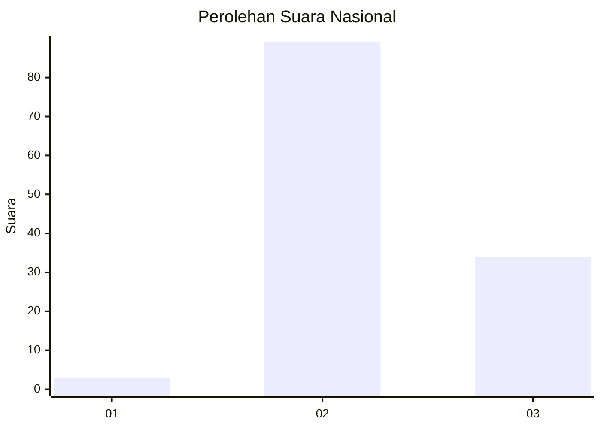
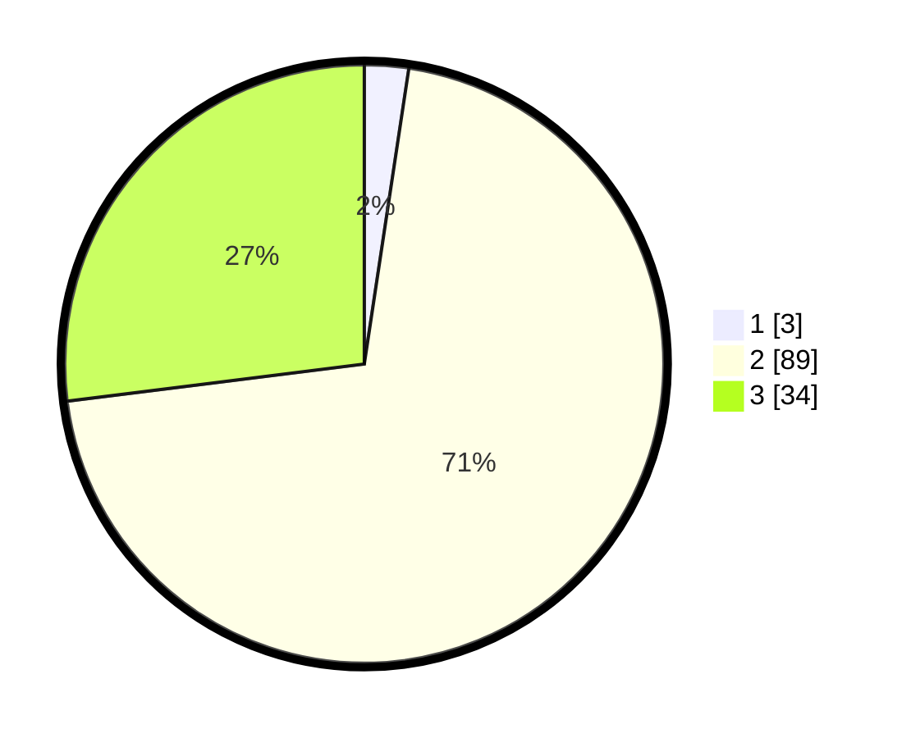

# Hasil

## Grafik

## Tabel

| No. | Nama Paslon    | Suara | Suara (raw) | Persentase |
|:--- |:-------------- | -----:| -----------:| ----------:|
| 1   | ANIES MUHAIMIN | 3     | [3][p-1]    | 2,38       |
| 2   | PRABOWO GIBRAN | 89    | [89][p-2]   | 70,63      |
| 3   | GANJAR MAHFUD  | 34    | [34][p-3]   | 26,98      |

[p-1]: https://github.com/gigit-pemilu/pemilu-2024/blob/main/pilpres/hitung-suara/sub/51-bali/sub/07-karangasem/sub/05-abang/sub/2013-kesimpar/sub/009-tps/sub/paslon-1.txt
[p-2]: https://github.com/gigit-pemilu/pemilu-2024/blob/main/pilpres/hitung-suara/sub/51-bali/sub/07-karangasem/sub/05-abang/sub/2013-kesimpar/sub/009-tps/sub/paslon-2.txt
[p-3]: https://github.com/gigit-pemilu/pemilu-2024/blob/main/pilpres/hitung-suara/sub/51-bali/sub/07-karangasem/sub/05-abang/sub/2013-kesimpar/sub/009-tps/sub/paslon-3.txt

## Foto C Plano

https://sirekap-obj-formc.kpu.go.id/9d6e/pemilu/ppwp/51/07/05/20/13/5107052013009-20240216-120528--e7e3ce9a-be08-476c-954a-30b5b67624dd.jpg

https://sirekap-obj-formc.kpu.go.id/9d6e/pemilu/ppwp/51/07/05/20/13/5107052013009-20240216-120532--a16187d7-00b4-4bc5-b81e-b9006b92778a.jpg

https://sirekap-obj-formc.kpu.go.id/9d6e/pemilu/ppwp/51/07/05/20/13/5107052013009-20240216-120529--e2ad3914-a1ea-4cd8-a8d7-b9932d5dec02.jpg

## Metadata

| Key        | Value               |
| ---------- | ------------------- |
| Time Stamp | 2024-02-16 12:51:22 |

## DATA PEMILIH TETAP

Jumlah pemilih dalam DPT: **153**.
 * L: **84**.
 * P: **69**.

## DATA PENGGUNA HAK PILIH

Jumlah pengguna hak pilih dalam DPT: **133**.
 * L: **73**.
 * P: **60**.

Jumlah pengguna hak pilih dalam DPTb: **0**.
 * L: **0**.
 * P: **0**.

Jumlah pengguna hak pilih dalam DPK: **0**.
 * L: **0**.
 * P: **0**.

Jumlah pengguna hak pilih: **133**.
 * L: **73**.
 * P: **60**.

## JUMLAH SUARA SAH DAN TIDAK SAH

JUMLAH SELURUH SUARA SAH: **126**.

JUMLAH SUARA TIDAK SAH: **7**.

JUMLAH SELURUH SUARA SAH DAN SUARA TIDAK SAH: **133**.

