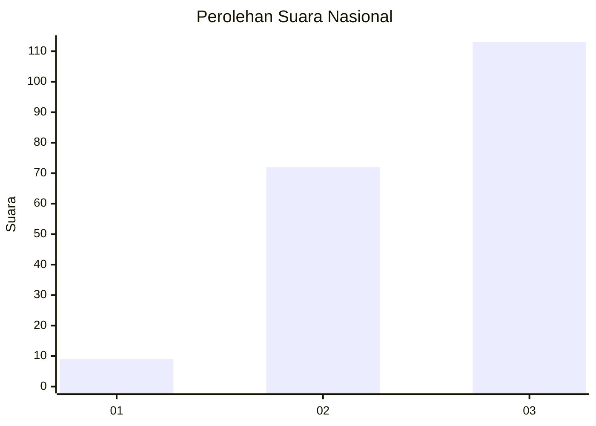
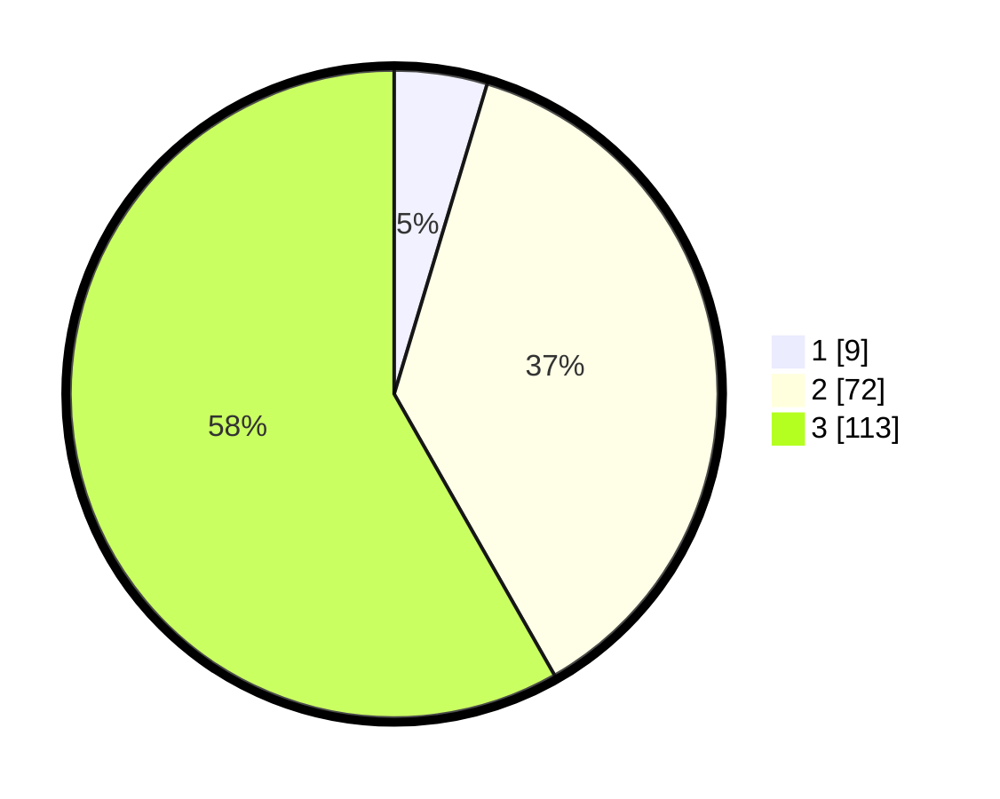

# Hasil

## Grafik

## Tabel

| No. | Nama Paslon    | Suara | Suara (raw) | Persentase |
|:--- |:-------------- | -----:| -----------:| ----------:|
| 1   | ANIES MUHAIMIN | 9     | [9][p-1]    | 4,64       |
| 2   | PRABOWO GIBRAN | 72    | [72][p-2]   | 37,11      |
| 3   | GANJAR MAHFUD  | 113   | [113][p-3]  | 58,25      |

[p-1]: https://github.com/gigit-pemilu/pemilu-2024/blob/main/pilpres/hitung-suara/sub/51-bali/sub/07-karangasem/sub/05-abang/sub/2014-tri-buana/sub/003-tps/sub/paslon-1.txt
[p-2]: https://github.com/gigit-pemilu/pemilu-2024/blob/main/pilpres/hitung-suara/sub/51-bali/sub/07-karangasem/sub/05-abang/sub/2014-tri-buana/sub/003-tps/sub/paslon-2.txt
[p-3]: https://github.com/gigit-pemilu/pemilu-2024/blob/main/pilpres/hitung-suara/sub/51-bali/sub/07-karangasem/sub/05-abang/sub/2014-tri-buana/sub/003-tps/sub/paslon-3.txt

## Foto C Plano

https://sirekap-obj-formc.kpu.go.id/9ca6/pemilu/ppwp/51/07/05/20/14/5107052014003-20240214-210016--b4250945-ee2f-4ebd-9e06-f8686386fd95.jpg

https://sirekap-obj-formc.kpu.go.id/9ca6/pemilu/ppwp/51/07/05/20/14/5107052014003-20240214-220052--4cb328cb-2b9b-4806-861b-998c16484d52.jpg

https://sirekap-obj-formc.kpu.go.id/9ca6/pemilu/ppwp/51/07/05/20/14/5107052014003-20240214-210215--1bac550d-4a19-48b0-a6ef-437da50ee207.jpg

## Metadata

| Key        | Value               |
| ---------- | ------------------- |
| Time Stamp | 2024-02-15 17:30:25 |

## DATA PEMILIH TETAP

Jumlah pemilih dalam DPT: **260**.
 * L: **139**.
 * P: **121**.

## DATA PENGGUNA HAK PILIH

Jumlah pengguna hak pilih dalam DPT: **197**.
 * L: **107**.
 * P: **90**.

Jumlah pengguna hak pilih dalam DPTb: **0**.
 * L: **0**.
 * P: **0**.

Jumlah pengguna hak pilih dalam DPK: **0**.
 * L: **0**.
 * P: **0**.

Jumlah pengguna hak pilih: **197**.
 * L: **107**.
 * P: **90**.

## JUMLAH SUARA SAH DAN TIDAK SAH

JUMLAH SELURUH SUARA SAH: **194**.

JUMLAH SUARA TIDAK SAH: **3**.

JUMLAH SELURUH SUARA SAH DAN SUARA TIDAK SAH: **197**.

