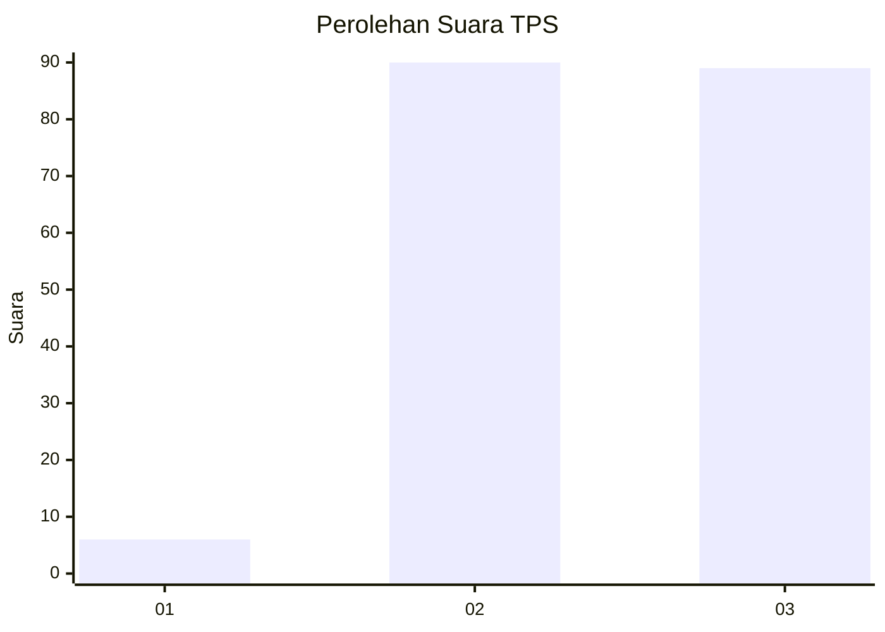
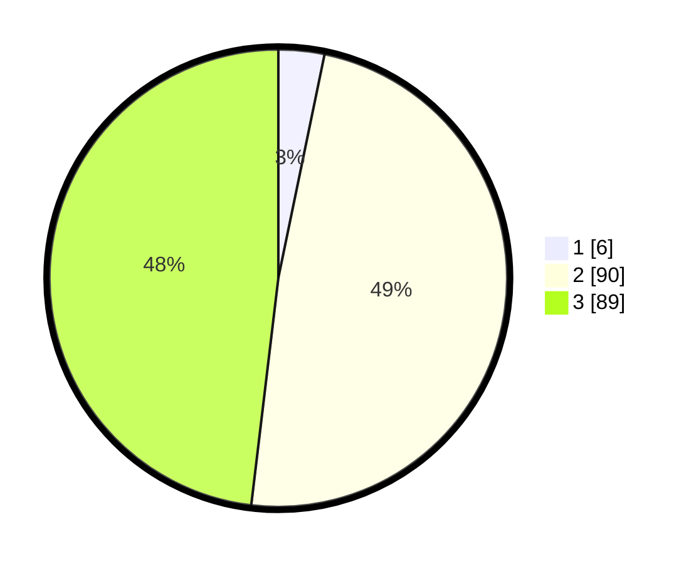

# Hasil

## Grafik

## Tabel

| No. | Nama Paslon    | Suara | Suara (raw) | Persentase |
|:--- |:-------------- | -----:| -----------:| ----------:|
| 1   | ANIES MUHAIMIN | 6     | [6][p-1]    | 3,24       |
| 2   | PRABOWO GIBRAN | 90    | [90][p-2]   | 48,65      |
| 3   | GANJAR MAHFUD  | 89    | [89][p-3]   | 48,11      |

[p-1]: https://github.com/gigit-pemilu/pemilu-2024-51-bali/blob/main/pilpres/hitung-suara/sub/51-bali/sub/07-karangasem/sub/06-bebandem/sub/2001-bungaya/sub/001-tps/sub/paslon-1.txt
[p-2]: https://github.com/gigit-pemilu/pemilu-2024-51-bali/blob/main/pilpres/hitung-suara/sub/51-bali/sub/07-karangasem/sub/06-bebandem/sub/2001-bungaya/sub/001-tps/sub/paslon-2.txt
[p-3]: https://github.com/gigit-pemilu/pemilu-2024-51-bali/blob/main/pilpres/hitung-suara/sub/51-bali/sub/07-karangasem/sub/06-bebandem/sub/2001-bungaya/sub/001-tps/sub/paslon-3.txt

## Foto C Plano

https://sirekap-obj-formc.kpu.go.id/da2b/pemilu/ppwp/51/07/06/20/01/5107062001001-20240214-192518--65c8cb77-0ab6-455d-a140-c1f53602cd2f.jpg

https://sirekap-obj-formc.kpu.go.id/da2b/pemilu/ppwp/51/07/06/20/01/5107062001001-20240214-192540--88aac8ef-c4df-46f6-860e-7c0898a41493.jpg

https://sirekap-obj-formc.kpu.go.id/da2b/pemilu/ppwp/51/07/06/20/01/5107062001001-20240214-192556--90f2ecc6-3560-4b9b-86f8-d170f4725395.jpg

## Metadata

| Key        | Value               |
| ---------- | ------------------- |
| Time Stamp | 2024-02-14 21:46:01 |

## DATA PEMILIH TETAP

Jumlah pemilih dalam DPT: **271**.
 * L: **135**.
 * P: **136**.

## DATA PENGGUNA HAK PILIH

Jumlah pengguna hak pilih dalam DPT: **192**.
 * L: **101**.
 * P: **91**.

Jumlah pengguna hak pilih dalam DPTb: **0**.
 * L: **0**.
 * P: **0**.

Jumlah pengguna hak pilih dalam DPK: **0**.
 * L: **0**.
 * P: **0**.

Jumlah pengguna hak pilih: **192**.
 * L: **101**.
 * P: **91**.

## JUMLAH SUARA SAH DAN TIDAK SAH

JUMLAH SELURUH SUARA SAH: **185**.

JUMLAH SUARA TIDAK SAH: **7**.

JUMLAH SELURUH SUARA SAH DAN SUARA TIDAK SAH: **192**.

