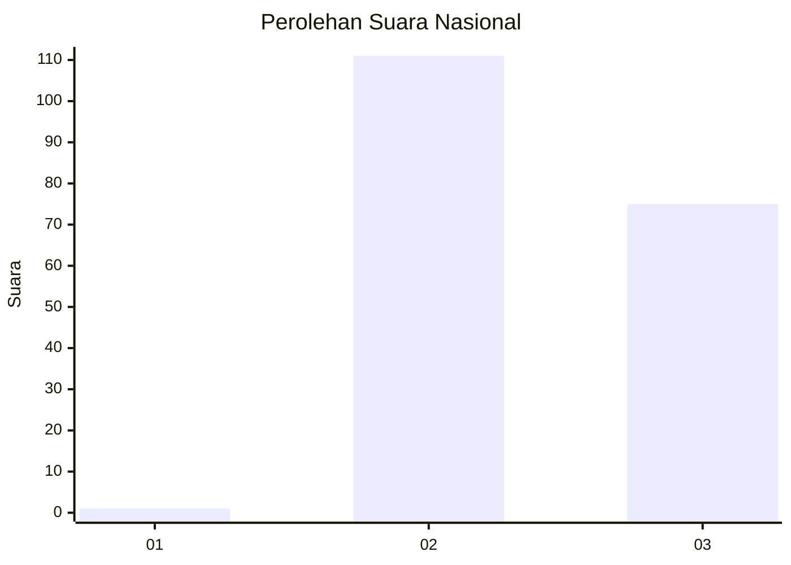
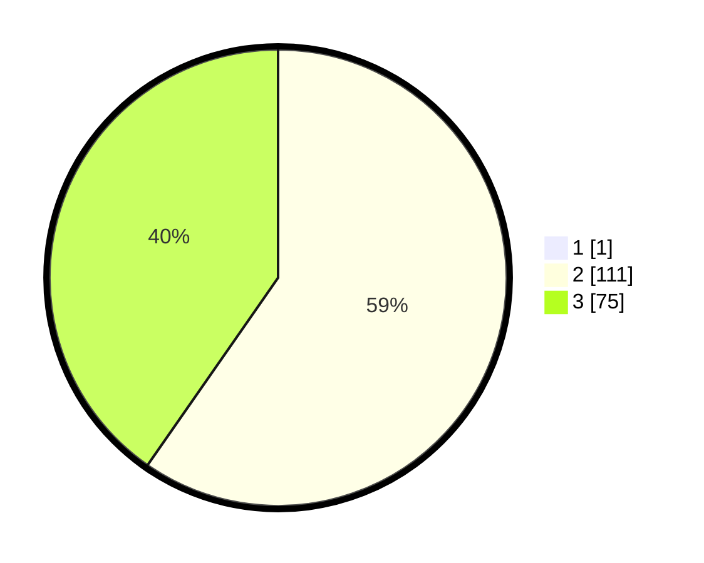

# Hasil

## Grafik

## Tabel

| No. | Nama Paslon    | Suara | Suara (raw) | Persentase |
|:--- |:-------------- | -----:| -----------:| ----------:|
| 1   | ANIES MUHAIMIN | 1     | [1][p-1]    | 0,53       |
| 2   | PRABOWO GIBRAN | 111   | [111][p-2]  | 59,36      |
| 3   | GANJAR MAHFUD  | 75    | [75][p-3]   | 40,11      |

[p-1]: https://github.com/gigit-pemilu/pemilu-2024/blob/main/pilpres/hitung-suara/sub/51-bali/sub/07-karangasem/sub/06-bebandem/sub/2001-bungaya/sub/003-tps/sub/paslon-1.txt
[p-2]: https://github.com/gigit-pemilu/pemilu-2024/blob/main/pilpres/hitung-suara/sub/51-bali/sub/07-karangasem/sub/06-bebandem/sub/2001-bungaya/sub/003-tps/sub/paslon-2.txt
[p-3]: https://github.com/gigit-pemilu/pemilu-2024/blob/main/pilpres/hitung-suara/sub/51-bali/sub/07-karangasem/sub/06-bebandem/sub/2001-bungaya/sub/003-tps/sub/paslon-3.txt

## Foto C Plano

https://sirekap-obj-formc.kpu.go.id/f217/pemilu/ppwp/51/07/06/20/01/5107062001003-20240220-102045--3cfb8790-68ae-44be-b865-9a6a086dda4c.jpg

https://sirekap-obj-formc.kpu.go.id/f217/pemilu/ppwp/51/07/06/20/01/5107062001003-20240220-102227--dce3225b-a6b2-4bab-96f0-68739b57d0b9.jpg

https://sirekap-obj-formc.kpu.go.id/f217/pemilu/ppwp/51/07/06/20/01/5107062001003-20240220-102500--f50f9bae-d45c-47ef-98f4-ea3ef3383f38.jpg

## Metadata

| Key        | Value               |
| ---------- | ------------------- |
| Time Stamp | 2024-02-24 22:31:28 |

