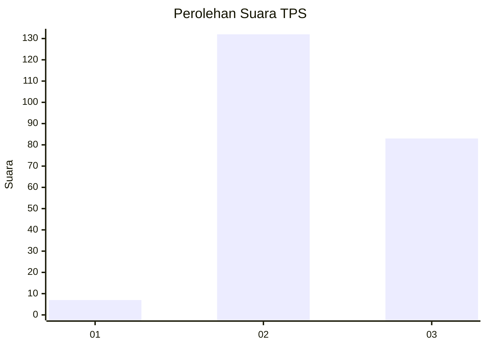
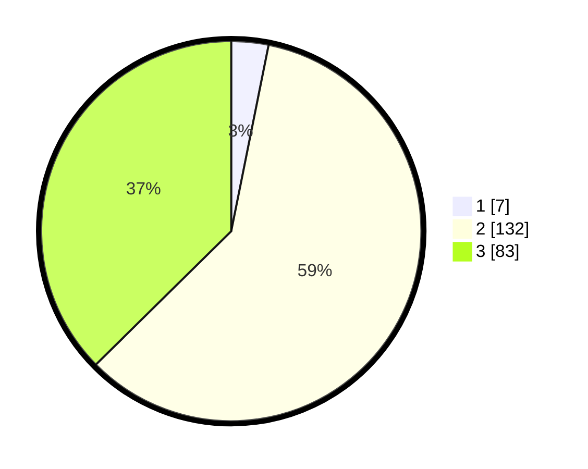

# Hasil

## Grafik

## Tabel

| No. | Nama Paslon    | Suara | Suara (raw) | Persentase |
|:--- |:-------------- | -----:| -----------:| ----------:|
| 1   | ANIES MUHAIMIN | 7     | [7][p-1]    | 3,15       |
| 2   | PRABOWO GIBRAN | 132   | [132][p-2]  | 59,46      |
| 3   | GANJAR MAHFUD  | 83    | [83][p-3]   | 37,39      |

[p-1]: https://github.com/gigit-pemilu/pemilu-2024-51-bali/blob/main/pilpres/hitung-suara/sub/51-bali/sub/07-karangasem/sub/06-bebandem/sub/2001-bungaya/sub/005-tps/sub/paslon-1.txt
[p-2]: https://github.com/gigit-pemilu/pemilu-2024-51-bali/blob/main/pilpres/hitung-suara/sub/51-bali/sub/07-karangasem/sub/06-bebandem/sub/2001-bungaya/sub/005-tps/sub/paslon-2.txt
[p-3]: https://github.com/gigit-pemilu/pemilu-2024-51-bali/blob/main/pilpres/hitung-suara/sub/51-bali/sub/07-karangasem/sub/06-bebandem/sub/2001-bungaya/sub/005-tps/sub/paslon-3.txt

## Foto C Plano

https://sirekap-obj-formc.kpu.go.id/ed17/pemilu/ppwp/51/07/06/20/01/5107062001005-20240215-143125--3290ea4f-5baa-4cb5-a6c2-7512ee761367.jpg

https://sirekap-obj-formc.kpu.go.id/ed17/pemilu/ppwp/51/07/06/20/01/5107062001005-20240215-143149--a5ca10e7-512f-487f-8eb2-99893458f1d4.jpg

https://sirekap-obj-formc.kpu.go.id/ed17/pemilu/ppwp/51/07/06/20/01/5107062001005-20240215-143135--7a4a8647-3bf2-496f-b72f-89fdedccf8a5.jpg

## Metadata

| Key        | Value               |
| ---------- | ------------------- |
| Time Stamp | 2024-02-16 10:00:28 |

## DATA PEMILIH TETAP

Jumlah pemilih dalam DPT: **298**.
 * L: **148**.
 * P: **150**.

## DATA PENGGUNA HAK PILIH

Jumlah pengguna hak pilih dalam DPT: **234**.
 * L: **118**.
 * P: **116**.

Jumlah pengguna hak pilih dalam DPTb: **0**.
 * L: **0**.
 * P: **0**.

Jumlah pengguna hak pilih dalam DPK: **0**.
 * L: **0**.
 * P: **0**.

Jumlah pengguna hak pilih: **234**.
 * L: **118**.
 * P: **116**.

## JUMLAH SUARA SAH DAN TIDAK SAH

JUMLAH SELURUH SUARA SAH: **222**.

JUMLAH SUARA TIDAK SAH: **12**.

JUMLAH SELURUH SUARA SAH DAN SUARA TIDAK SAH: **234**.

