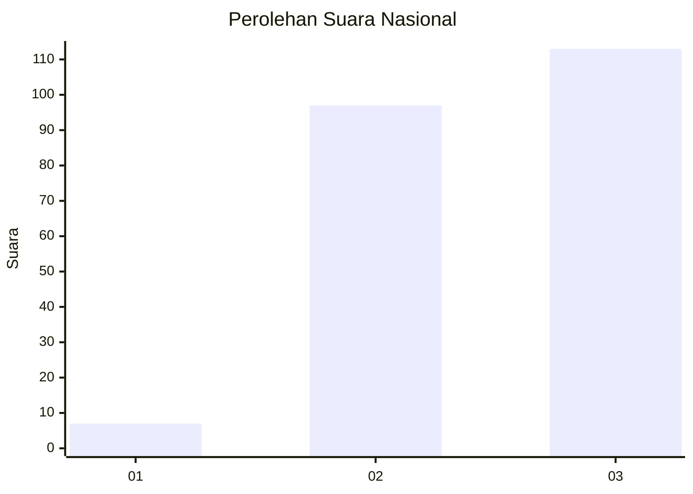
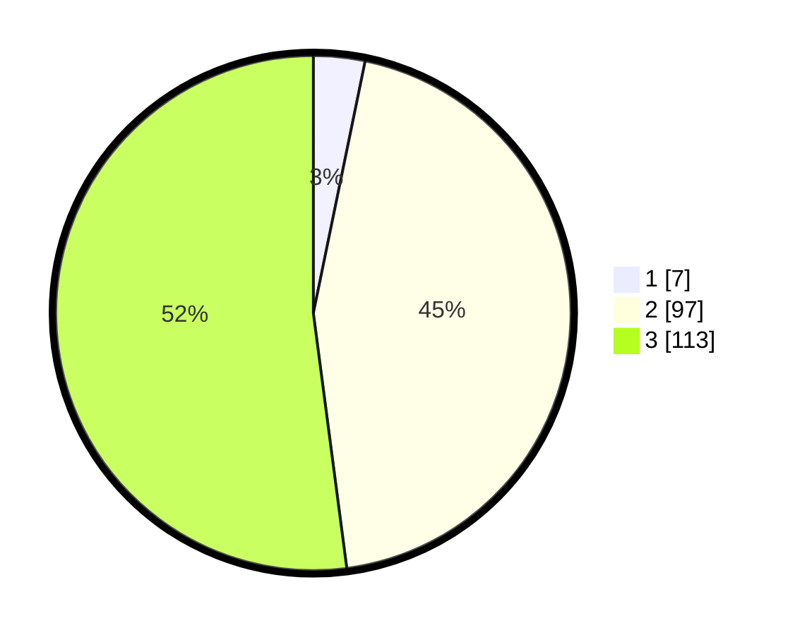

# Hasil

## Grafik

## Tabel

| No. | Nama Paslon    | Suara | Suara (raw) | Persentase |
|:--- |:-------------- | -----:| -----------:| ----------:|
| 1   | ANIES MUHAIMIN | 7     | [7][p-1]    | 3,23       |
| 2   | PRABOWO GIBRAN | 97    | [97][p-2]   | 44,70      |
| 3   | GANJAR MAHFUD  | 113   | [113][p-3]  | 52,07      |

[p-1]: https://github.com/gigit-pemilu/pemilu-2024/blob/main/pilpres/hitung-suara/sub/51-bali/sub/07-karangasem/sub/06-bebandem/sub/2001-bungaya/sub/010-tps/sub/paslon-1.txt
[p-2]: https://github.com/gigit-pemilu/pemilu-2024/blob/main/pilpres/hitung-suara/sub/51-bali/sub/07-karangasem/sub/06-bebandem/sub/2001-bungaya/sub/010-tps/sub/paslon-2.txt
[p-3]: https://github.com/gigit-pemilu/pemilu-2024/blob/main/pilpres/hitung-suara/sub/51-bali/sub/07-karangasem/sub/06-bebandem/sub/2001-bungaya/sub/010-tps/sub/paslon-3.txt

## Foto C Plano

https://sirekap-obj-formc.kpu.go.id/fa01/pemilu/ppwp/51/07/06/20/01/5107062001010-20240214-233255--5a005eef-46df-4292-b0d3-08debc39ce46.jpg

https://sirekap-obj-formc.kpu.go.id/fa01/pemilu/ppwp/51/07/06/20/01/5107062001010-20240214-224446--d72fcbb5-7049-476b-93ae-cdc8c1d22981.jpg

https://sirekap-obj-formc.kpu.go.id/fa01/pemilu/ppwp/51/07/06/20/01/5107062001010-20240214-224545--f4c86a3f-1c6a-4f26-8c21-f5fe4fd3a669.jpg

## Metadata

| Key        | Value               |
| ---------- | ------------------- |
| Time Stamp | 2024-02-24 22:31:28 |

