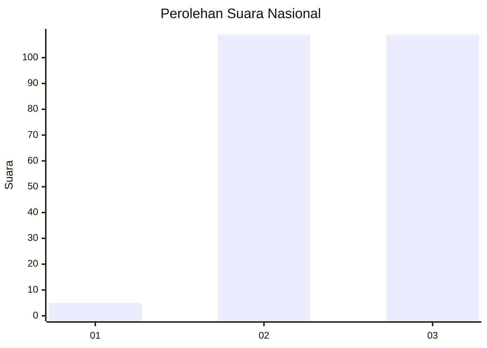
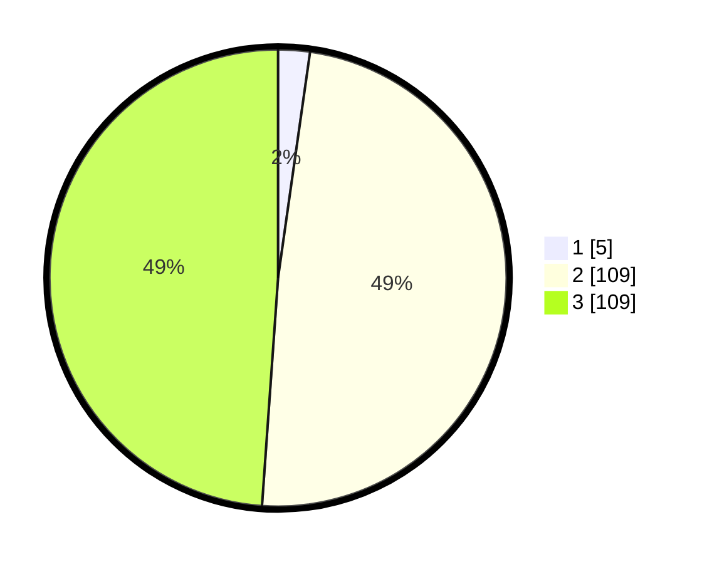

# Hasil

## Grafik

## Tabel

| No. | Nama Paslon    | Suara | Suara (raw) | Persentase |
|:--- |:-------------- | -----:| -----------:| ----------:|
| 1   | ANIES MUHAIMIN | 5     | [5][p-1]    | 2,24       |
| 2   | PRABOWO GIBRAN | 109   | [109][p-2]  | 48,88      |
| 3   | GANJAR MAHFUD  | 109   | [109][p-3]  | 48,88      |

[p-1]: https://github.com/gigit-pemilu/pemilu-2024/blob/main/pilpres/hitung-suara/sub/51-bali/sub/07-karangasem/sub/06-bebandem/sub/2001-bungaya/sub/013-tps/sub/paslon-1.txt
[p-2]: https://github.com/gigit-pemilu/pemilu-2024/blob/main/pilpres/hitung-suara/sub/51-bali/sub/07-karangasem/sub/06-bebandem/sub/2001-bungaya/sub/013-tps/sub/paslon-2.txt
[p-3]: https://github.com/gigit-pemilu/pemilu-2024/blob/main/pilpres/hitung-suara/sub/51-bali/sub/07-karangasem/sub/06-bebandem/sub/2001-bungaya/sub/013-tps/sub/paslon-3.txt

## Foto C Plano

https://sirekap-obj-formc.kpu.go.id/a628/pemilu/ppwp/51/07/06/20/01/5107062001013-20240214-230453--f5ba52fa-4a00-40b1-a67f-3b79c3e7ed20.jpg

https://sirekap-obj-formc.kpu.go.id/a628/pemilu/ppwp/51/07/06/20/01/5107062001013-20240214-230939--6463b352-da59-4713-b499-a4045f0bccb3.jpg

https://sirekap-obj-formc.kpu.go.id/a628/pemilu/ppwp/51/07/06/20/01/5107062001013-20240214-231240--f4c45a0f-fd4f-4005-a8b1-431d660b5436.jpg

## Metadata

| Key        | Value               |
| ---------- | ------------------- |
| Time Stamp | 2024-02-24 22:31:28 |

