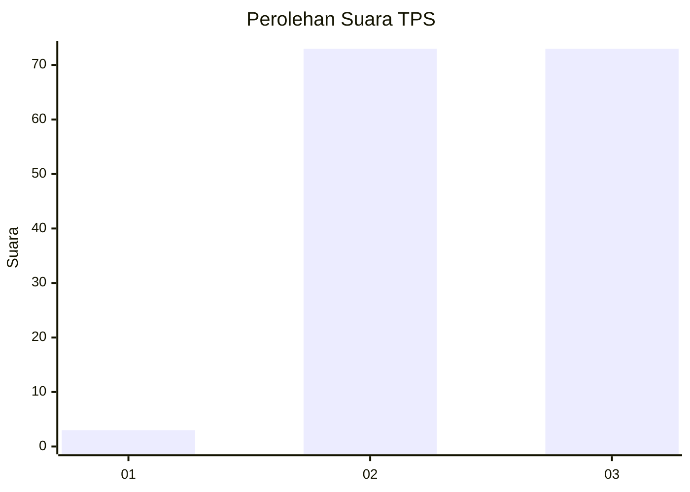
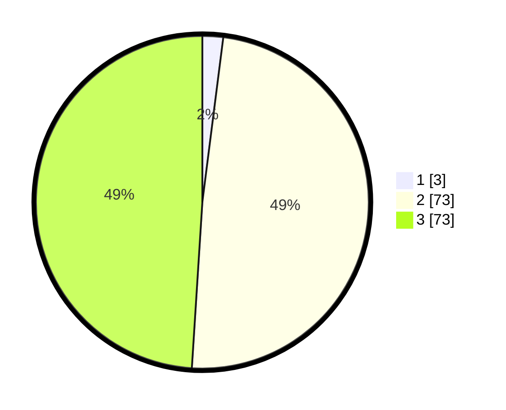

# Hasil

## Grafik

## Tabel

| No. | Nama Paslon    | Suara | Suara (raw) | Persentase |
|:--- |:-------------- | -----:| -----------:| ----------:|
| 1   | ANIES MUHAIMIN | 3     | [3][p-1]    | 2,01       |
| 2   | PRABOWO GIBRAN | 73    | [73][p-2]   | 48,99      |
| 3   | GANJAR MAHFUD  | 73    | [73][p-3]   | 48,99      |

[p-1]: https://github.com/gigit-pemilu/pemilu-2024-51-bali/blob/main/pilpres/hitung-suara/sub/51-bali/sub/07-karangasem/sub/06-bebandem/sub/2001-bungaya/sub/018-tps/sub/paslon-1.txt
[p-2]: https://github.com/gigit-pemilu/pemilu-2024-51-bali/blob/main/pilpres/hitung-suara/sub/51-bali/sub/07-karangasem/sub/06-bebandem/sub/2001-bungaya/sub/018-tps/sub/paslon-2.txt
[p-3]: https://github.com/gigit-pemilu/pemilu-2024-51-bali/blob/main/pilpres/hitung-suara/sub/51-bali/sub/07-karangasem/sub/06-bebandem/sub/2001-bungaya/sub/018-tps/sub/paslon-3.txt

## Foto C Plano

https://sirekap-obj-formc.kpu.go.id/86b8/pemilu/ppwp/51/07/06/20/01/5107062001018-20240214-222513--1c7e6e7f-02c9-41da-b546-7f8f42895760.jpg

https://sirekap-obj-formc.kpu.go.id/86b8/pemilu/ppwp/51/07/06/20/01/5107062001018-20240214-222524--71c1a550-9a99-4eca-8018-5c69c1a4a3af.jpg

https://sirekap-obj-formc.kpu.go.id/86b8/pemilu/ppwp/51/07/06/20/01/5107062001018-20240214-222535--aa842b4e-01d3-4948-a925-afca39115d8d.jpg

## Metadata

| Key        | Value               |
| ---------- | ------------------- |
| Time Stamp | 2024-02-19 06:16:00 |

