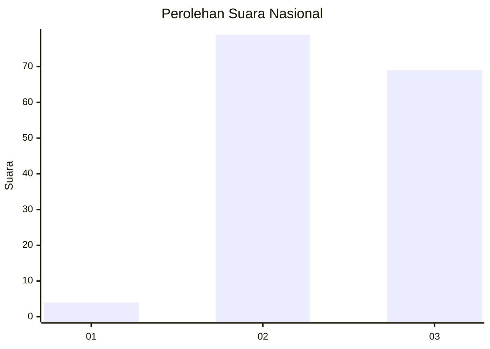
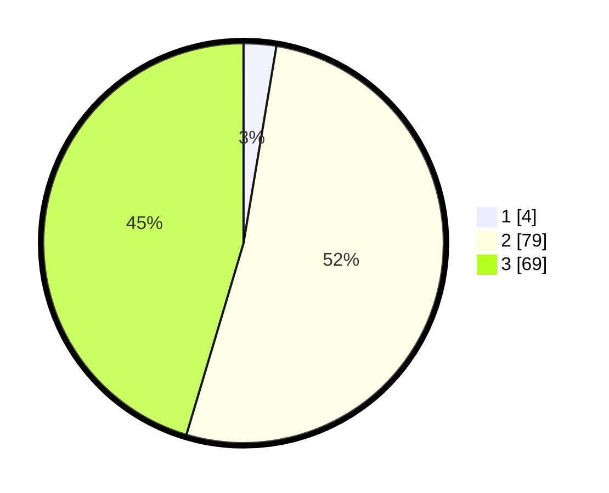

# Hasil

## Grafik

## Tabel

| No. | Nama Paslon    | Suara | Suara (raw) | Persentase |
|:--- |:-------------- | -----:| -----------:| ----------:|
| 1   | ANIES MUHAIMIN | 4     | [4][p-1]    | 2,63       |
| 2   | PRABOWO GIBRAN | 79    | [79][p-2]   | 51,97      |
| 3   | GANJAR MAHFUD  | 69    | [69][p-3]   | 45,39      |

[p-1]: https://github.com/gigit-pemilu/pemilu-2024/blob/main/pilpres/hitung-suara/sub/51-bali/sub/07-karangasem/sub/06-bebandem/sub/2002-budakeling/sub/001-tps/sub/paslon-1.txt
[p-2]: https://github.com/gigit-pemilu/pemilu-2024/blob/main/pilpres/hitung-suara/sub/51-bali/sub/07-karangasem/sub/06-bebandem/sub/2002-budakeling/sub/001-tps/sub/paslon-2.txt
[p-3]: https://github.com/gigit-pemilu/pemilu-2024/blob/main/pilpres/hitung-suara/sub/51-bali/sub/07-karangasem/sub/06-bebandem/sub/2002-budakeling/sub/001-tps/sub/paslon-3.txt

## Foto C Plano

https://sirekap-obj-formc.kpu.go.id/925b/pemilu/ppwp/51/07/06/20/02/5107062002001-20240214-132924--ef284187-5f12-48aa-bff9-28e9fc370fef.jpg

https://sirekap-obj-formc.kpu.go.id/925b/pemilu/ppwp/51/07/06/20/02/5107062002001-20240214-222218--3d4f4a64-fc22-4e5c-a64a-41458280dbd5.jpg

https://sirekap-obj-formc.kpu.go.id/925b/pemilu/ppwp/51/07/06/20/02/5107062002001-20240214-133351--3fa740ae-d043-4827-b591-6b6e4c3e2ff8.jpg

## Metadata

| Key        | Value               |
| ---------- | ------------------- |
| Time Stamp | 2024-02-15 12:00:28 |

## DATA PEMILIH TETAP

Jumlah pemilih dalam DPT: **198**.
 * L: **88**.
 * P: **110**.

## DATA PENGGUNA HAK PILIH

Jumlah pengguna hak pilih dalam DPT: **157**.
 * L: **72**.
 * P: **85**.

Jumlah pengguna hak pilih dalam DPTb: **0**.
 * L: **0**.
 * P: **0**.

Jumlah pengguna hak pilih dalam DPK: **2**.
 * L: **1**.
 * P: **1**.

Jumlah pengguna hak pilih: **159**.
 * L: **73**.
 * P: **86**.

## JUMLAH SUARA SAH DAN TIDAK SAH

JUMLAH SELURUH SUARA SAH: **152**.

JUMLAH SUARA TIDAK SAH: **7**.

JUMLAH SELURUH SUARA SAH DAN SUARA TIDAK SAH: **159**.

