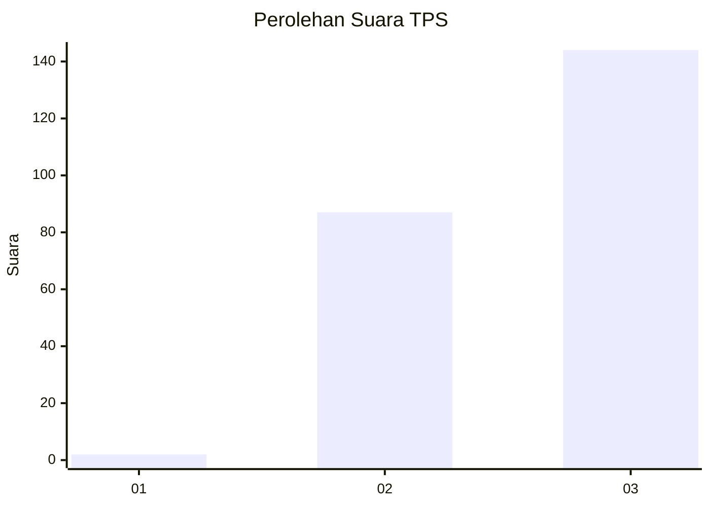
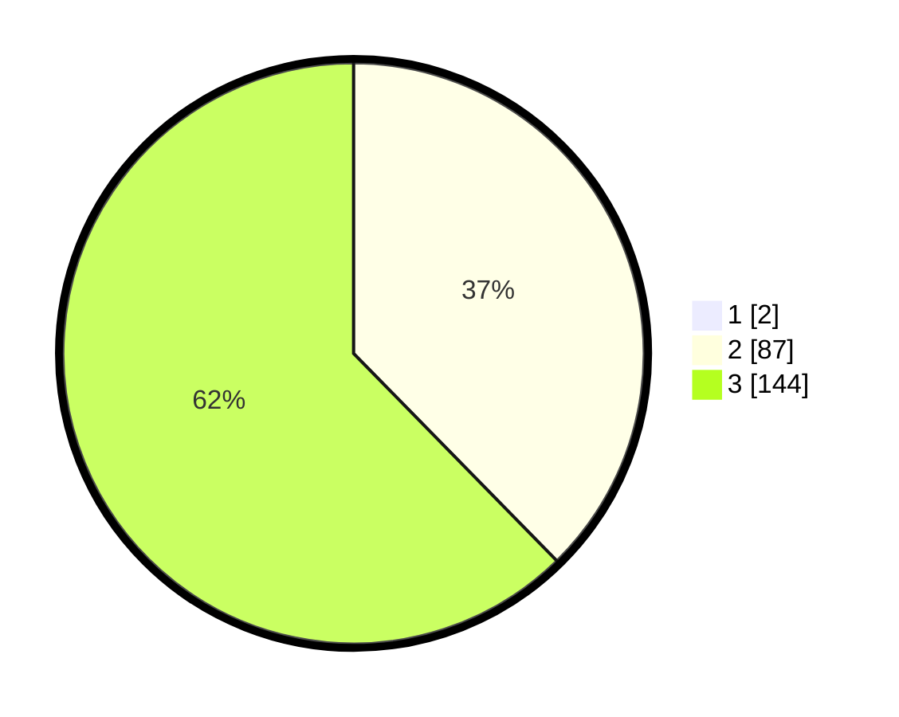

# Hasil

## Grafik

## Tabel

| No. | Nama Paslon    | Suara | Suara (raw) | Persentase |
|:--- |:-------------- | -----:| -----------:| ----------:|
| 1   | ANIES MUHAIMIN | 2     | [2][p-1]    | 0,86       |
| 2   | PRABOWO GIBRAN | 87    | [87][p-2]   | 37,34      |
| 3   | GANJAR MAHFUD  | 144   | [144][p-3]  | 61,80      |

[p-1]: https://github.com/gigit-pemilu/pemilu-2024-51-bali/blob/main/pilpres/hitung-suara/sub/51-bali/sub/07-karangasem/sub/06-bebandem/sub/2002-budakeling/sub/006-tps/sub/paslon-1.txt
[p-2]: https://github.com/gigit-pemilu/pemilu-2024-51-bali/blob/main/pilpres/hitung-suara/sub/51-bali/sub/07-karangasem/sub/06-bebandem/sub/2002-budakeling/sub/006-tps/sub/paslon-2.txt
[p-3]: https://github.com/gigit-pemilu/pemilu-2024-51-bali/blob/main/pilpres/hitung-suara/sub/51-bali/sub/07-karangasem/sub/06-bebandem/sub/2002-budakeling/sub/006-tps/sub/paslon-3.txt

## Foto C Plano

https://sirekap-obj-formc.kpu.go.id/144d/pemilu/ppwp/51/07/06/20/02/5107062002006-20240214-224746--03acd08e-1004-4d84-9864-33a6d105bd23.jpg

https://sirekap-obj-formc.kpu.go.id/144d/pemilu/ppwp/51/07/06/20/02/5107062002006-20240214-224811--2bd2b0c9-f227-477c-919f-e85be4f0dbe4.jpg

https://sirekap-obj-formc.kpu.go.id/144d/pemilu/ppwp/51/07/06/20/02/5107062002006-20240214-224817--11754cc2-f3d9-4e0c-a511-a5dc719606c1.jpg

## Metadata

| Key        | Value               |
| ---------- | ------------------- |
| Time Stamp | 2024-02-25 23:00:00 |

