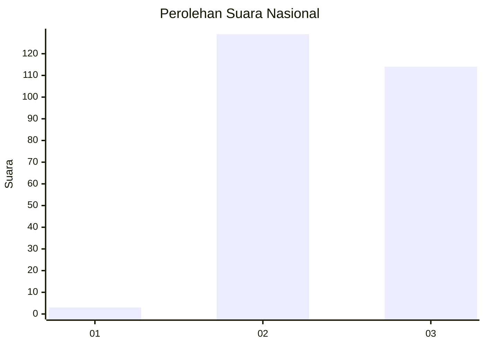
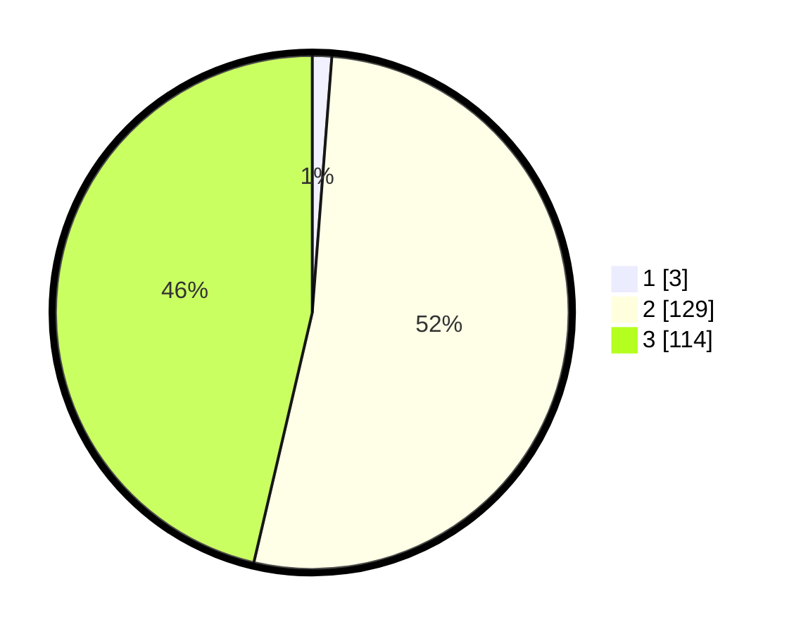

# Hasil

## Grafik

## Tabel

| No. | Nama Paslon    | Suara | Suara (raw) | Persentase |
|:--- |:-------------- | -----:| -----------:| ----------:|
| 1   | ANIES MUHAIMIN | 3     | [3][p-1]    | 1,22       |
| 2   | PRABOWO GIBRAN | 129   | [129][p-2]  | 52,44      |
| 3   | GANJAR MAHFUD  | 114   | [114][p-3]  | 46,34      |

[p-1]: https://github.com/gigit-pemilu/pemilu-2024/blob/main/pilpres/hitung-suara/sub/51-bali/sub/07-karangasem/sub/06-bebandem/sub/2002-budakeling/sub/013-tps/sub/paslon-1.txt
[p-2]: https://github.com/gigit-pemilu/pemilu-2024/blob/main/pilpres/hitung-suara/sub/51-bali/sub/07-karangasem/sub/06-bebandem/sub/2002-budakeling/sub/013-tps/sub/paslon-2.txt
[p-3]: https://github.com/gigit-pemilu/pemilu-2024/blob/main/pilpres/hitung-suara/sub/51-bali/sub/07-karangasem/sub/06-bebandem/sub/2002-budakeling/sub/013-tps/sub/paslon-3.txt

## Foto C Plano

https://sirekap-obj-formc.kpu.go.id/7cbf/pemilu/ppwp/51/07/06/20/02/5107062002013-20240214-232544--54823ef0-6009-4e1b-b1af-77738bb3b8f5.jpg

https://sirekap-obj-formc.kpu.go.id/7cbf/pemilu/ppwp/51/07/06/20/02/5107062002013-20240214-232548--d91e415b-f58c-4f19-9efb-3a031bcc9b2f.jpg

https://sirekap-obj-formc.kpu.go.id/7cbf/pemilu/ppwp/51/07/06/20/02/5107062002013-20240214-232552--3a2ffbcb-98de-4407-a931-ce80dee3454f.jpg

## Metadata

| Key        | Value               |
| ---------- | ------------------- |
| Time Stamp | 2024-02-24 22:31:28 |

