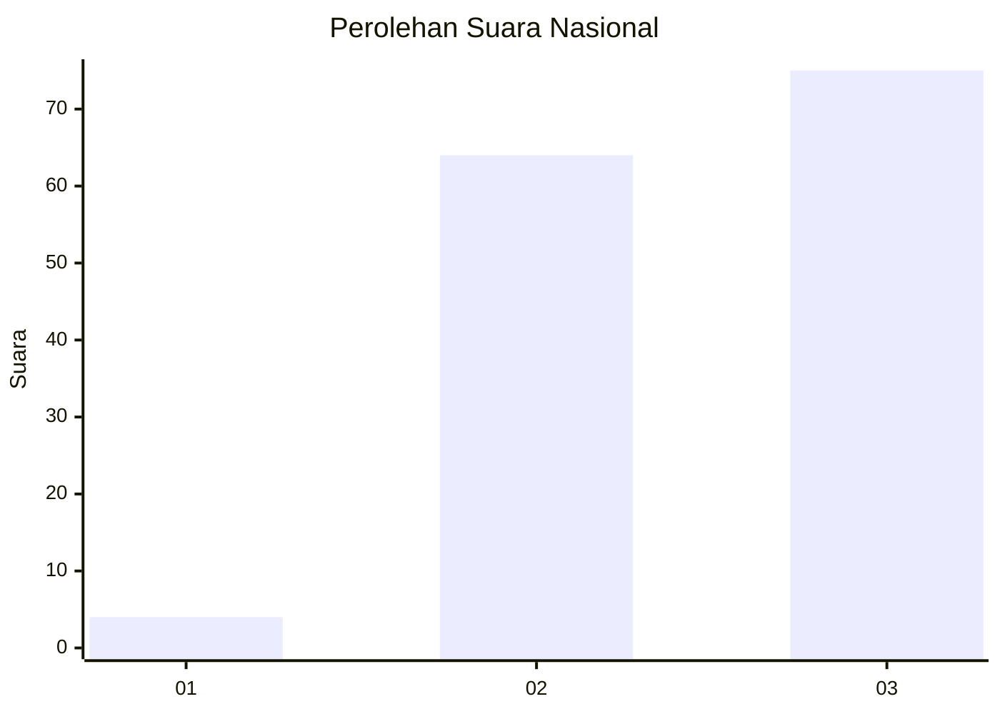
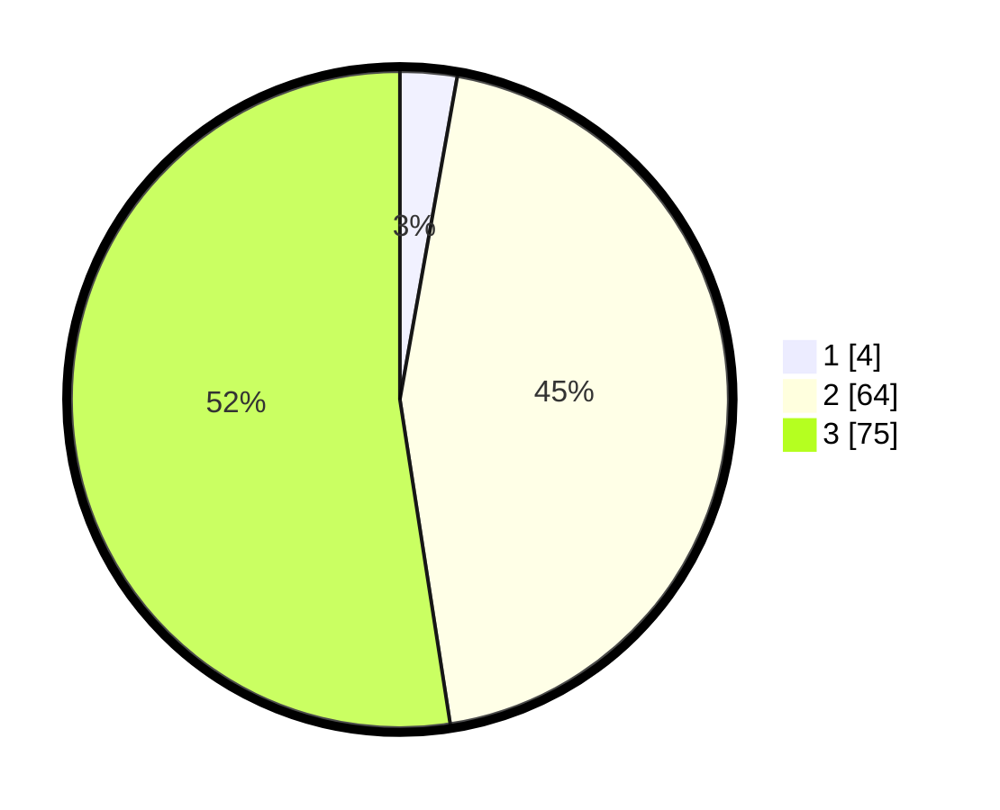

# Hasil

## Grafik

## Tabel

| No. | Nama Paslon    | Suara | Suara (raw) | Persentase |
|:--- |:-------------- | -----:| -----------:| ----------:|
| 1   | ANIES MUHAIMIN | 4     | [4][p-1]    | 2,80       |
| 2   | PRABOWO GIBRAN | 64    | [64][p-2]   | 44,76      |
| 3   | GANJAR MAHFUD  | 75    | [75][p-3]   | 52,45      |

[p-1]: https://github.com/gigit-pemilu/pemilu-2024/blob/main/pilpres/hitung-suara/sub/51-bali/sub/07-karangasem/sub/06-bebandem/sub/2003-bebandem/sub/009-tps/sub/paslon-1.txt
[p-2]: https://github.com/gigit-pemilu/pemilu-2024/blob/main/pilpres/hitung-suara/sub/51-bali/sub/07-karangasem/sub/06-bebandem/sub/2003-bebandem/sub/009-tps/sub/paslon-2.txt
[p-3]: https://github.com/gigit-pemilu/pemilu-2024/blob/main/pilpres/hitung-suara/sub/51-bali/sub/07-karangasem/sub/06-bebandem/sub/2003-bebandem/sub/009-tps/sub/paslon-3.txt

## Foto C Plano

https://sirekap-obj-formc.kpu.go.id/4100/pemilu/ppwp/51/07/06/20/03/5107062003009-20240216-144135--3a4d99e1-6479-4f81-ad66-584a1c0ce65b.jpg

https://sirekap-obj-formc.kpu.go.id/4100/pemilu/ppwp/51/07/06/20/03/5107062003009-20240216-144137--1d9e0461-522d-4e0e-805d-09c695a712c9.jpg

https://sirekap-obj-formc.kpu.go.id/4100/pemilu/ppwp/51/07/06/20/03/5107062003009-20240216-144136--4a91527e-e90e-45e2-b731-f7d4e9f7d69e.jpg

## Metadata

| Key        | Value               |
| ---------- | ------------------- |
| Time Stamp | 2024-02-17 10:30:03 |

## DATA PEMILIH TETAP

Jumlah pemilih dalam DPT: **187**.
 * L: **94**.
 * P: **93**.

## DATA PENGGUNA HAK PILIH

Jumlah pengguna hak pilih dalam DPT: **151**.
 * L: **78**.
 * P: **73**.

Jumlah pengguna hak pilih dalam DPTb: **0**.
 * L: **0**.
 * P: **0**.

Jumlah pengguna hak pilih dalam DPK: **0**.
 * L: **0**.
 * P: **0**.

Jumlah pengguna hak pilih: **151**.
 * L: **78**.
 * P: **73**.

## JUMLAH SUARA SAH DAN TIDAK SAH

JUMLAH SELURUH SUARA SAH: **143**.

JUMLAH SUARA TIDAK SAH: **8**.

JUMLAH SELURUH SUARA SAH DAN SUARA TIDAK SAH: **151**.

