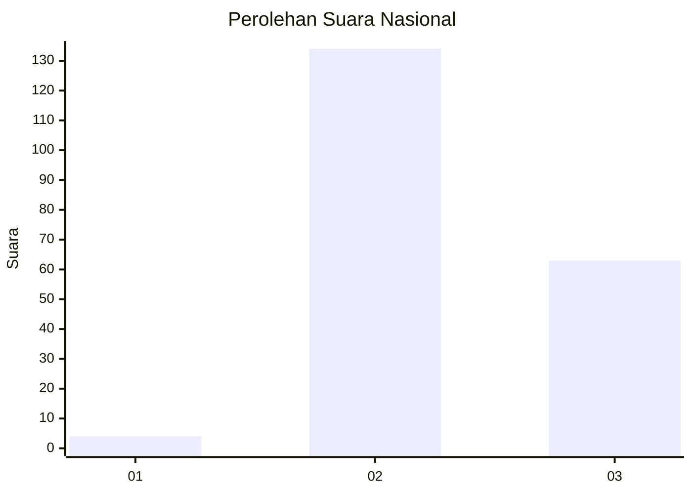
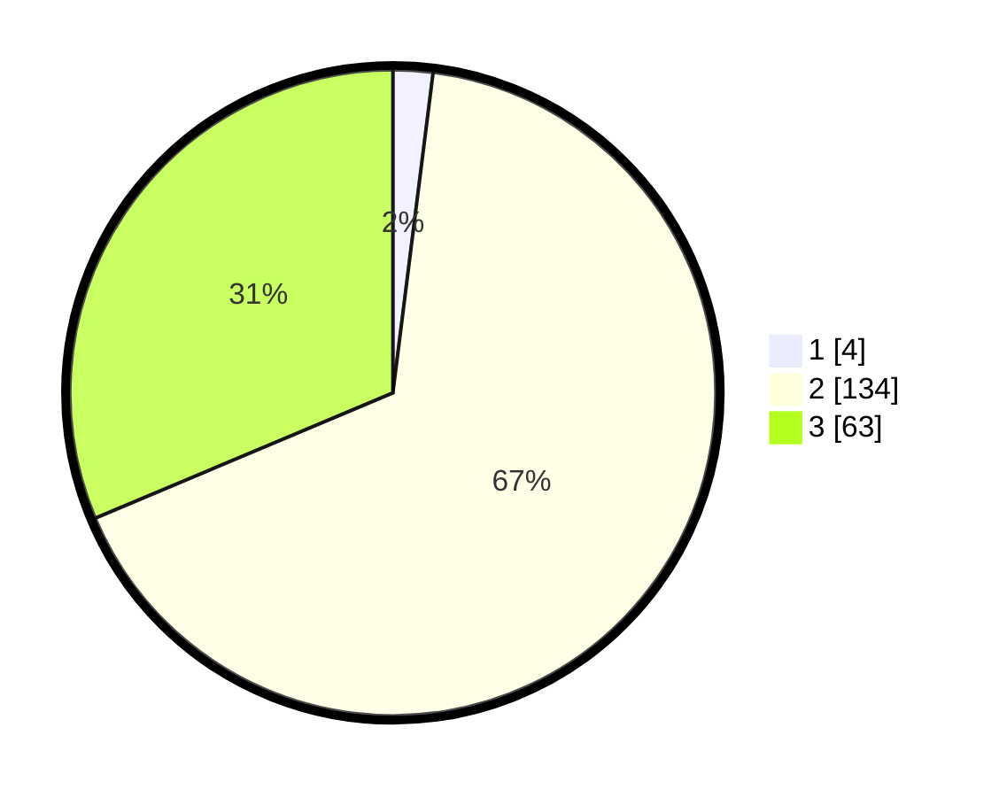

# Hasil

## Grafik

## Tabel

| No. | Nama Paslon    | Suara | Suara (raw) | Persentase |
|:--- |:-------------- | -----:| -----------:| ----------:|
| 1   | ANIES MUHAIMIN | 4     | [4][p-1]    | 1,99       |
| 2   | PRABOWO GIBRAN | 134   | [134][p-2]  | 66,67      |
| 3   | GANJAR MAHFUD  | 63    | [63][p-3]   | 31,34      |

[p-1]: https://github.com/gigit-pemilu/pemilu-2024/blob/main/pilpres/hitung-suara/sub/51-bali/sub/07-karangasem/sub/06-bebandem/sub/2003-bebandem/sub/017-tps/sub/paslon-1.txt
[p-2]: https://github.com/gigit-pemilu/pemilu-2024/blob/main/pilpres/hitung-suara/sub/51-bali/sub/07-karangasem/sub/06-bebandem/sub/2003-bebandem/sub/017-tps/sub/paslon-2.txt
[p-3]: https://github.com/gigit-pemilu/pemilu-2024/blob/main/pilpres/hitung-suara/sub/51-bali/sub/07-karangasem/sub/06-bebandem/sub/2003-bebandem/sub/017-tps/sub/paslon-3.txt

## Foto C Plano

https://sirekap-obj-formc.kpu.go.id/5d1d/pemilu/ppwp/51/07/06/20/03/5107062003017-20240214-140954--84e6deb4-b2ad-4b79-85e6-e636a4587be4.jpg

https://sirekap-obj-formc.kpu.go.id/5d1d/pemilu/ppwp/51/07/06/20/03/5107062003017-20240214-141103--bf4d332e-349f-410b-bfc7-cbfc7ec8de31.jpg

https://sirekap-obj-formc.kpu.go.id/5d1d/pemilu/ppwp/51/07/06/20/03/5107062003017-20240214-141222--fface686-2ac6-4f51-b123-83d6a959ff5c.jpg

## Metadata

| Key        | Value               |
| ---------- | ------------------- |
| Time Stamp | 2024-02-24 22:31:28 |

