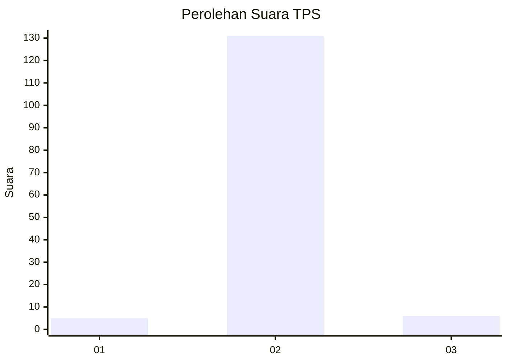
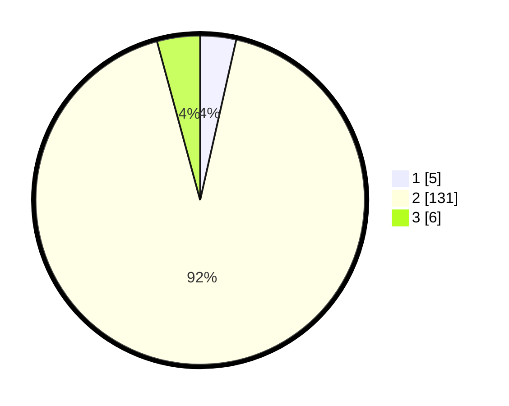

# Hasil

## Grafik

## Tabel

| No. | Nama Paslon    | Suara | Suara (raw) | Persentase |
|:--- |:-------------- | -----:| -----------:| ----------:|
| 1   | ANIES MUHAIMIN | 5     | [5][p-1]    | 3,52       |
| 2   | PRABOWO GIBRAN | 131   | [131][p-2]  | 92,25      |
| 3   | GANJAR MAHFUD  | 6     | [6][p-3]    | 4,23       |

[p-1]: https://github.com/gigit-pemilu/pemilu-2024-51-bali/blob/main/pilpres/hitung-suara/sub/51-bali/sub/07-karangasem/sub/06-bebandem/sub/2003-bebandem/sub/035-tps/sub/paslon-1.txt
[p-2]: https://github.com/gigit-pemilu/pemilu-2024-51-bali/blob/main/pilpres/hitung-suara/sub/51-bali/sub/07-karangasem/sub/06-bebandem/sub/2003-bebandem/sub/035-tps/sub/paslon-2.txt
[p-3]: https://github.com/gigit-pemilu/pemilu-2024-51-bali/blob/main/pilpres/hitung-suara/sub/51-bali/sub/07-karangasem/sub/06-bebandem/sub/2003-bebandem/sub/035-tps/sub/paslon-3.txt

## Foto C Plano

https://sirekap-obj-formc.kpu.go.id/debf/pemilu/ppwp/51/07/06/20/03/5107062003035-20240217-195657--00c3ff55-b341-4b6c-8a2b-f17485ed4665.jpg

https://sirekap-obj-formc.kpu.go.id/debf/pemilu/ppwp/51/07/06/20/03/5107062003035-20240217-195709--5b6215cc-fccc-4428-8ea9-6f3c4dacc60d.jpg

## Metadata

| Key        | Value               |
| ---------- | ------------------- |
| Time Stamp | 2024-02-24 22:31:28 |

