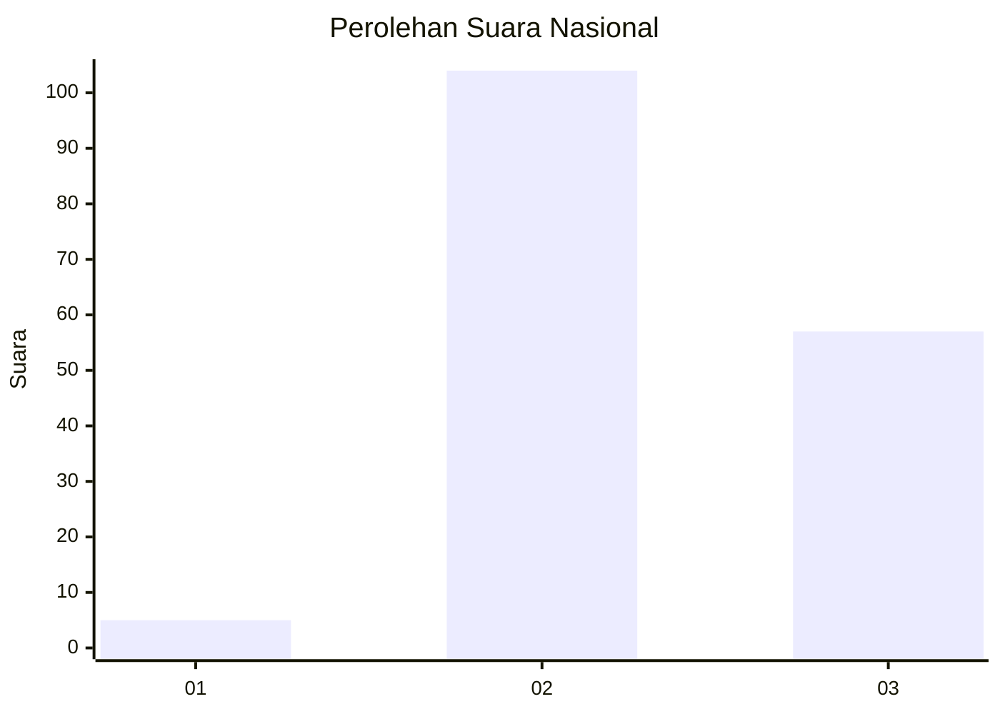
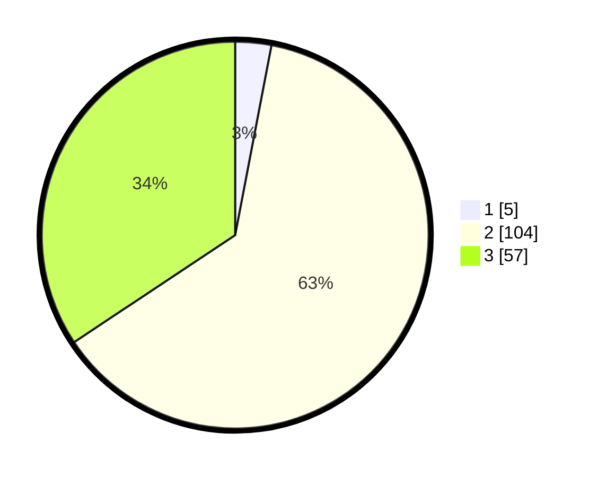

# Hasil

## Grafik

## Tabel

| No. | Nama Paslon    | Suara | Suara (raw) | Persentase |
|:--- |:-------------- | -----:| -----------:| ----------:|
| 1   | ANIES MUHAIMIN | 5     | [5][p-1]    | 3,01       |
| 2   | PRABOWO GIBRAN | 104   | [104][p-2]  | 62,65      |
| 3   | GANJAR MAHFUD  | 57    | [57][p-3]   | 34,34      |

[p-1]: https://github.com/gigit-pemilu/pemilu-2024/blob/main/pilpres/hitung-suara/sub/51-bali/sub/07-karangasem/sub/06-bebandem/sub/2003-bebandem/sub/037-tps/sub/paslon-1.txt
[p-2]: https://github.com/gigit-pemilu/pemilu-2024/blob/main/pilpres/hitung-suara/sub/51-bali/sub/07-karangasem/sub/06-bebandem/sub/2003-bebandem/sub/037-tps/sub/paslon-2.txt
[p-3]: https://github.com/gigit-pemilu/pemilu-2024/blob/main/pilpres/hitung-suara/sub/51-bali/sub/07-karangasem/sub/06-bebandem/sub/2003-bebandem/sub/037-tps/sub/paslon-3.txt

## Foto C Plano

https://sirekap-obj-formc.kpu.go.id/305d/pemilu/ppwp/51/07/06/20/03/5107062003037-20240214-203526--28ffcb68-2de2-4e45-ac5e-ff11b8c0ec80.jpg

https://sirekap-obj-formc.kpu.go.id/305d/pemilu/ppwp/51/07/06/20/03/5107062003037-20240214-133047--6964826a-df09-4355-adb5-955a7bc47a47.jpg

## Metadata

| Key        | Value               |
| ---------- | ------------------- |
| Time Stamp | 2024-02-21 14:00:00 |

