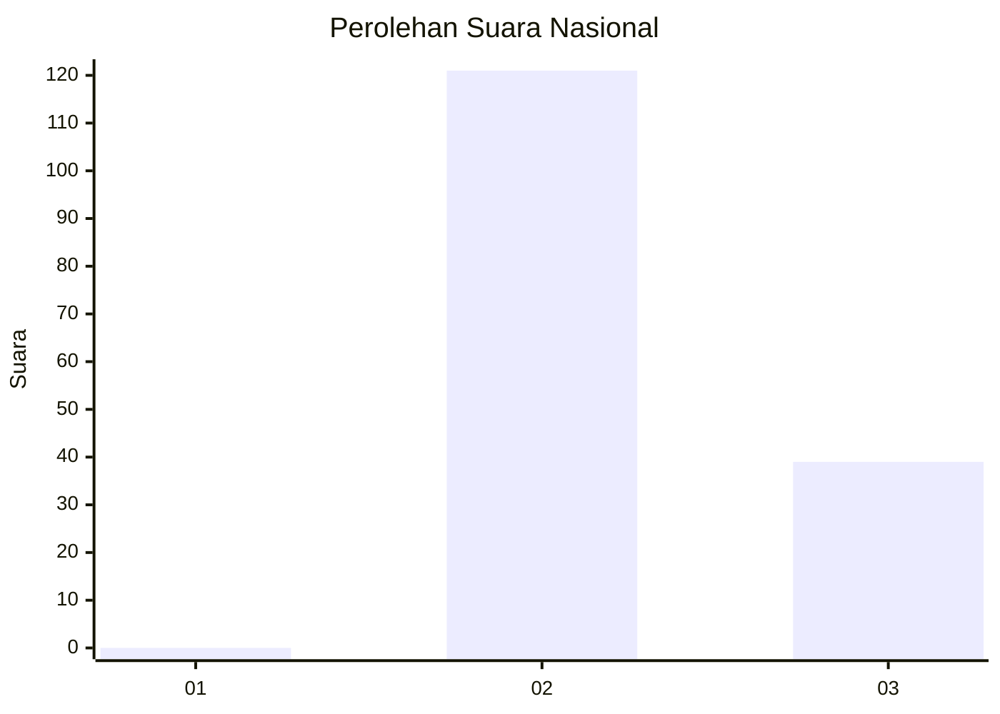
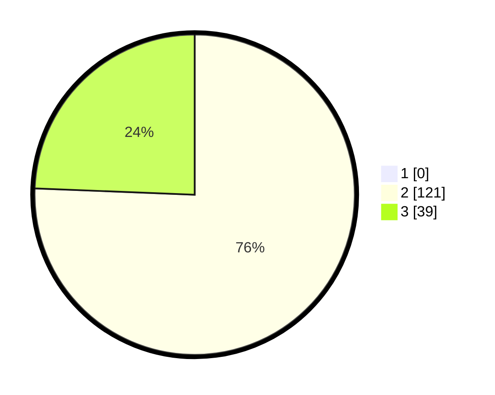

# Hasil

## Grafik

## Tabel

| No. | Nama Paslon    | Suara | Suara (raw) | Persentase |
|:--- |:-------------- | -----:| -----------:| ----------:|
| 1   | ANIES MUHAIMIN | 0     | [0][p-1]    | 0,00       |
| 2   | PRABOWO GIBRAN | 121   | [121][p-2]  | 75,63      |
| 3   | GANJAR MAHFUD  | 39    | [39][p-3]   | 24,38      |

[p-1]: https://github.com/gigit-pemilu/pemilu-2024/blob/main/pilpres/hitung-suara/sub/51-bali/sub/07-karangasem/sub/06-bebandem/sub/2004-sibetan/sub/002-tps/sub/paslon-1.txt
[p-2]: https://github.com/gigit-pemilu/pemilu-2024/blob/main/pilpres/hitung-suara/sub/51-bali/sub/07-karangasem/sub/06-bebandem/sub/2004-sibetan/sub/002-tps/sub/paslon-2.txt
[p-3]: https://github.com/gigit-pemilu/pemilu-2024/blob/main/pilpres/hitung-suara/sub/51-bali/sub/07-karangasem/sub/06-bebandem/sub/2004-sibetan/sub/002-tps/sub/paslon-3.txt

## Foto C Plano

https://sirekap-obj-formc.kpu.go.id/53a6/pemilu/ppwp/51/07/06/20/04/5107062004002-20240216-083419--50b3adbd-a220-46b5-86c6-113164ffcd9e.jpg

https://sirekap-obj-formc.kpu.go.id/53a6/pemilu/ppwp/51/07/06/20/04/5107062004002-20240216-083829--7b603c51-2de9-4bcf-a2e8-43f4f6d231de.jpg

https://sirekap-obj-formc.kpu.go.id/53a6/pemilu/ppwp/51/07/06/20/04/5107062004002-20240216-083834--586f89fc-f06a-4716-a10c-a93b2a985bc2.jpg

## Metadata

| Key        | Value               |
| ---------- | ------------------- |
| Time Stamp | 2024-02-24 22:31:28 |

