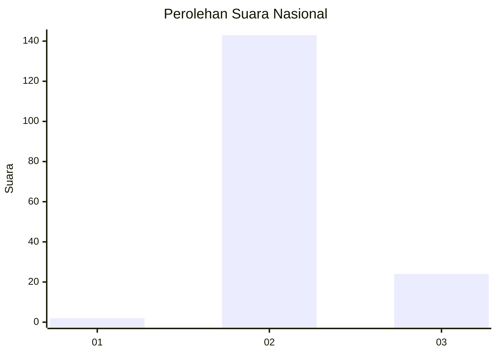
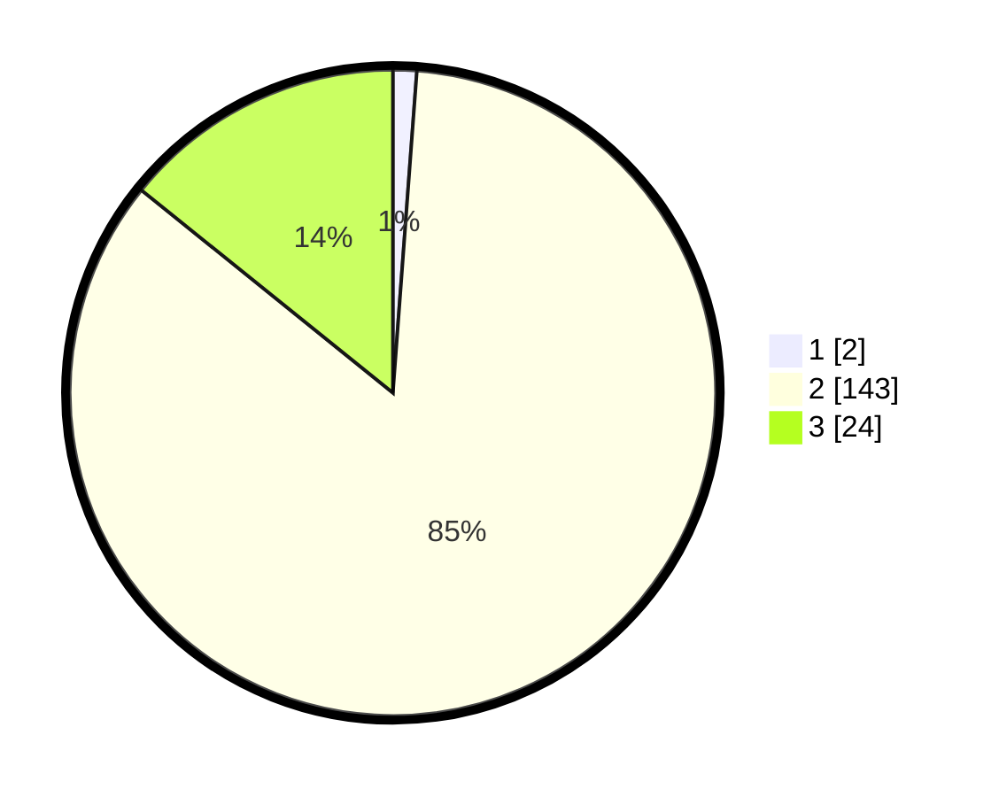

# Hasil

## Grafik

## Tabel

| No. | Nama Paslon    | Suara | Suara (raw) | Persentase |
|:--- |:-------------- | -----:| -----------:| ----------:|
| 1   | ANIES MUHAIMIN | 2     | [2][p-1]    | 1,18       |
| 2   | PRABOWO GIBRAN | 143   | [143][p-2]  | 84,62      |
| 3   | GANJAR MAHFUD  | 24    | [24][p-3]   | 14,20      |

[p-1]: https://github.com/gigit-pemilu/pemilu-2024/blob/main/pilpres/hitung-suara/sub/51-bali/sub/07-karangasem/sub/06-bebandem/sub/2004-sibetan/sub/004-tps/sub/paslon-1.txt
[p-2]: https://github.com/gigit-pemilu/pemilu-2024/blob/main/pilpres/hitung-suara/sub/51-bali/sub/07-karangasem/sub/06-bebandem/sub/2004-sibetan/sub/004-tps/sub/paslon-2.txt
[p-3]: https://github.com/gigit-pemilu/pemilu-2024/blob/main/pilpres/hitung-suara/sub/51-bali/sub/07-karangasem/sub/06-bebandem/sub/2004-sibetan/sub/004-tps/sub/paslon-3.txt

## Foto C Plano

https://sirekap-obj-formc.kpu.go.id/65d5/pemilu/ppwp/51/07/06/20/04/5107062004004-20240215-130521--78c42478-c35e-46d5-b5d0-50598f4fbd4c.jpg

https://sirekap-obj-formc.kpu.go.id/65d5/pemilu/ppwp/51/07/06/20/04/5107062004004-20240215-130534--3d54a0a3-a279-4621-a06a-61300c94731e.jpg

https://sirekap-obj-formc.kpu.go.id/65d5/pemilu/ppwp/51/07/06/20/04/5107062004004-20240215-130537--3b4be7af-5beb-4426-a447-ba5ac23aeb78.jpg

## Metadata

| Key        | Value               |
| ---------- | ------------------- |
| Time Stamp | 2024-02-19 06:16:00 |

