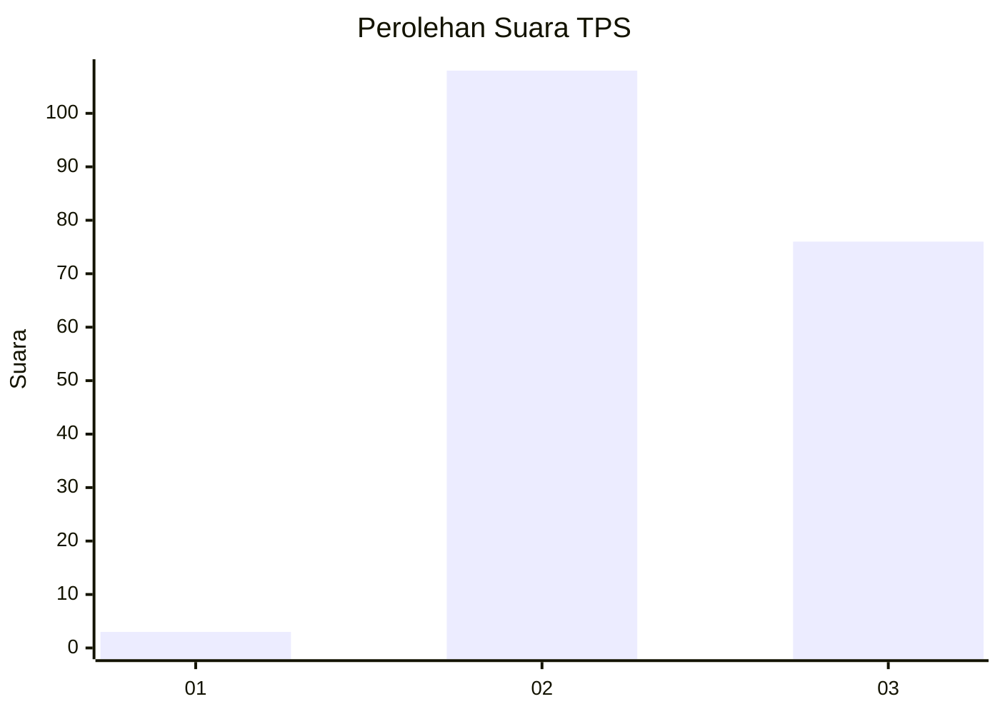
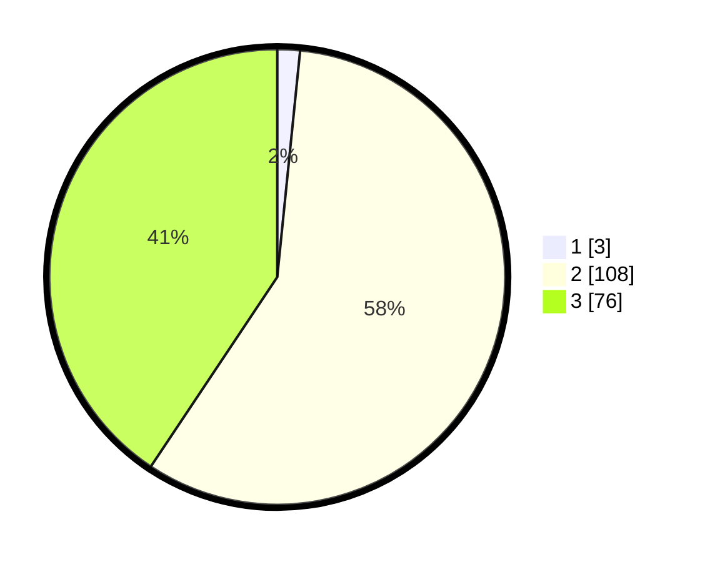

# Hasil

## Grafik

## Tabel

| No. | Nama Paslon    | Suara | Suara (raw) | Persentase |
|:--- |:-------------- | -----:| -----------:| ----------:|
| 1   | ANIES MUHAIMIN | 3     | [3][p-1]    | 1,60       |
| 2   | PRABOWO GIBRAN | 108   | [108][p-2]  | 57,75      |
| 3   | GANJAR MAHFUD  | 76    | [76][p-3]   | 40,64      |

[p-1]: https://github.com/gigit-pemilu/pemilu-2024-51-bali/blob/main/pilpres/hitung-suara/sub/51-bali/sub/07-karangasem/sub/06-bebandem/sub/2004-sibetan/sub/012-tps/sub/paslon-1.txt
[p-2]: https://github.com/gigit-pemilu/pemilu-2024-51-bali/blob/main/pilpres/hitung-suara/sub/51-bali/sub/07-karangasem/sub/06-bebandem/sub/2004-sibetan/sub/012-tps/sub/paslon-2.txt
[p-3]: https://github.com/gigit-pemilu/pemilu-2024-51-bali/blob/main/pilpres/hitung-suara/sub/51-bali/sub/07-karangasem/sub/06-bebandem/sub/2004-sibetan/sub/012-tps/sub/paslon-3.txt

## Foto C Plano

https://sirekap-obj-formc.kpu.go.id/0d29/pemilu/ppwp/51/07/06/20/04/5107062004012-20240214-190525--1aead7c4-412a-40a4-adce-c32b7590510e.jpg

https://sirekap-obj-formc.kpu.go.id/0d29/pemilu/ppwp/51/07/06/20/04/5107062004012-20240214-190613--c3161376-948a-4041-a944-da1edb2e0cef.jpg

https://sirekap-obj-formc.kpu.go.id/0d29/pemilu/ppwp/51/07/06/20/04/5107062004012-20240214-190703--153c7f62-1437-4251-b030-204a5c25b5b8.jpg

## Metadata

| Key        | Value               |
| ---------- | ------------------- |
| Time Stamp | 2024-02-19 06:16:00 |

