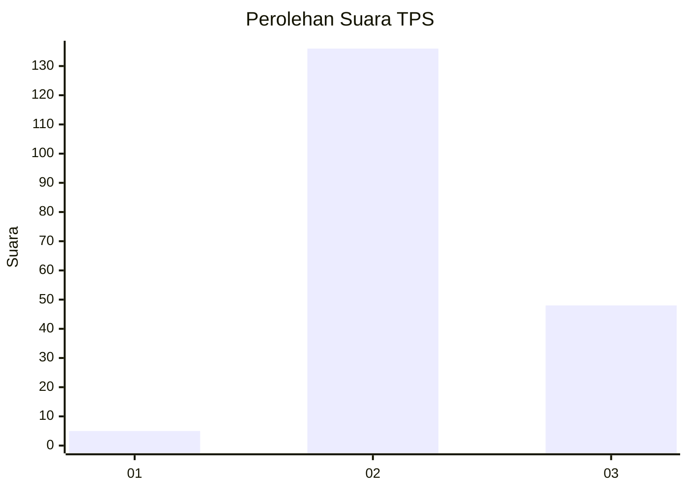
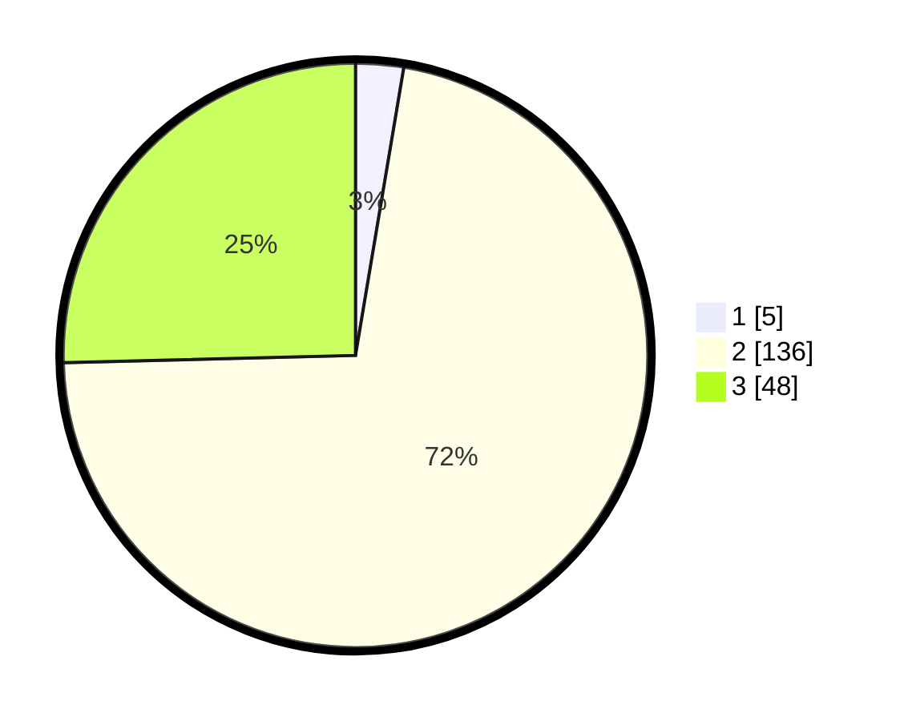

# Hasil

## Grafik

## Tabel

| No. | Nama Paslon    | Suara | Suara (raw) | Persentase |
|:--- |:-------------- | -----:| -----------:| ----------:|
| 1   | ANIES MUHAIMIN | 5     | [5][p-1]    | 2,65       |
| 2   | PRABOWO GIBRAN | 136   | [136][p-2]  | 71,96      |
| 3   | GANJAR MAHFUD  | 48    | [48][p-3]   | 25,40      |

[p-1]: https://github.com/gigit-pemilu/pemilu-2024-51-bali/blob/main/pilpres/hitung-suara/sub/51-bali/sub/07-karangasem/sub/06-bebandem/sub/2004-sibetan/sub/014-tps/sub/paslon-1.txt
[p-2]: https://github.com/gigit-pemilu/pemilu-2024-51-bali/blob/main/pilpres/hitung-suara/sub/51-bali/sub/07-karangasem/sub/06-bebandem/sub/2004-sibetan/sub/014-tps/sub/paslon-2.txt
[p-3]: https://github.com/gigit-pemilu/pemilu-2024-51-bali/blob/main/pilpres/hitung-suara/sub/51-bali/sub/07-karangasem/sub/06-bebandem/sub/2004-sibetan/sub/014-tps/sub/paslon-3.txt

## Foto C Plano

https://sirekap-obj-formc.kpu.go.id/29a0/pemilu/ppwp/51/07/06/20/04/5107062004014-20240215-140028--9cbf3a45-2335-4401-8b26-506637652cb4.jpg

https://sirekap-obj-formc.kpu.go.id/29a0/pemilu/ppwp/51/07/06/20/04/5107062004014-20240215-140053--1ef3ba67-df57-4ea1-90d0-db37f78349e0.jpg

https://sirekap-obj-formc.kpu.go.id/29a0/pemilu/ppwp/51/07/06/20/04/5107062004014-20240215-140114--60b441d4-e4e5-411f-9ec3-e6349ef0c228.jpg

## Metadata

| Key        | Value               |
| ---------- | ------------------- |
| Time Stamp | 2024-02-19 06:16:00 |

