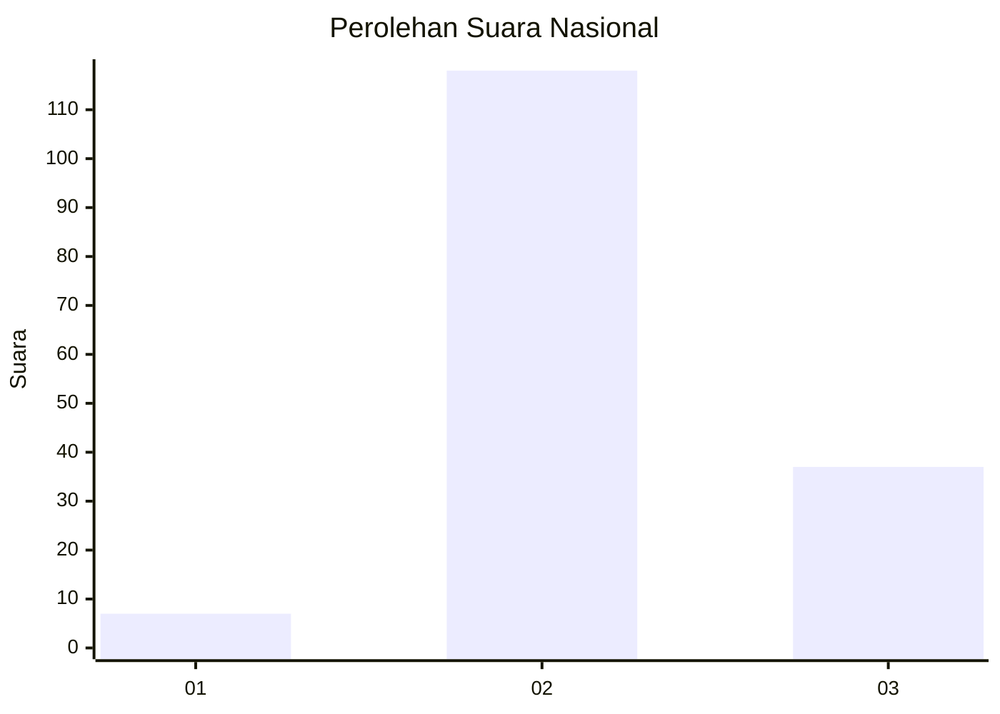
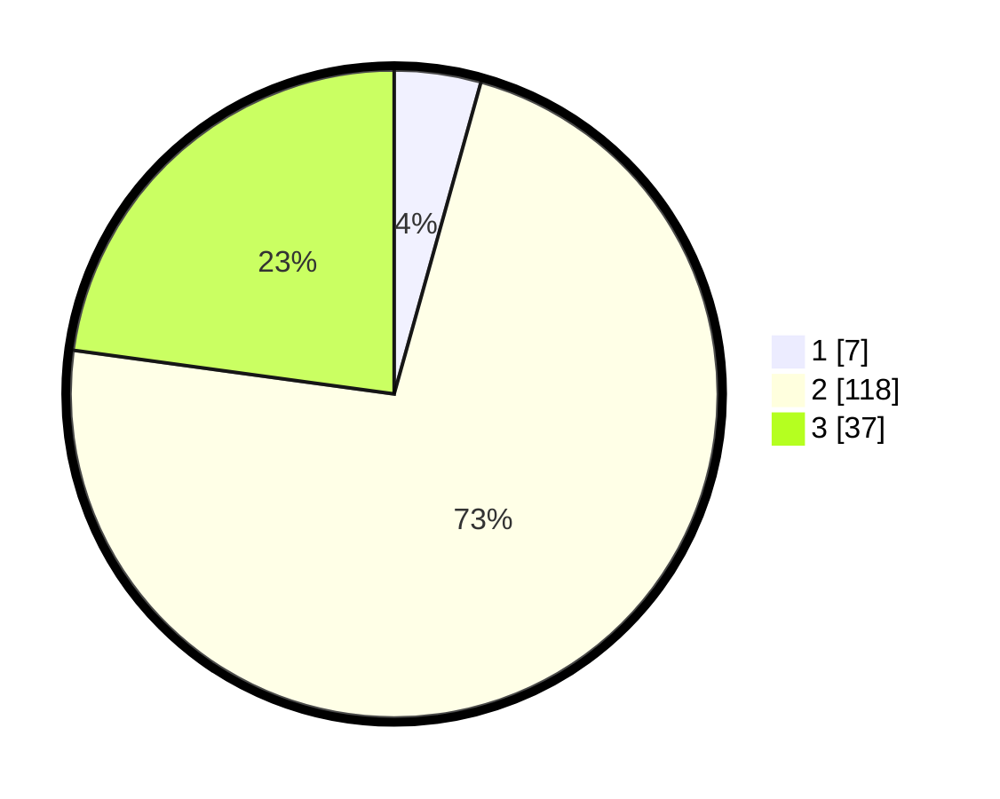

# Hasil

## Grafik

## Tabel

| No. | Nama Paslon    | Suara | Suara (raw) | Persentase |
|:--- |:-------------- | -----:| -----------:| ----------:|
| 1   | ANIES MUHAIMIN | 7     | [7][p-1]    | 4,32       |
| 2   | PRABOWO GIBRAN | 118   | [118][p-2]  | 72,84      |
| 3   | GANJAR MAHFUD  | 37    | [37][p-3]   | 22,84      |

[p-1]: https://github.com/gigit-pemilu/pemilu-2024/blob/main/pilpres/hitung-suara/sub/51-bali/sub/07-karangasem/sub/06-bebandem/sub/2004-sibetan/sub/015-tps/sub/paslon-1.txt
[p-2]: https://github.com/gigit-pemilu/pemilu-2024/blob/main/pilpres/hitung-suara/sub/51-bali/sub/07-karangasem/sub/06-bebandem/sub/2004-sibetan/sub/015-tps/sub/paslon-2.txt
[p-3]: https://github.com/gigit-pemilu/pemilu-2024/blob/main/pilpres/hitung-suara/sub/51-bali/sub/07-karangasem/sub/06-bebandem/sub/2004-sibetan/sub/015-tps/sub/paslon-3.txt

## Foto C Plano

https://sirekap-obj-formc.kpu.go.id/4e7c/pemilu/ppwp/51/07/06/20/04/5107062004015-20240214-212332--98c1229d-d251-48e1-b7b2-fe353fb9d4e8.jpg

https://sirekap-obj-formc.kpu.go.id/4e7c/pemilu/ppwp/51/07/06/20/04/5107062004015-20240214-201339--2a4549a8-be05-402c-9f6f-7d22f087cc6e.jpg

## Metadata

| Key        | Value               |
| ---------- | ------------------- |
| Time Stamp | 2024-02-19 06:16:00 |

