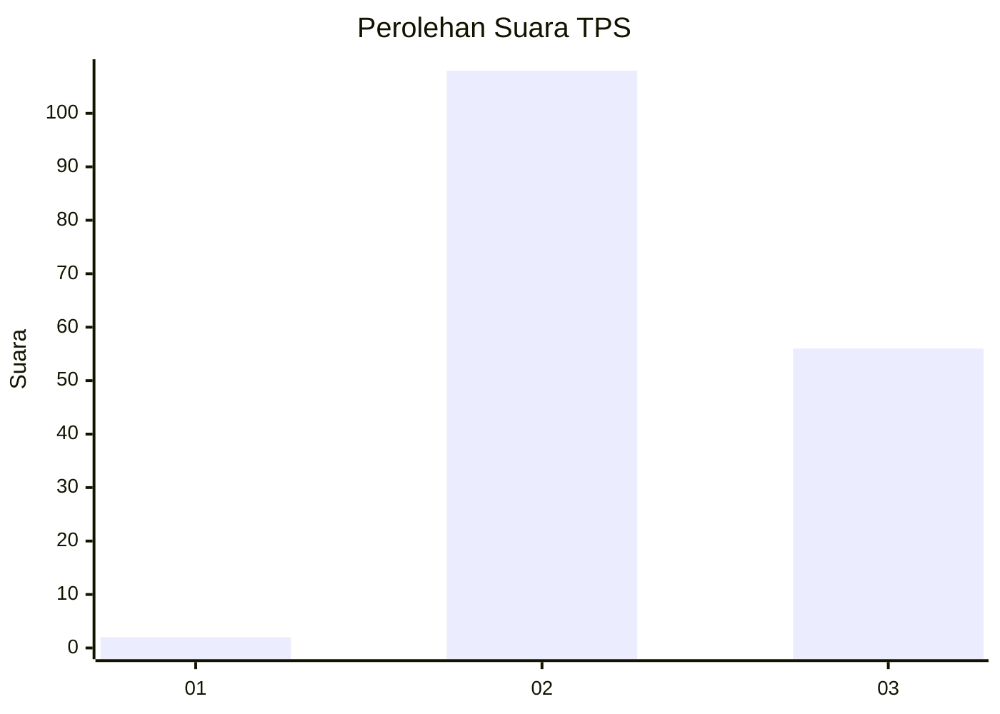
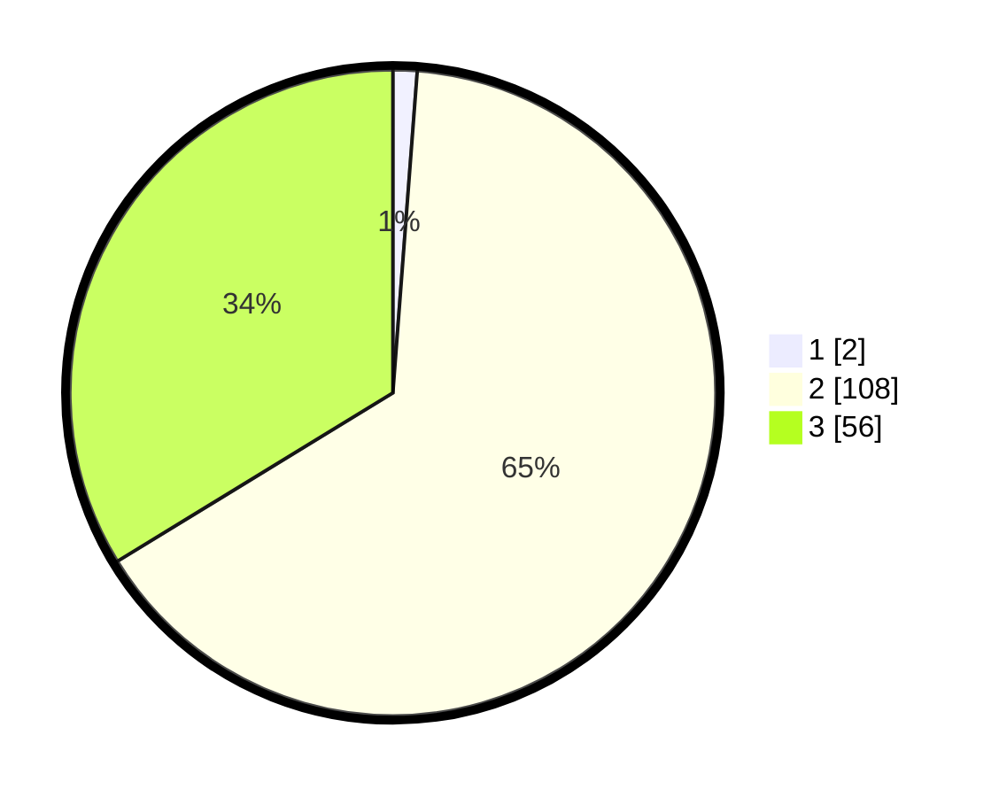

# Hasil

## Grafik

## Tabel

| No. | Nama Paslon    | Suara | Suara (raw) | Persentase |
|:--- |:-------------- | -----:| -----------:| ----------:|
| 1   | ANIES MUHAIMIN | 2     | [2][p-1]    | 1,20       |
| 2   | PRABOWO GIBRAN | 108   | [108][p-2]  | 65,06      |
| 3   | GANJAR MAHFUD  | 56    | [56][p-3]   | 33,73      |

[p-1]: https://github.com/gigit-pemilu/pemilu-2024-51-bali/blob/main/pilpres/hitung-suara/sub/51-bali/sub/07-karangasem/sub/06-bebandem/sub/2004-sibetan/sub/020-tps/sub/paslon-1.txt
[p-2]: https://github.com/gigit-pemilu/pemilu-2024-51-bali/blob/main/pilpres/hitung-suara/sub/51-bali/sub/07-karangasem/sub/06-bebandem/sub/2004-sibetan/sub/020-tps/sub/paslon-2.txt
[p-3]: https://github.com/gigit-pemilu/pemilu-2024-51-bali/blob/main/pilpres/hitung-suara/sub/51-bali/sub/07-karangasem/sub/06-bebandem/sub/2004-sibetan/sub/020-tps/sub/paslon-3.txt

## Foto C Plano

https://sirekap-obj-formc.kpu.go.id/55f8/pemilu/ppwp/51/07/06/20/04/5107062004020-20240215-164648--fc941354-0aac-46b5-8edf-686fd2ed06e1.jpg

https://sirekap-obj-formc.kpu.go.id/55f8/pemilu/ppwp/51/07/06/20/04/5107062004020-20240215-164800--0a35e292-6aee-4138-8153-31d3a33d78dc.jpg

https://sirekap-obj-formc.kpu.go.id/55f8/pemilu/ppwp/51/07/06/20/04/5107062004020-20240215-165031--ffd13e2e-550e-4b94-96f9-b14ce98dad81.jpg

## Metadata

| Key        | Value               |
| ---------- | ------------------- |
| Time Stamp | 2024-02-24 22:31:28 |

