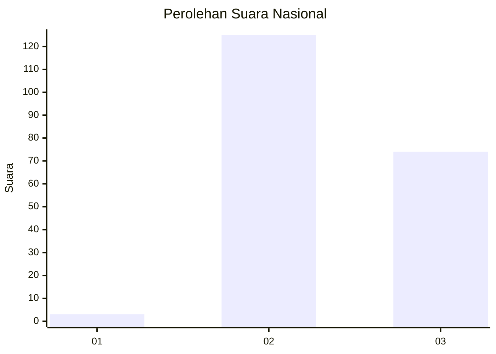
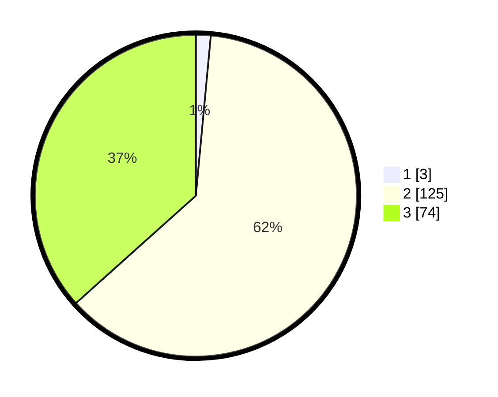

# Hasil

## Grafik

## Tabel

| No. | Nama Paslon    | Suara | Suara (raw) | Persentase |
|:--- |:-------------- | -----:| -----------:| ----------:|
| 1   | ANIES MUHAIMIN | 3     | [3][p-1]    | 1,49       |
| 2   | PRABOWO GIBRAN | 125   | [125][p-2]  | 61,88      |
| 3   | GANJAR MAHFUD  | 74    | [74][p-3]   | 36,63      |

[p-1]: https://github.com/gigit-pemilu/pemilu-2024/blob/main/pilpres/hitung-suara/sub/51-bali/sub/07-karangasem/sub/06-bebandem/sub/2004-sibetan/sub/025-tps/sub/paslon-1.txt
[p-2]: https://github.com/gigit-pemilu/pemilu-2024/blob/main/pilpres/hitung-suara/sub/51-bali/sub/07-karangasem/sub/06-bebandem/sub/2004-sibetan/sub/025-tps/sub/paslon-2.txt
[p-3]: https://github.com/gigit-pemilu/pemilu-2024/blob/main/pilpres/hitung-suara/sub/51-bali/sub/07-karangasem/sub/06-bebandem/sub/2004-sibetan/sub/025-tps/sub/paslon-3.txt

## Foto C Plano

https://sirekap-obj-formc.kpu.go.id/764c/pemilu/ppwp/51/07/06/20/04/5107062004025-20240215-072147--d3a1d0b5-55f1-49db-b70f-e5c5f4512e2e.jpg

https://sirekap-obj-formc.kpu.go.id/764c/pemilu/ppwp/51/07/06/20/04/5107062004025-20240216-071652--d224775d-8cd2-49aa-9877-6a918cf4829d.jpg

https://sirekap-obj-formc.kpu.go.id/764c/pemilu/ppwp/51/07/06/20/04/5107062004025-20240215-082521--aeae9cf6-9799-473c-a95e-df21b1b37792.jpg

## Metadata

| Key        | Value               |
| ---------- | ------------------- |
| Time Stamp | 2024-02-16 12:51:22 |

