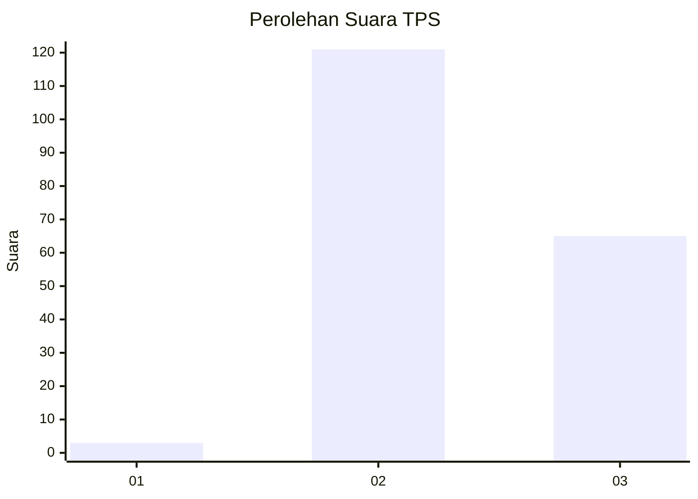
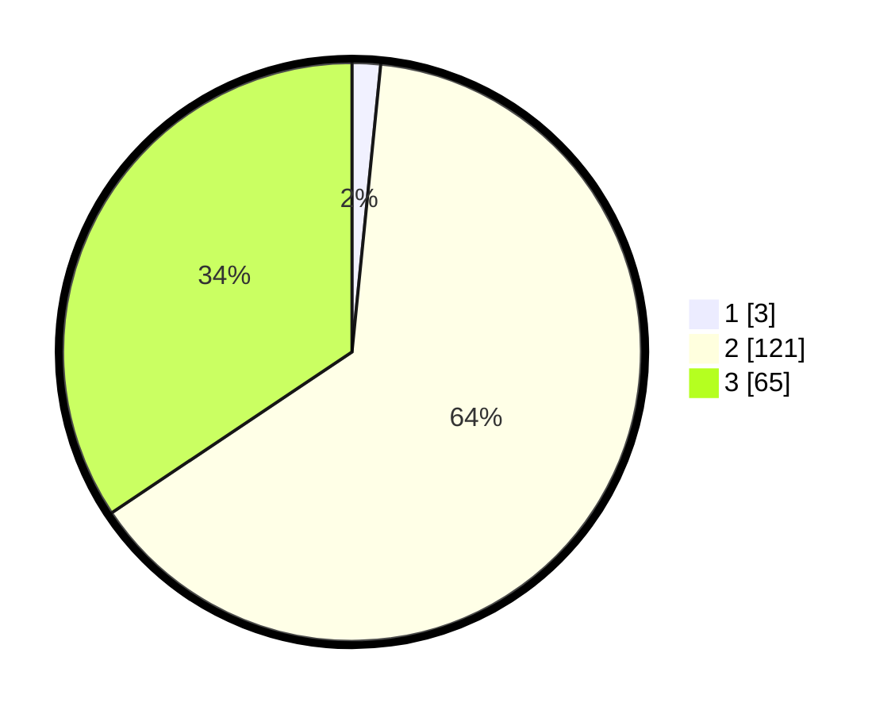

# Hasil

## Grafik

## Tabel

| No. | Nama Paslon    | Suara | Suara (raw) | Persentase |
|:--- |:-------------- | -----:| -----------:| ----------:|
| 1   | ANIES MUHAIMIN | 3     | [3][p-1]    | 1,59       |
| 2   | PRABOWO GIBRAN | 121   | [121][p-2]  | 64,02      |
| 3   | GANJAR MAHFUD  | 65    | [65][p-3]   | 34,39      |

[p-1]: https://github.com/gigit-pemilu/pemilu-2024-51-bali/blob/main/pilpres/hitung-suara/sub/51-bali/sub/07-karangasem/sub/06-bebandem/sub/2004-sibetan/sub/027-tps/sub/paslon-1.txt
[p-2]: https://github.com/gigit-pemilu/pemilu-2024-51-bali/blob/main/pilpres/hitung-suara/sub/51-bali/sub/07-karangasem/sub/06-bebandem/sub/2004-sibetan/sub/027-tps/sub/paslon-2.txt
[p-3]: https://github.com/gigit-pemilu/pemilu-2024-51-bali/blob/main/pilpres/hitung-suara/sub/51-bali/sub/07-karangasem/sub/06-bebandem/sub/2004-sibetan/sub/027-tps/sub/paslon-3.txt

## Foto C Plano

https://sirekap-obj-formc.kpu.go.id/6d92/pemilu/ppwp/51/07/06/20/04/5107062004027-20240214-141742--4a19f276-9171-445c-896a-07b312bed5d5.jpg

https://sirekap-obj-formc.kpu.go.id/6d92/pemilu/ppwp/51/07/06/20/04/5107062004027-20240214-141423--35aee62d-ef46-4e6d-a371-d1028d5f83b0.jpg

https://sirekap-obj-formc.kpu.go.id/6d92/pemilu/ppwp/51/07/06/20/04/5107062004027-20240214-141135--3e743f87-2ad9-4767-b80a-97ebb647132a.jpg

## Metadata

| Key        | Value               |
| ---------- | ------------------- |
| Time Stamp | 2024-02-24 22:31:28 |

