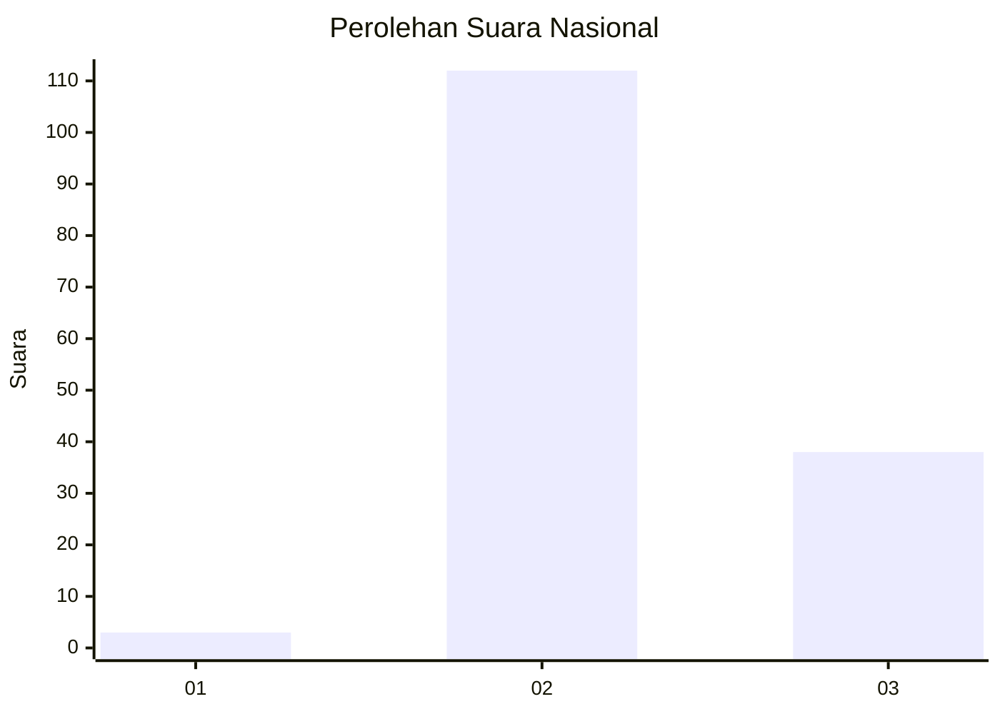
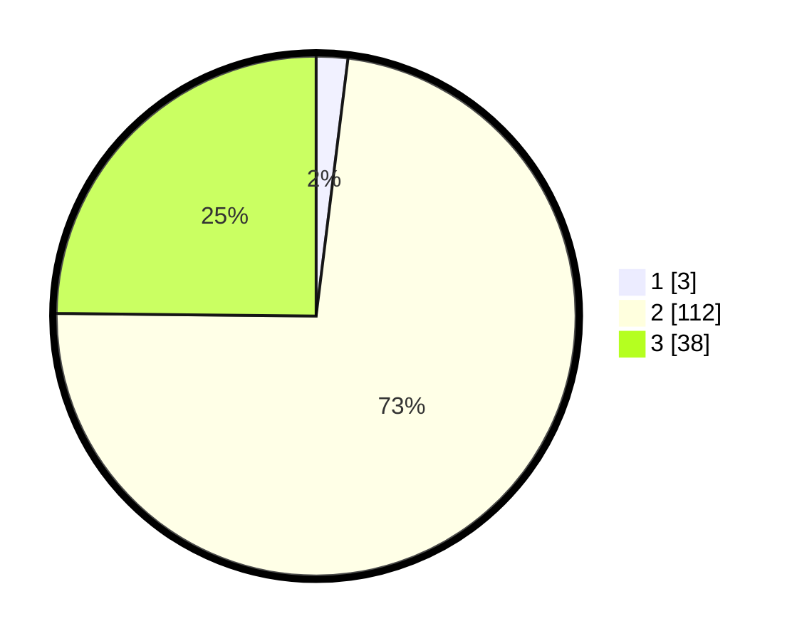

# Hasil

## Grafik

## Tabel

| No. | Nama Paslon    | Suara | Suara (raw) | Persentase |
|:--- |:-------------- | -----:| -----------:| ----------:|
| 1   | ANIES MUHAIMIN | 3     | [3][p-1]    | 1,96       |
| 2   | PRABOWO GIBRAN | 112   | [112][p-2]  | 73,20      |
| 3   | GANJAR MAHFUD  | 38    | [38][p-3]   | 24,84      |

[p-1]: https://github.com/gigit-pemilu/pemilu-2024/blob/main/pilpres/hitung-suara/sub/51-bali/sub/07-karangasem/sub/06-bebandem/sub/2004-sibetan/sub/029-tps/sub/paslon-1.txt
[p-2]: https://github.com/gigit-pemilu/pemilu-2024/blob/main/pilpres/hitung-suara/sub/51-bali/sub/07-karangasem/sub/06-bebandem/sub/2004-sibetan/sub/029-tps/sub/paslon-2.txt
[p-3]: https://github.com/gigit-pemilu/pemilu-2024/blob/main/pilpres/hitung-suara/sub/51-bali/sub/07-karangasem/sub/06-bebandem/sub/2004-sibetan/sub/029-tps/sub/paslon-3.txt

## Foto C Plano

https://sirekap-obj-formc.kpu.go.id/d540/pemilu/ppwp/51/07/06/20/04/5107062004029-20240214-202858--187c8f4f-3e58-4ea0-876b-8b7cab76b684.jpg

https://sirekap-obj-formc.kpu.go.id/d540/pemilu/ppwp/51/07/06/20/04/5107062004029-20240214-204152--e12e9d44-e8ad-4cbd-b22d-0981ea450944.jpg

https://sirekap-obj-formc.kpu.go.id/d540/pemilu/ppwp/51/07/06/20/04/5107062004029-20240214-204357--808f4534-d7eb-44d2-bec9-2cbf37643435.jpg

## Metadata

| Key        | Value               |
| ---------- | ------------------- |
| Time Stamp | 2024-02-19 06:16:00 |

