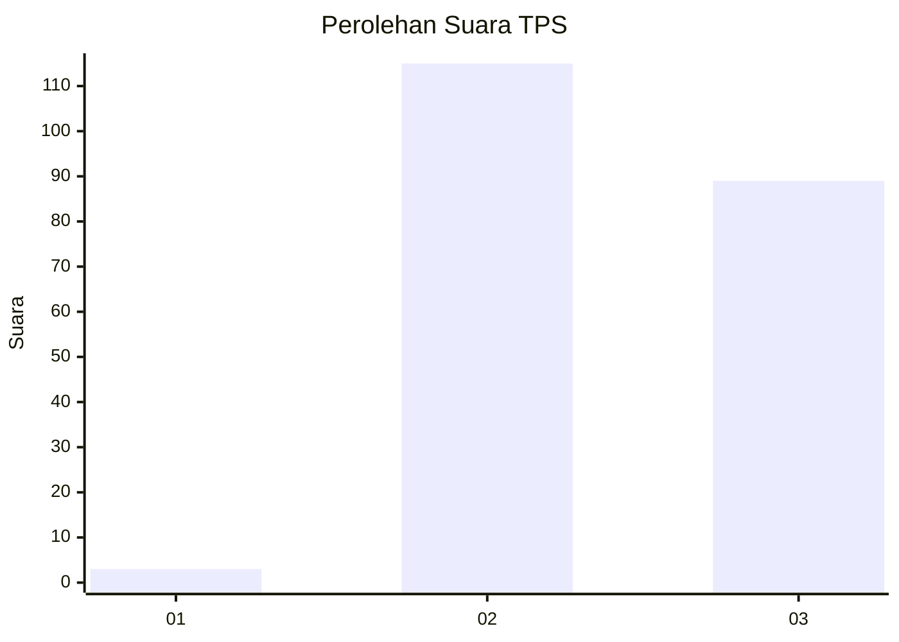
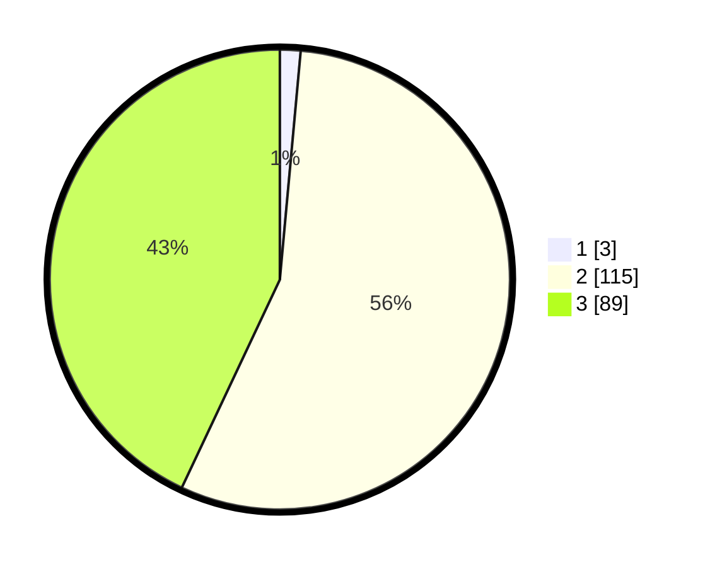

# Hasil

## Grafik

## Tabel

| No. | Nama Paslon    | Suara | Suara (raw) | Persentase |
|:--- |:-------------- | -----:| -----------:| ----------:|
| 1   | ANIES MUHAIMIN | 3     | [3][p-1]    | 1,45       |
| 2   | PRABOWO GIBRAN | 115   | [115][p-2]  | 55,56      |
| 3   | GANJAR MAHFUD  | 89    | [89][p-3]   | 43,00      |

[p-1]: https://github.com/gigit-pemilu/pemilu-2024-51-bali/blob/main/pilpres/hitung-suara/sub/51-bali/sub/07-karangasem/sub/06-bebandem/sub/2004-sibetan/sub/030-tps/sub/paslon-1.txt
[p-2]: https://github.com/gigit-pemilu/pemilu-2024-51-bali/blob/main/pilpres/hitung-suara/sub/51-bali/sub/07-karangasem/sub/06-bebandem/sub/2004-sibetan/sub/030-tps/sub/paslon-2.txt
[p-3]: https://github.com/gigit-pemilu/pemilu-2024-51-bali/blob/main/pilpres/hitung-suara/sub/51-bali/sub/07-karangasem/sub/06-bebandem/sub/2004-sibetan/sub/030-tps/sub/paslon-3.txt

## Foto C Plano

https://sirekap-obj-formc.kpu.go.id/f6f5/pemilu/ppwp/51/07/06/20/04/5107062004030-20240214-200923--6201c68e-d6a7-4213-af83-520c8e8dca52.jpg

https://sirekap-obj-formc.kpu.go.id/f6f5/pemilu/ppwp/51/07/06/20/04/5107062004030-20240214-200852--6124d75d-1fa4-4b29-9017-b8975948fd49.jpg

https://sirekap-obj-formc.kpu.go.id/f6f5/pemilu/ppwp/51/07/06/20/04/5107062004030-20240214-200949--f2ef8bb2-4912-4dfd-8161-6b5a4b8cd2db.jpg

## Metadata

| Key        | Value               |
| ---------- | ------------------- |
| Time Stamp | 2024-02-24 22:31:28 |

