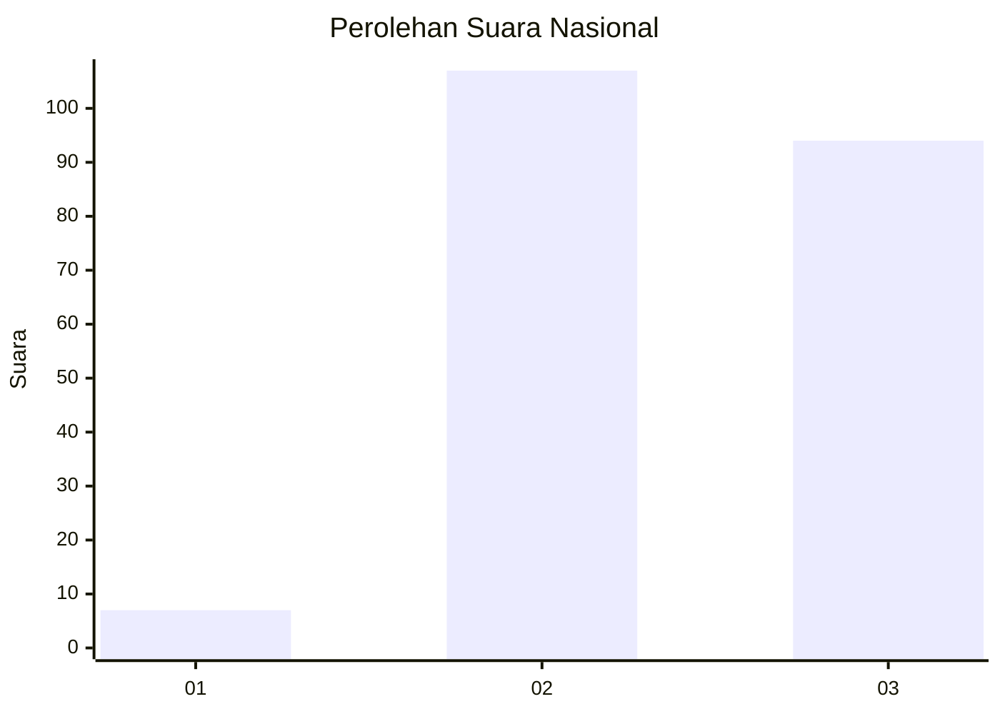
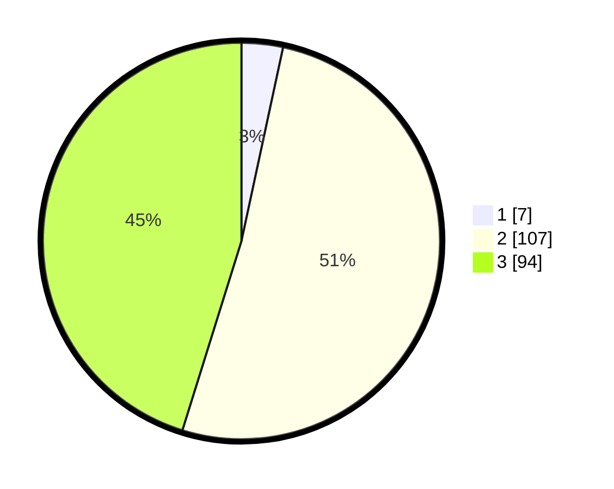

# Hasil

## Grafik

## Tabel

| No. | Nama Paslon    | Suara | Suara (raw) | Persentase |
|:--- |:-------------- | -----:| -----------:| ----------:|
| 1   | ANIES MUHAIMIN | 7     | [7][p-1]    | 3,37       |
| 2   | PRABOWO GIBRAN | 107   | [107][p-2]  | 51,44      |
| 3   | GANJAR MAHFUD  | 94    | [94][p-3]   | 45,19      |

[p-1]: https://github.com/gigit-pemilu/pemilu-2024/blob/main/pilpres/hitung-suara/sub/51-bali/sub/07-karangasem/sub/06-bebandem/sub/2004-sibetan/sub/031-tps/sub/paslon-1.txt
[p-2]: https://github.com/gigit-pemilu/pemilu-2024/blob/main/pilpres/hitung-suara/sub/51-bali/sub/07-karangasem/sub/06-bebandem/sub/2004-sibetan/sub/031-tps/sub/paslon-2.txt
[p-3]: https://github.com/gigit-pemilu/pemilu-2024/blob/main/pilpres/hitung-suara/sub/51-bali/sub/07-karangasem/sub/06-bebandem/sub/2004-sibetan/sub/031-tps/sub/paslon-3.txt

## Foto C Plano

https://sirekap-obj-formc.kpu.go.id/e385/pemilu/ppwp/51/07/06/20/04/5107062004031-20240214-225624--5c783229-47b8-48b7-bd00-cfe41c3f9185.jpg

https://sirekap-obj-formc.kpu.go.id/e385/pemilu/ppwp/51/07/06/20/04/5107062004031-20240214-225738--e8fce634-00aa-4239-8de9-610ec0ee7487.jpg

https://sirekap-obj-formc.kpu.go.id/e385/pemilu/ppwp/51/07/06/20/04/5107062004031-20240214-214613--85a78026-6593-441a-8174-0435552b42df.jpg

## Metadata

| Key        | Value               |
| ---------- | ------------------- |
| Time Stamp | 2024-02-24 22:31:28 |

