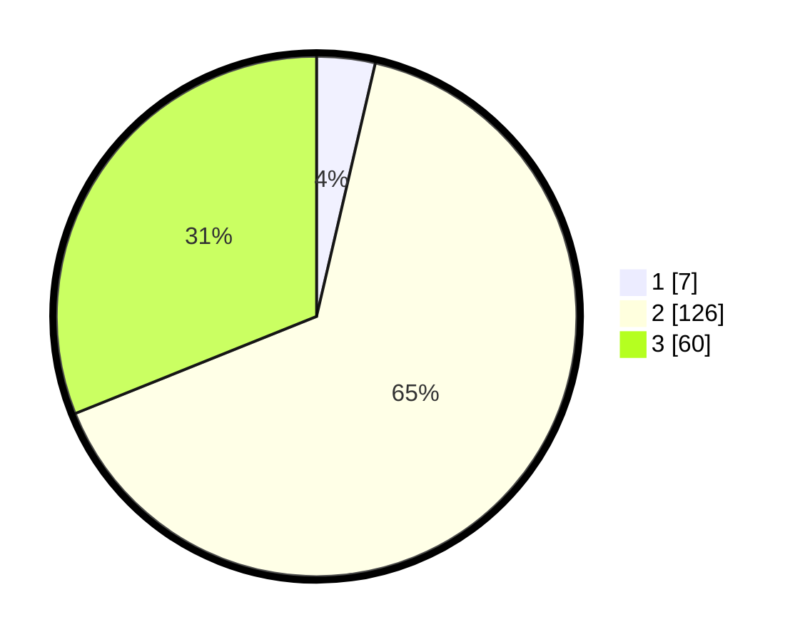

# Hasil

## Grafik

## Tabel

| No. | Nama Paslon    | Suara | Suara (raw) | Persentase |
|:--- |:-------------- | -----:| -----------:| ----------:|
| 1   | ANIES MUHAIMIN | 7     | [7][p-1]    | 3,63       |
| 2   | PRABOWO GIBRAN | 126   | [126][p-2]  | 65,28      |
| 3   | GANJAR MAHFUD  | 60    | [60][p-3]   | 31,09      |

[p-1]: https://github.com/gigit-pemilu/pemilu-2024-51-bali/blob/main/pilpres/hitung-suara/sub/51-bali/sub/07-karangasem/sub/06-bebandem/sub/2005-jungutan/sub/003-tps/sub/paslon-1.txt
[p-2]: https://github.com/gigit-pemilu/pemilu-2024-51-bali/blob/main/pilpres/hitung-suara/sub/51-bali/sub/07-karangasem/sub/06-bebandem/sub/2005-jungutan/sub/003-tps/sub/paslon-2.txt
[p-3]: https://github.com/gigit-pemilu/pemilu-2024-51-bali/blob/main/pilpres/hitung-suara/sub/51-bali/sub/07-karangasem/sub/06-bebandem/sub/2005-jungutan/sub/003-tps/sub/paslon-3.txt

## Foto C Plano

https://sirekap-obj-formc.kpu.go.id/eb99/pemilu/ppwp/51/07/06/20/05/5107062005003-20240214-132509--2eac1d8f-67bb-4d14-bf8f-26dead5c412a.jpg

https://sirekap-obj-formc.kpu.go.id/eb99/pemilu/ppwp/51/07/06/20/05/5107062005003-20240214-130446--01ba7a6d-6ac6-4497-949a-5178fcb1d6e9.jpg

https://sirekap-obj-formc.kpu.go.id/eb99/pemilu/ppwp/51/07/06/20/05/5107062005003-20240214-130621--79b44329-1b53-4615-90b1-d861cc2e1f71.jpg

## Metadata

| Key        | Value               |
| ---------- | ------------------- |
| Time Stamp | 2024-02-24 22:31:28 |

