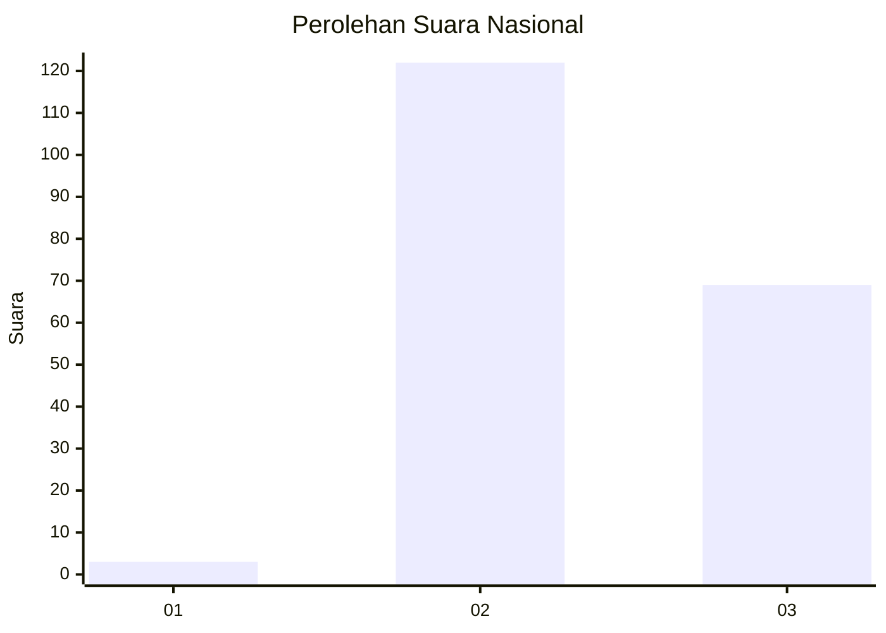
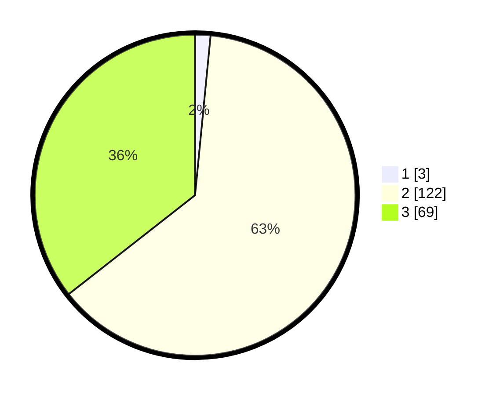

# Hasil

## Grafik

## Tabel

| No. | Nama Paslon    | Suara | Suara (raw) | Persentase |
|:--- |:-------------- | -----:| -----------:| ----------:|
| 1   | ANIES MUHAIMIN | 3     | [3][p-1]    | 1,55       |
| 2   | PRABOWO GIBRAN | 122   | [122][p-2]  | 62,89      |
| 3   | GANJAR MAHFUD  | 69    | [69][p-3]   | 35,57      |

[p-1]: https://github.com/gigit-pemilu/pemilu-2024/blob/main/pilpres/hitung-suara/sub/51-bali/sub/07-karangasem/sub/06-bebandem/sub/2005-jungutan/sub/005-tps/sub/paslon-1.txt
[p-2]: https://github.com/gigit-pemilu/pemilu-2024/blob/main/pilpres/hitung-suara/sub/51-bali/sub/07-karangasem/sub/06-bebandem/sub/2005-jungutan/sub/005-tps/sub/paslon-2.txt
[p-3]: https://github.com/gigit-pemilu/pemilu-2024/blob/main/pilpres/hitung-suara/sub/51-bali/sub/07-karangasem/sub/06-bebandem/sub/2005-jungutan/sub/005-tps/sub/paslon-3.txt

## Foto C Plano

https://sirekap-obj-formc.kpu.go.id/1900/pemilu/ppwp/51/07/06/20/05/5107062005005-20240214-220202--80d4cc22-7f0e-4e30-8ecc-3129f42dbd34.jpg

https://sirekap-obj-formc.kpu.go.id/1900/pemilu/ppwp/51/07/06/20/05/5107062005005-20240214-215913--eadf7b7e-2b27-441d-95a2-136457c2d0cb.jpg

https://sirekap-obj-formc.kpu.go.id/1900/pemilu/ppwp/51/07/06/20/05/5107062005005-20240214-215929--e8523840-75b0-493b-8d04-5d8e54f7b703.jpg

## Metadata

| Key        | Value               |
| ---------- | ------------------- |
| Time Stamp | 2024-02-19 06:16:00 |

