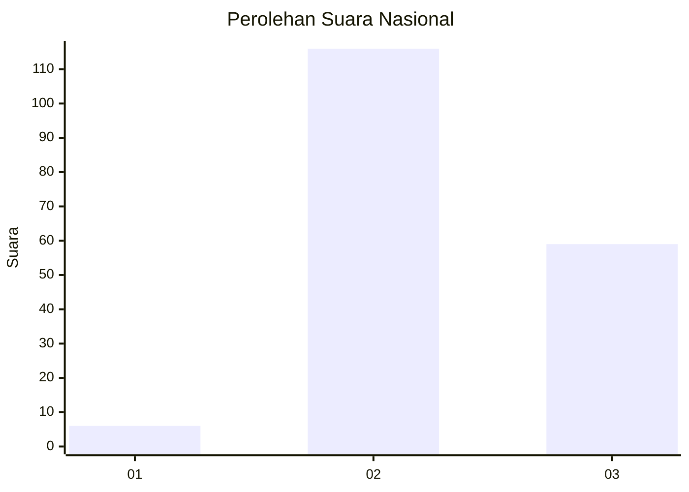
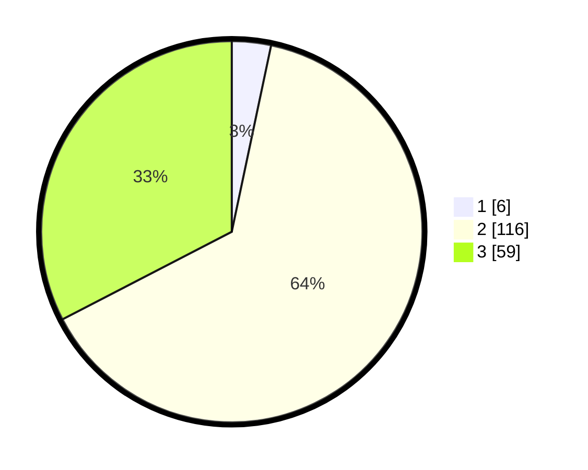

# Hasil

## Grafik

## Tabel

| No. | Nama Paslon    | Suara | Suara (raw) | Persentase |
|:--- |:-------------- | -----:| -----------:| ----------:|
| 1   | ANIES MUHAIMIN | 6     | [6][p-1]    | 3,31       |
| 2   | PRABOWO GIBRAN | 116   | [116][p-2]  | 64,09      |
| 3   | GANJAR MAHFUD  | 59    | [59][p-3]   | 32,60      |

[p-1]: https://github.com/gigit-pemilu/pemilu-2024/blob/main/pilpres/hitung-suara/sub/51-bali/sub/07-karangasem/sub/06-bebandem/sub/2005-jungutan/sub/013-tps/sub/paslon-1.txt
[p-2]: https://github.com/gigit-pemilu/pemilu-2024/blob/main/pilpres/hitung-suara/sub/51-bali/sub/07-karangasem/sub/06-bebandem/sub/2005-jungutan/sub/013-tps/sub/paslon-2.txt
[p-3]: https://github.com/gigit-pemilu/pemilu-2024/blob/main/pilpres/hitung-suara/sub/51-bali/sub/07-karangasem/sub/06-bebandem/sub/2005-jungutan/sub/013-tps/sub/paslon-3.txt

## Foto C Plano

https://sirekap-obj-formc.kpu.go.id/21cd/pemilu/ppwp/51/07/06/20/05/5107062005013-20240215-005711--b1bffaed-f7ab-421b-aeb7-1e26ad4d1256.jpg

https://sirekap-obj-formc.kpu.go.id/21cd/pemilu/ppwp/51/07/06/20/05/5107062005013-20240215-005723--7b7dabfb-53b8-4efd-89a1-092969e37333.jpg

https://sirekap-obj-formc.kpu.go.id/21cd/pemilu/ppwp/51/07/06/20/05/5107062005013-20240215-005732--a75f2579-5da6-49fa-842e-6476e67d7425.jpg

## Metadata

| Key        | Value               |
| ---------- | ------------------- |
| Time Stamp | 2024-02-25 15:00:00 |

