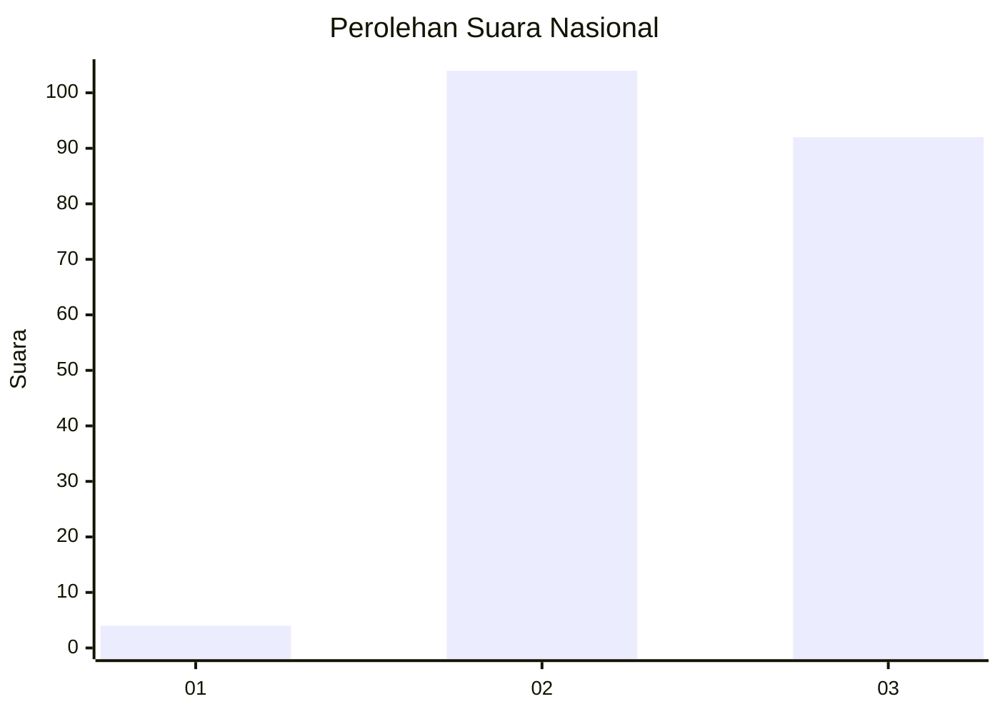
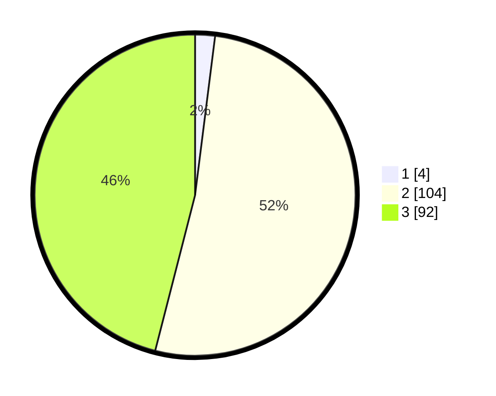

# Hasil

## Grafik

## Tabel

| No. | Nama Paslon    | Suara | Suara (raw) | Persentase |
|:--- |:-------------- | -----:| -----------:| ----------:|
| 1   | ANIES MUHAIMIN | 4     | [4][p-1]    | 2,00       |
| 2   | PRABOWO GIBRAN | 104   | [104][p-2]  | 52,00      |
| 3   | GANJAR MAHFUD  | 92    | [92][p-3]   | 46,00      |

[p-1]: https://github.com/gigit-pemilu/pemilu-2024/blob/main/pilpres/hitung-suara/sub/51-bali/sub/07-karangasem/sub/06-bebandem/sub/2005-jungutan/sub/016-tps/sub/paslon-1.txt
[p-2]: https://github.com/gigit-pemilu/pemilu-2024/blob/main/pilpres/hitung-suara/sub/51-bali/sub/07-karangasem/sub/06-bebandem/sub/2005-jungutan/sub/016-tps/sub/paslon-2.txt
[p-3]: https://github.com/gigit-pemilu/pemilu-2024/blob/main/pilpres/hitung-suara/sub/51-bali/sub/07-karangasem/sub/06-bebandem/sub/2005-jungutan/sub/016-tps/sub/paslon-3.txt

## Foto C Plano

https://sirekap-obj-formc.kpu.go.id/30dc/pemilu/ppwp/51/07/06/20/05/5107062005016-20240214-232944--4b4a89a3-eb46-40c1-bc60-a63d738b9d17.jpg

https://sirekap-obj-formc.kpu.go.id/30dc/pemilu/ppwp/51/07/06/20/05/5107062005016-20240214-141535--6ebd7249-4e7f-4d7a-a6db-1a941e15c21d.jpg

https://sirekap-obj-formc.kpu.go.id/30dc/pemilu/ppwp/51/07/06/20/05/5107062005016-20240214-141616--6201767d-29fa-4a08-80a5-7b2263bfaed3.jpg

## Metadata

| Key        | Value               |
| ---------- | ------------------- |
| Time Stamp | 2024-02-16 12:51:22 |

