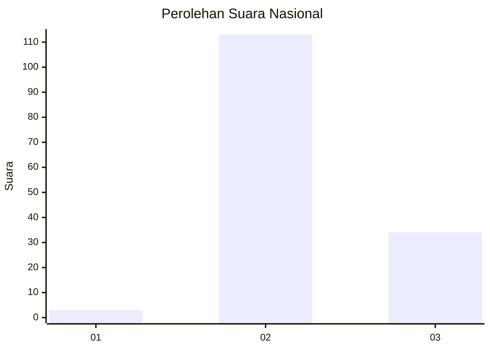
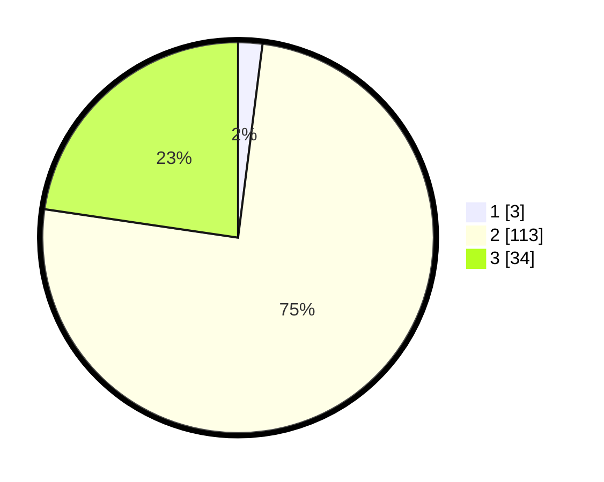

# Hasil

## Grafik

## Tabel

| No. | Nama Paslon    | Suara | Suara (raw) | Persentase |
|:--- |:-------------- | -----:| -----------:| ----------:|
| 1   | ANIES MUHAIMIN | 3     | [3][p-1]    | 2,00       |
| 2   | PRABOWO GIBRAN | 113   | [113][p-2]  | 75,33      |
| 3   | GANJAR MAHFUD  | 34    | [34][p-3]   | 22,67      |

[p-1]: https://github.com/gigit-pemilu/pemilu-2024/blob/main/pilpres/hitung-suara/sub/51-bali/sub/07-karangasem/sub/06-bebandem/sub/2005-jungutan/sub/024-tps/sub/paslon-1.txt
[p-2]: https://github.com/gigit-pemilu/pemilu-2024/blob/main/pilpres/hitung-suara/sub/51-bali/sub/07-karangasem/sub/06-bebandem/sub/2005-jungutan/sub/024-tps/sub/paslon-2.txt
[p-3]: https://github.com/gigit-pemilu/pemilu-2024/blob/main/pilpres/hitung-suara/sub/51-bali/sub/07-karangasem/sub/06-bebandem/sub/2005-jungutan/sub/024-tps/sub/paslon-3.txt

## Foto C Plano

https://sirekap-obj-formc.kpu.go.id/a9c4/pemilu/ppwp/51/07/06/20/05/5107062005024-20240219-101619--ecfee2aa-2966-474e-a8fc-da86cc99a637.jpg

https://sirekap-obj-formc.kpu.go.id/a9c4/pemilu/ppwp/51/07/06/20/05/5107062005024-20240219-101643--65535cc1-c239-4c74-a089-52e59a140b88.jpg

https://sirekap-obj-formc.kpu.go.id/a9c4/pemilu/ppwp/51/07/06/20/05/5107062005024-20240219-101632--9e6545b7-1a40-4212-a426-a90ac8ca5087.jpg

## Metadata

| Key        | Value               |
| ---------- | ------------------- |
| Time Stamp | 2024-02-24 22:31:28 |

