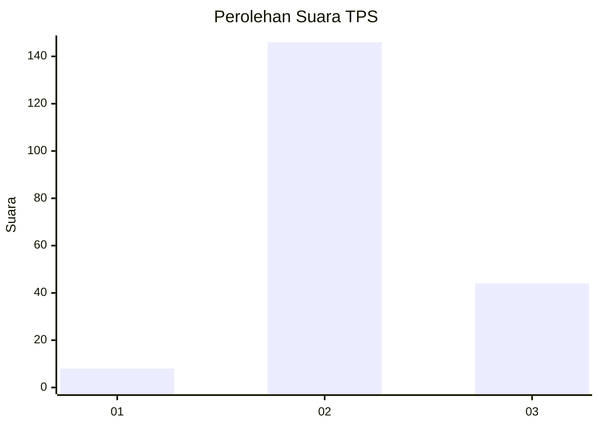
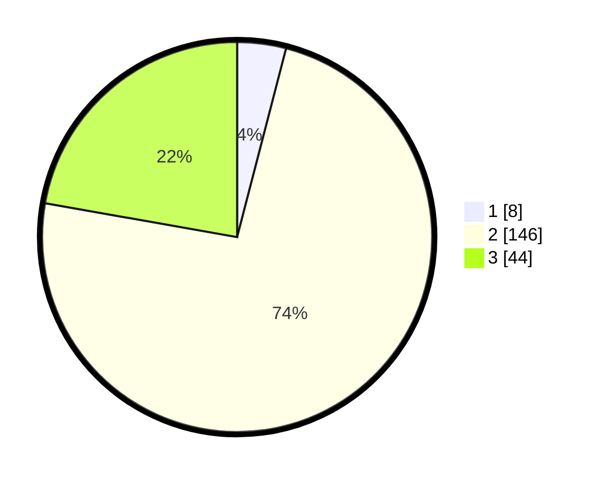

# Hasil

## Grafik

## Tabel

| No. | Nama Paslon    | Suara | Suara (raw) | Persentase |
|:--- |:-------------- | -----:| -----------:| ----------:|
| 1   | ANIES MUHAIMIN | 8     | [8][p-1]    | 4,04       |
| 2   | PRABOWO GIBRAN | 146   | [146][p-2]  | 73,74      |
| 3   | GANJAR MAHFUD  | 44    | [44][p-3]   | 22,22      |

[p-1]: https://github.com/gigit-pemilu/pemilu-2024-51-bali/blob/main/pilpres/hitung-suara/sub/51-bali/sub/07-karangasem/sub/06-bebandem/sub/2006-bungaya-kangin/sub/004-tps/sub/paslon-1.txt
[p-2]: https://github.com/gigit-pemilu/pemilu-2024-51-bali/blob/main/pilpres/hitung-suara/sub/51-bali/sub/07-karangasem/sub/06-bebandem/sub/2006-bungaya-kangin/sub/004-tps/sub/paslon-2.txt
[p-3]: https://github.com/gigit-pemilu/pemilu-2024-51-bali/blob/main/pilpres/hitung-suara/sub/51-bali/sub/07-karangasem/sub/06-bebandem/sub/2006-bungaya-kangin/sub/004-tps/sub/paslon-3.txt

## Foto C Plano

https://sirekap-obj-formc.kpu.go.id/6981/pemilu/ppwp/51/07/06/20/06/5107062006004-20240214-210826--733592b1-5c97-4637-8942-07771f4adf12.jpg

https://sirekap-obj-formc.kpu.go.id/6981/pemilu/ppwp/51/07/06/20/06/5107062006004-20240214-211006--b6877bdd-3f90-4cdd-af85-1448743a1e54.jpg

https://sirekap-obj-formc.kpu.go.id/6981/pemilu/ppwp/51/07/06/20/06/5107062006004-20240214-211127--37f749c8-015e-46d7-9f08-0436a407cf03.jpg

## Metadata

| Key        | Value               |
| ---------- | ------------------- |
| Time Stamp | 2024-02-15 00:41:44 |

## DATA PEMILIH TETAP

Jumlah pemilih dalam DPT: **247**.
 * L: **118**.
 * P: **129**.

## DATA PENGGUNA HAK PILIH

Jumlah pengguna hak pilih dalam DPT: **223**.
 * L: **107**.
 * P: **116**.

Jumlah pengguna hak pilih dalam DPTb: **0**.
 * L: **0**.
 * P: **0**.

Jumlah pengguna hak pilih dalam DPK: **2**.
 * L: **0**.
 * P: **2**.

Jumlah pengguna hak pilih: **225**.
 * L: **108**.
 * P: **117**.

## JUMLAH SUARA SAH DAN TIDAK SAH

JUMLAH SELURUH SUARA SAH: **198**.

JUMLAH SUARA TIDAK SAH: **27**.

JUMLAH SELURUH SUARA SAH DAN SUARA TIDAK SAH: **225**.

