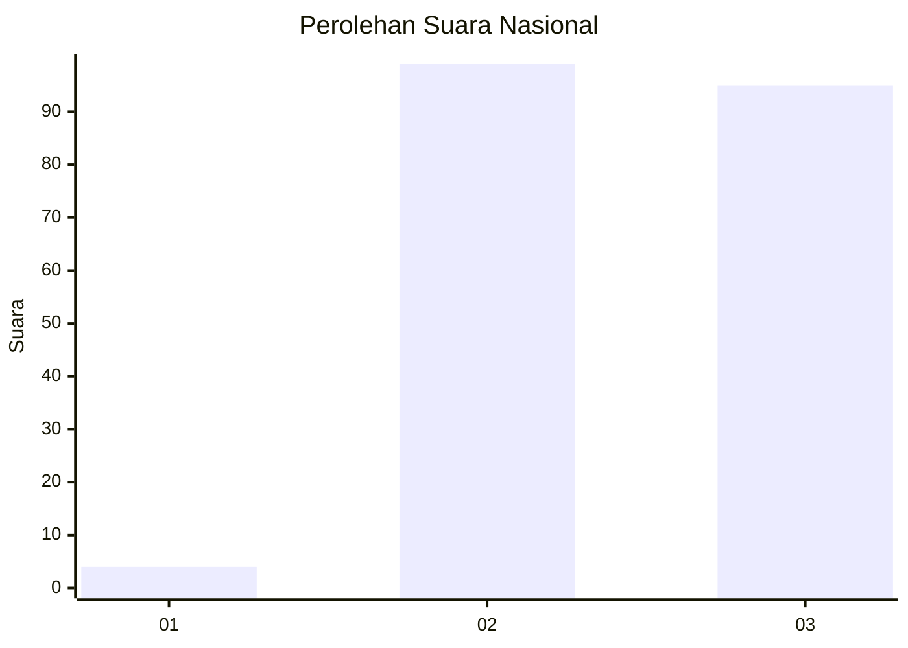
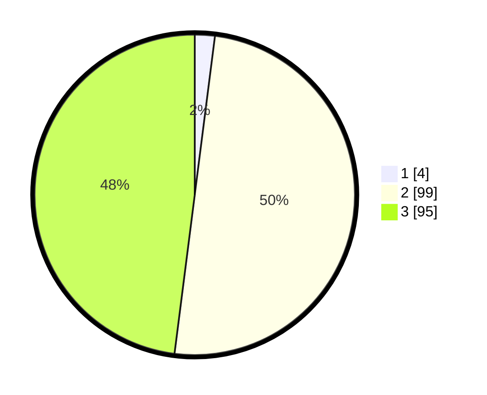

# Hasil

## Grafik

## Tabel

| No. | Nama Paslon    | Suara | Suara (raw) | Persentase |
|:--- |:-------------- | -----:| -----------:| ----------:|
| 1   | ANIES MUHAIMIN | 4     | [4][p-1]    | 2,02       |
| 2   | PRABOWO GIBRAN | 99    | [99][p-2]   | 50,00      |
| 3   | GANJAR MAHFUD  | 95    | [95][p-3]   | 47,98      |

[p-1]: https://github.com/gigit-pemilu/pemilu-2024/blob/main/pilpres/hitung-suara/sub/51-bali/sub/07-karangasem/sub/06-bebandem/sub/2006-bungaya-kangin/sub/006-tps/sub/paslon-1.txt
[p-2]: https://github.com/gigit-pemilu/pemilu-2024/blob/main/pilpres/hitung-suara/sub/51-bali/sub/07-karangasem/sub/06-bebandem/sub/2006-bungaya-kangin/sub/006-tps/sub/paslon-2.txt
[p-3]: https://github.com/gigit-pemilu/pemilu-2024/blob/main/pilpres/hitung-suara/sub/51-bali/sub/07-karangasem/sub/06-bebandem/sub/2006-bungaya-kangin/sub/006-tps/sub/paslon-3.txt

## Foto C Plano

https://sirekap-obj-formc.kpu.go.id/7652/pemilu/ppwp/51/07/06/20/06/5107062006006-20240214-130807--f7285c07-0a9c-4dc7-92e0-f3901940fdbb.jpg

https://sirekap-obj-formc.kpu.go.id/7652/pemilu/ppwp/51/07/06/20/06/5107062006006-20240214-131519--272331aa-cd8e-463f-8dec-0590d1fd0ea3.jpg

https://sirekap-obj-formc.kpu.go.id/7652/pemilu/ppwp/51/07/06/20/06/5107062006006-20240216-001642--8df68da6-e6e9-4524-9793-0ed5b2d31d84.jpg

## Metadata

| Key        | Value               |
| ---------- | ------------------- |
| Time Stamp | 2024-02-16 13:30:32 |

## DATA PEMILIH TETAP

Jumlah pemilih dalam DPT: **251**.
 * L: **126**.
 * P: **125**.

## DATA PENGGUNA HAK PILIH

Jumlah pengguna hak pilih dalam DPT: **197**.
 * L: **104**.
 * P: **93**.

Jumlah pengguna hak pilih dalam DPTb: **0**.
 * L: **0**.
 * P: **0**.

Jumlah pengguna hak pilih dalam DPK: **1**.
 * L: **1**.
 * P: **0**.

Jumlah pengguna hak pilih: **198**.
 * L: **105**.
 * P: **93**.

## JUMLAH SUARA SAH DAN TIDAK SAH

JUMLAH SELURUH SUARA SAH: **198**.

JUMLAH SUARA TIDAK SAH: **0**.

JUMLAH SELURUH SUARA SAH DAN SUARA TIDAK SAH: **198**.

