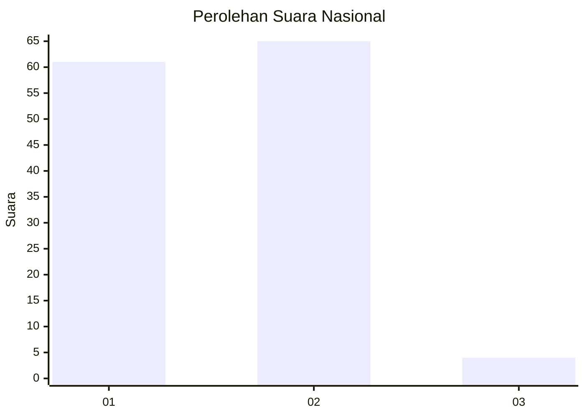
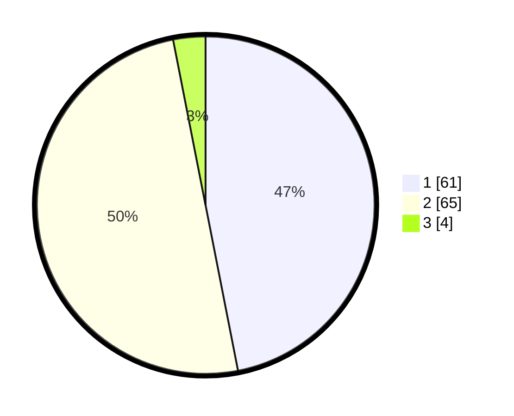

# Hasil

## Grafik

## Tabel

| No. | Nama Paslon    | Suara | Suara (raw) | Persentase |
|:--- |:-------------- | -----:| -----------:| ----------:|
| 1   | ANIES MUHAIMIN | 61    | [61][p-1]   | 46,92      |
| 2   | PRABOWO GIBRAN | 65    | [65][p-2]   | 50,00      |
| 3   | GANJAR MAHFUD  | 4     | [4][p-3]    | 3,08       |

[p-1]: https://github.com/gigit-pemilu/pemilu-2024/blob/main/pilpres/hitung-suara/sub/51-bali/sub/07-karangasem/sub/06-bebandem/sub/2006-bungaya-kangin/sub/012-tps/sub/paslon-1.txt
[p-2]: https://github.com/gigit-pemilu/pemilu-2024/blob/main/pilpres/hitung-suara/sub/51-bali/sub/07-karangasem/sub/06-bebandem/sub/2006-bungaya-kangin/sub/012-tps/sub/paslon-2.txt
[p-3]: https://github.com/gigit-pemilu/pemilu-2024/blob/main/pilpres/hitung-suara/sub/51-bali/sub/07-karangasem/sub/06-bebandem/sub/2006-bungaya-kangin/sub/012-tps/sub/paslon-3.txt

## Foto C Plano

https://sirekap-obj-formc.kpu.go.id/5032/pemilu/ppwp/51/07/06/20/06/5107062006012-20240214-141748--09d8d719-602c-441e-9d34-7effd916918b.jpg

https://sirekap-obj-formc.kpu.go.id/5032/pemilu/ppwp/51/07/06/20/06/5107062006012-20240214-141828--7acd9197-c4e2-4092-b869-8b676cac44ed.jpg

https://sirekap-obj-formc.kpu.go.id/5032/pemilu/ppwp/51/07/06/20/06/5107062006012-20240214-141907--cb7d4243-cd54-4b88-9511-906e329ee6d8.jpg

## Metadata

| Key        | Value               |
| ---------- | ------------------- |
| Time Stamp | 2024-02-24 22:31:28 |

