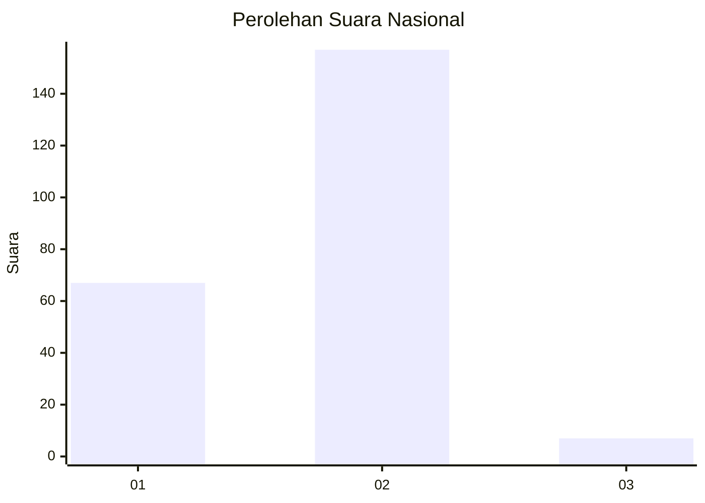
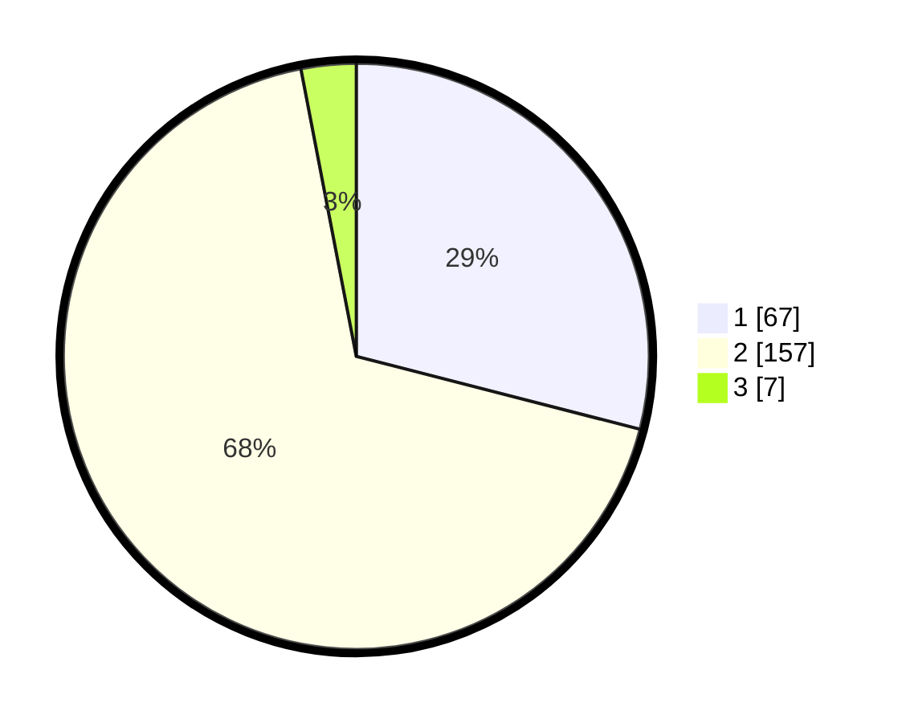

# Hasil

## Grafik

## Tabel

| No. | Nama Paslon    | Suara | Suara (raw) | Persentase |
|:--- |:-------------- | -----:| -----------:| ----------:|
| 1   | ANIES MUHAIMIN | 67    | [67][p-1]   | 29,00      |
| 2   | PRABOWO GIBRAN | 157   | [157][p-2]  | 67,97      |
| 3   | GANJAR MAHFUD  | 7     | [7][p-3]    | 3,03       |

[p-1]: https://github.com/gigit-pemilu/pemilu-2024/blob/main/pilpres/hitung-suara/sub/51-bali/sub/07-karangasem/sub/06-bebandem/sub/2006-bungaya-kangin/sub/016-tps/sub/paslon-1.txt
[p-2]: https://github.com/gigit-pemilu/pemilu-2024/blob/main/pilpres/hitung-suara/sub/51-bali/sub/07-karangasem/sub/06-bebandem/sub/2006-bungaya-kangin/sub/016-tps/sub/paslon-2.txt
[p-3]: https://github.com/gigit-pemilu/pemilu-2024/blob/main/pilpres/hitung-suara/sub/51-bali/sub/07-karangasem/sub/06-bebandem/sub/2006-bungaya-kangin/sub/016-tps/sub/paslon-3.txt

## Foto C Plano

https://sirekap-obj-formc.kpu.go.id/33c8/pemilu/ppwp/51/07/06/20/06/5107062006016-20240215-002155--18ef6a62-7ed5-4db9-addf-255f77b0703f.jpg

https://sirekap-obj-formc.kpu.go.id/33c8/pemilu/ppwp/51/07/06/20/06/5107062006016-20240215-002320--a9d10873-6569-413f-832c-2ae82697a86d.jpg

https://sirekap-obj-formc.kpu.go.id/33c8/pemilu/ppwp/51/07/06/20/06/5107062006016-20240215-002445--3fb7a2f9-4576-4f13-bcea-0958c6036e30.jpg

## Metadata

| Key        | Value               |
| ---------- | ------------------- |
| Time Stamp | 2024-02-24 22:31:28 |

