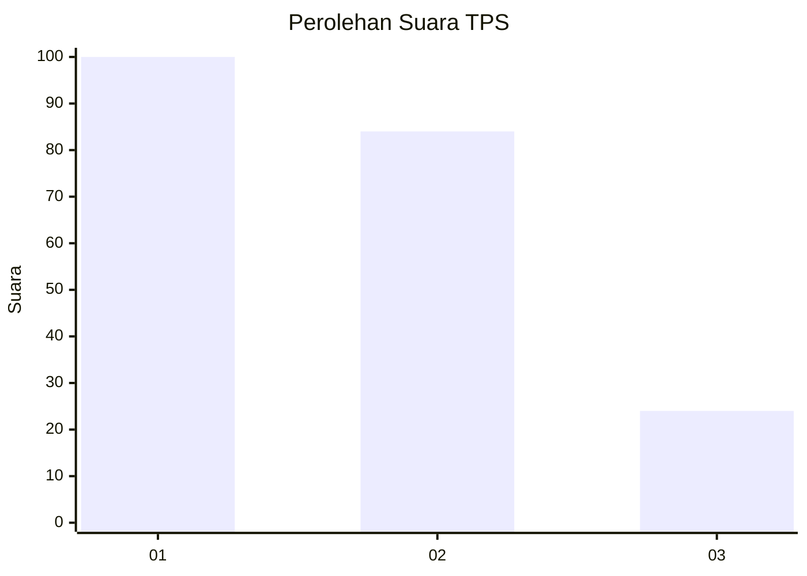
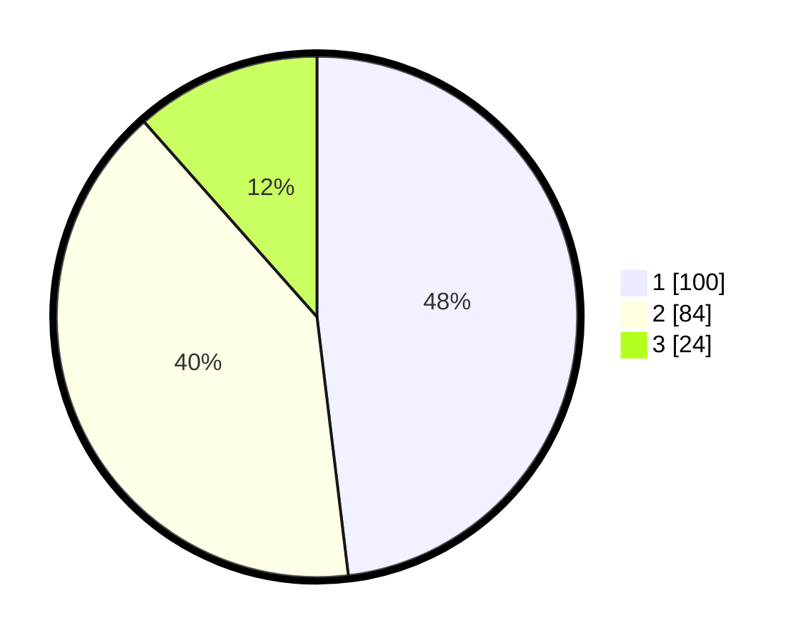

# Hasil

## Grafik

## Tabel

| No. | Nama Paslon    | Suara | Suara (raw) | Persentase |
|:--- |:-------------- | -----:| -----------:| ----------:|
| 1   | ANIES MUHAIMIN | 100   | [100][p-1]  | 48,08      |
| 2   | PRABOWO GIBRAN | 84    | [84][p-2]   | 40,38      |
| 3   | GANJAR MAHFUD  | 24    | [24][p-3]   | 11,54      |

[p-1]: https://github.com/gigit-pemilu/pemilu-2024-51-bali/blob/main/pilpres/hitung-suara/sub/51-bali/sub/07-karangasem/sub/06-bebandem/sub/2006-bungaya-kangin/sub/018-tps/sub/paslon-1.txt
[p-2]: https://github.com/gigit-pemilu/pemilu-2024-51-bali/blob/main/pilpres/hitung-suara/sub/51-bali/sub/07-karangasem/sub/06-bebandem/sub/2006-bungaya-kangin/sub/018-tps/sub/paslon-2.txt
[p-3]: https://github.com/gigit-pemilu/pemilu-2024-51-bali/blob/main/pilpres/hitung-suara/sub/51-bali/sub/07-karangasem/sub/06-bebandem/sub/2006-bungaya-kangin/sub/018-tps/sub/paslon-3.txt

## Foto C Plano

https://sirekap-obj-formc.kpu.go.id/b7dd/pemilu/ppwp/51/07/06/20/06/5107062006018-20240214-233451--fc4448be-aebb-4c57-81d9-9a919456c6f9.jpg

https://sirekap-obj-formc.kpu.go.id/b7dd/pemilu/ppwp/51/07/06/20/06/5107062006018-20240214-233508--a576b6d4-be6d-4ad2-9588-25156eda8800.jpg

https://sirekap-obj-formc.kpu.go.id/b7dd/pemilu/ppwp/51/07/06/20/06/5107062006018-20240214-233729--8a6e054c-4d62-41b6-adb0-f006e2c8b608.jpg

## Metadata

| Key        | Value               |
| ---------- | ------------------- |
| Time Stamp | 2024-02-19 06:16:00 |

