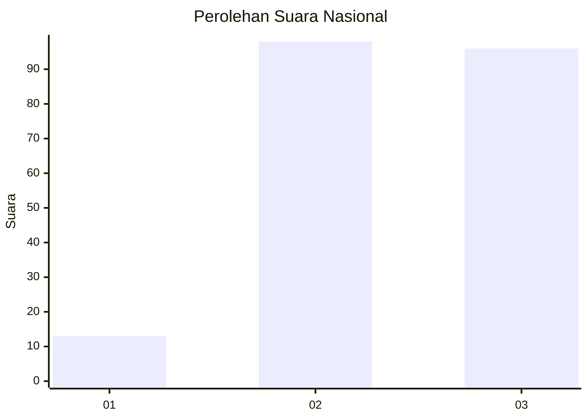
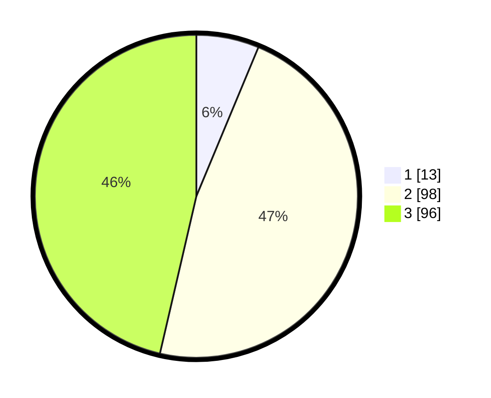

# Hasil

## Grafik

## Tabel

| No. | Nama Paslon    | Suara | Suara (raw) | Persentase |
|:--- |:-------------- | -----:| -----------:| ----------:|
| 1   | ANIES MUHAIMIN | 13    | [13][p-1]   | 6,28       |
| 2   | PRABOWO GIBRAN | 98    | [98][p-2]   | 47,34      |
| 3   | GANJAR MAHFUD  | 96    | [96][p-3]   | 46,38      |

[p-1]: https://github.com/gigit-pemilu/pemilu-2024/blob/main/pilpres/hitung-suara/sub/51-bali/sub/07-karangasem/sub/06-bebandem/sub/2006-bungaya-kangin/sub/022-tps/sub/paslon-1.txt
[p-2]: https://github.com/gigit-pemilu/pemilu-2024/blob/main/pilpres/hitung-suara/sub/51-bali/sub/07-karangasem/sub/06-bebandem/sub/2006-bungaya-kangin/sub/022-tps/sub/paslon-2.txt
[p-3]: https://github.com/gigit-pemilu/pemilu-2024/blob/main/pilpres/hitung-suara/sub/51-bali/sub/07-karangasem/sub/06-bebandem/sub/2006-bungaya-kangin/sub/022-tps/sub/paslon-3.txt

## Foto C Plano

https://sirekap-obj-formc.kpu.go.id/137f/pemilu/ppwp/51/07/06/20/06/5107062006022-20240214-141620--67dc90e8-3cd8-4043-bba5-9d0655e75921.jpg

https://sirekap-obj-formc.kpu.go.id/137f/pemilu/ppwp/51/07/06/20/06/5107062006022-20240214-141732--b8cb95f6-77b7-4912-9abd-97ecd2c5f05b.jpg

https://sirekap-obj-formc.kpu.go.id/137f/pemilu/ppwp/51/07/06/20/06/5107062006022-20240214-141816--06ca2e61-ec71-4c3a-9192-74566d160588.jpg

## Metadata

| Key        | Value               |
| ---------- | ------------------- |
| Time Stamp | 2024-02-19 06:16:00 |

