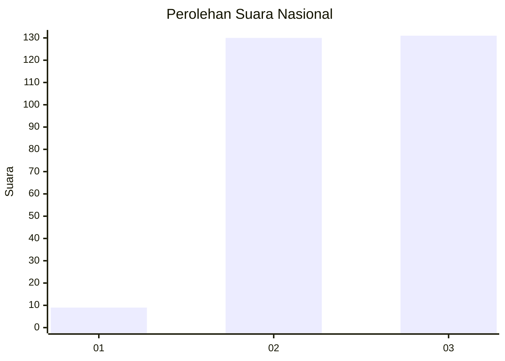
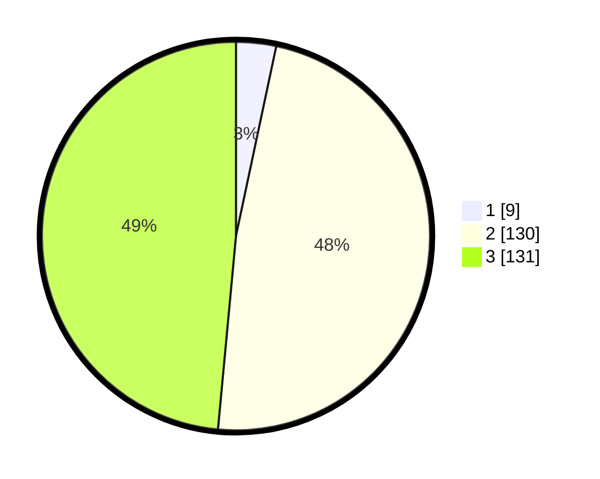

# Hasil

## Grafik

## Tabel

| No. | Nama Paslon    | Suara | Suara (raw) | Persentase |
|:--- |:-------------- | -----:| -----------:| ----------:|
| 1   | ANIES MUHAIMIN | 9     | [9][p-1]    | 3,33       |
| 2   | PRABOWO GIBRAN | 130   | [130][p-2]  | 48,15      |
| 3   | GANJAR MAHFUD  | 131   | [131][p-3]  | 48,52      |

[p-1]: https://github.com/gigit-pemilu/pemilu-2024/blob/main/pilpres/hitung-suara/sub/51-bali/sub/07-karangasem/sub/06-bebandem/sub/2007-bhuana-giri/sub/005-tps/sub/paslon-1.txt
[p-2]: https://github.com/gigit-pemilu/pemilu-2024/blob/main/pilpres/hitung-suara/sub/51-bali/sub/07-karangasem/sub/06-bebandem/sub/2007-bhuana-giri/sub/005-tps/sub/paslon-2.txt
[p-3]: https://github.com/gigit-pemilu/pemilu-2024/blob/main/pilpres/hitung-suara/sub/51-bali/sub/07-karangasem/sub/06-bebandem/sub/2007-bhuana-giri/sub/005-tps/sub/paslon-3.txt

## Foto C Plano

https://sirekap-obj-formc.kpu.go.id/52f7/pemilu/ppwp/51/07/06/20/07/5107062007005-20240214-132640--a15a1ab2-71f8-4adf-b914-2848f6bdb2b3.jpg

https://sirekap-obj-formc.kpu.go.id/52f7/pemilu/ppwp/51/07/06/20/07/5107062007005-20240216-132652--14edf8d8-7703-4038-b43d-b0665d92546d.jpg

https://sirekap-obj-formc.kpu.go.id/52f7/pemilu/ppwp/51/07/06/20/07/5107062007005-20240216-132651--e2911940-808a-4836-9143-7a0ba54cf4fd.jpg

## Metadata

| Key        | Value               |
| ---------- | ------------------- |
| Time Stamp | 2024-02-16 13:30:32 |

## DATA PEMILIH TETAP

Jumlah pemilih dalam DPT: **288**.
 * L: **135**.
 * P: **153**.

## DATA PENGGUNA HAK PILIH

Jumlah pengguna hak pilih dalam DPT: **279**.
 * L: **130**.
 * P: **149**.

Jumlah pengguna hak pilih dalam DPTb: **0**.
 * L: **0**.
 * P: **0**.

Jumlah pengguna hak pilih dalam DPK: **0**.
 * L: **0**.
 * P: **0**.

Jumlah pengguna hak pilih: **279**.
 * L: **130**.
 * P: **149**.

## JUMLAH SUARA SAH DAN TIDAK SAH

JUMLAH SELURUH SUARA SAH: **270**.

JUMLAH SUARA TIDAK SAH: **9**.

JUMLAH SELURUH SUARA SAH DAN SUARA TIDAK SAH: **279**.

