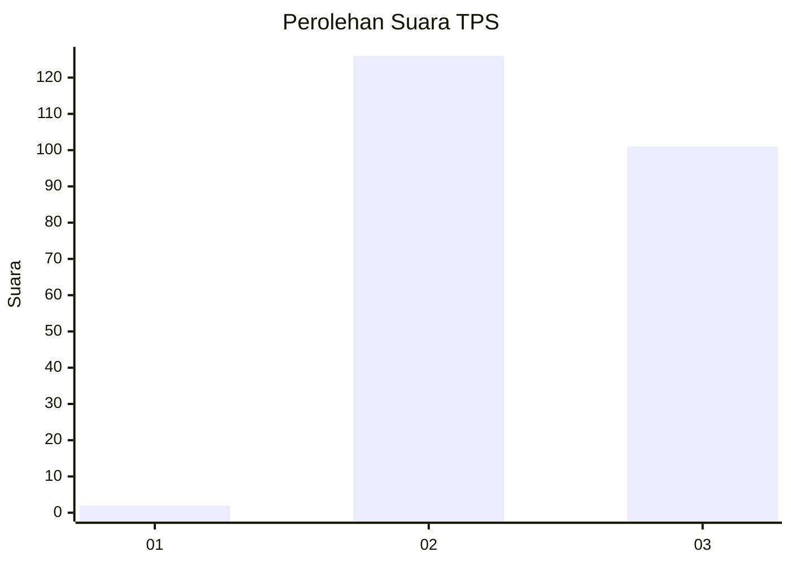
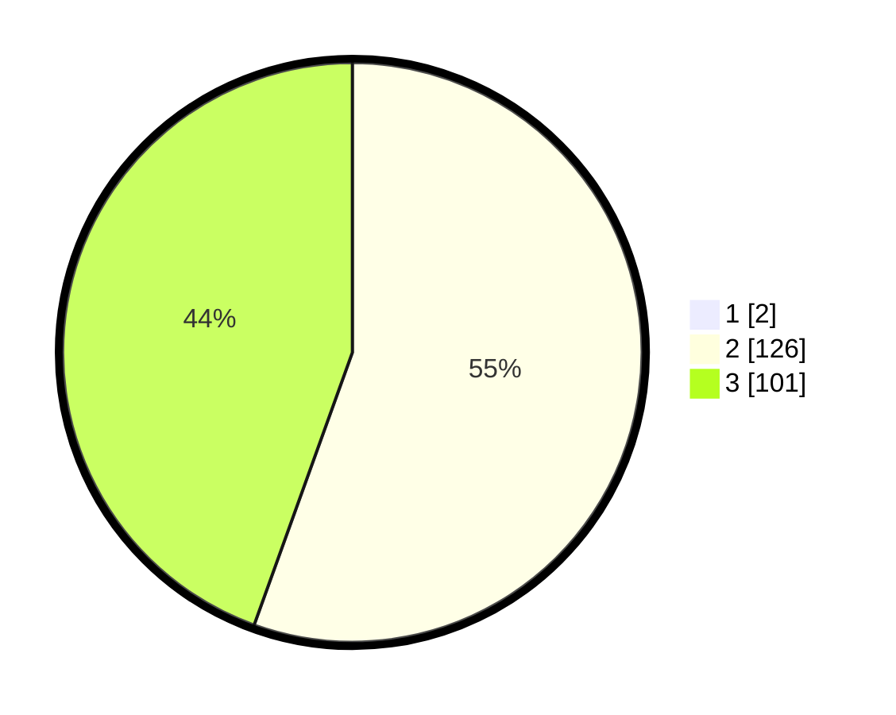

# Hasil

## Grafik

## Tabel

| No. | Nama Paslon    | Suara | Suara (raw) | Persentase |
|:--- |:-------------- | -----:| -----------:| ----------:|
| 1   | ANIES MUHAIMIN | 2     | [2][p-1]    | 0,87       |
| 2   | PRABOWO GIBRAN | 126   | [126][p-2]  | 55,02      |
| 3   | GANJAR MAHFUD  | 101   | [101][p-3]  | 44,10      |

[p-1]: https://github.com/gigit-pemilu/pemilu-2024-51-bali/blob/main/pilpres/hitung-suara/sub/51-bali/sub/07-karangasem/sub/06-bebandem/sub/2007-bhuana-giri/sub/009-tps/sub/paslon-1.txt
[p-2]: https://github.com/gigit-pemilu/pemilu-2024-51-bali/blob/main/pilpres/hitung-suara/sub/51-bali/sub/07-karangasem/sub/06-bebandem/sub/2007-bhuana-giri/sub/009-tps/sub/paslon-2.txt
[p-3]: https://github.com/gigit-pemilu/pemilu-2024-51-bali/blob/main/pilpres/hitung-suara/sub/51-bali/sub/07-karangasem/sub/06-bebandem/sub/2007-bhuana-giri/sub/009-tps/sub/paslon-3.txt

## Foto C Plano

https://sirekap-obj-formc.kpu.go.id/db09/pemilu/ppwp/51/07/06/20/07/5107062007009-20240214-211159--e88a03b4-9ba5-4afc-b721-1a658929e073.jpg

https://sirekap-obj-formc.kpu.go.id/db09/pemilu/ppwp/51/07/06/20/07/5107062007009-20240214-214752--89ae93e8-4eb4-47e4-85d4-0f3feb443998.jpg

https://sirekap-obj-formc.kpu.go.id/db09/pemilu/ppwp/51/07/06/20/07/5107062007009-20240214-214929--7f94ddf0-5dab-43ec-8877-6ab6b965bf77.jpg

## Metadata

| Key        | Value               |
| ---------- | ------------------- |
| Time Stamp | 2024-02-19 06:16:00 |

