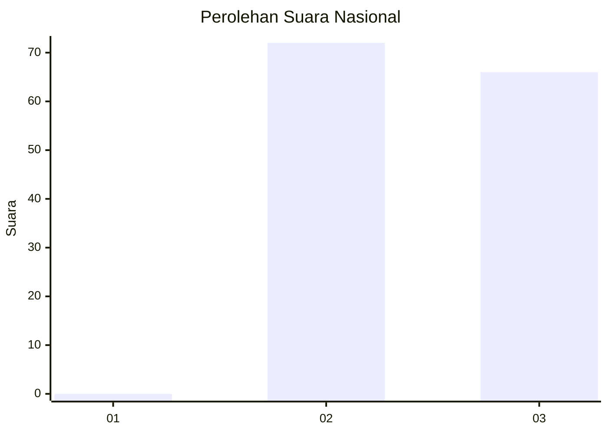
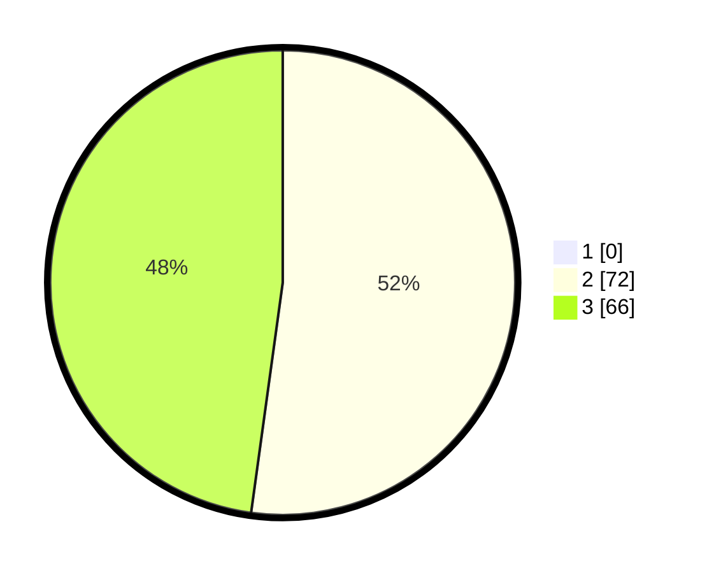

# Hasil

## Grafik

## Tabel

| No. | Nama Paslon    | Suara | Suara (raw) | Persentase |
|:--- |:-------------- | -----:| -----------:| ----------:|
| 1   | ANIES MUHAIMIN | 0     | [0][p-1]    | 0,00       |
| 2   | PRABOWO GIBRAN | 72    | [72][p-2]   | 52,17      |
| 3   | GANJAR MAHFUD  | 66    | [66][p-3]   | 47,83      |

[p-1]: https://github.com/gigit-pemilu/pemilu-2024/blob/main/pilpres/hitung-suara/sub/51-bali/sub/07-karangasem/sub/06-bebandem/sub/2007-bhuana-giri/sub/027-tps/sub/paslon-1.txt
[p-2]: https://github.com/gigit-pemilu/pemilu-2024/blob/main/pilpres/hitung-suara/sub/51-bali/sub/07-karangasem/sub/06-bebandem/sub/2007-bhuana-giri/sub/027-tps/sub/paslon-2.txt
[p-3]: https://github.com/gigit-pemilu/pemilu-2024/blob/main/pilpres/hitung-suara/sub/51-bali/sub/07-karangasem/sub/06-bebandem/sub/2007-bhuana-giri/sub/027-tps/sub/paslon-3.txt

## Foto C Plano

https://sirekap-obj-formc.kpu.go.id/6ef5/pemilu/ppwp/51/07/06/20/07/5107062007027-20240214-214601--33d235b3-caf1-4762-93ba-45cc89bfd948.jpg

https://sirekap-obj-formc.kpu.go.id/6ef5/pemilu/ppwp/51/07/06/20/07/5107062007027-20240214-211711--7f7de83f-3a45-4808-b221-bba084892c89.jpg

https://sirekap-obj-formc.kpu.go.id/6ef5/pemilu/ppwp/51/07/06/20/07/5107062007027-20240214-211837--f711f343-00c0-4a64-a278-bb7fff7eb1fc.jpg

## Metadata

| Key        | Value               |
| ---------- | ------------------- |
| Time Stamp | 2024-02-19 06:16:00 |

