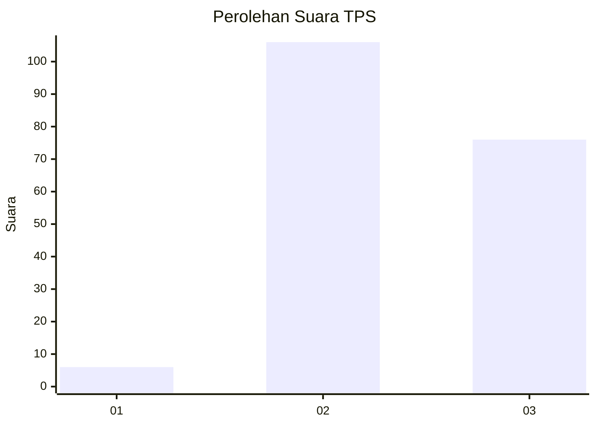
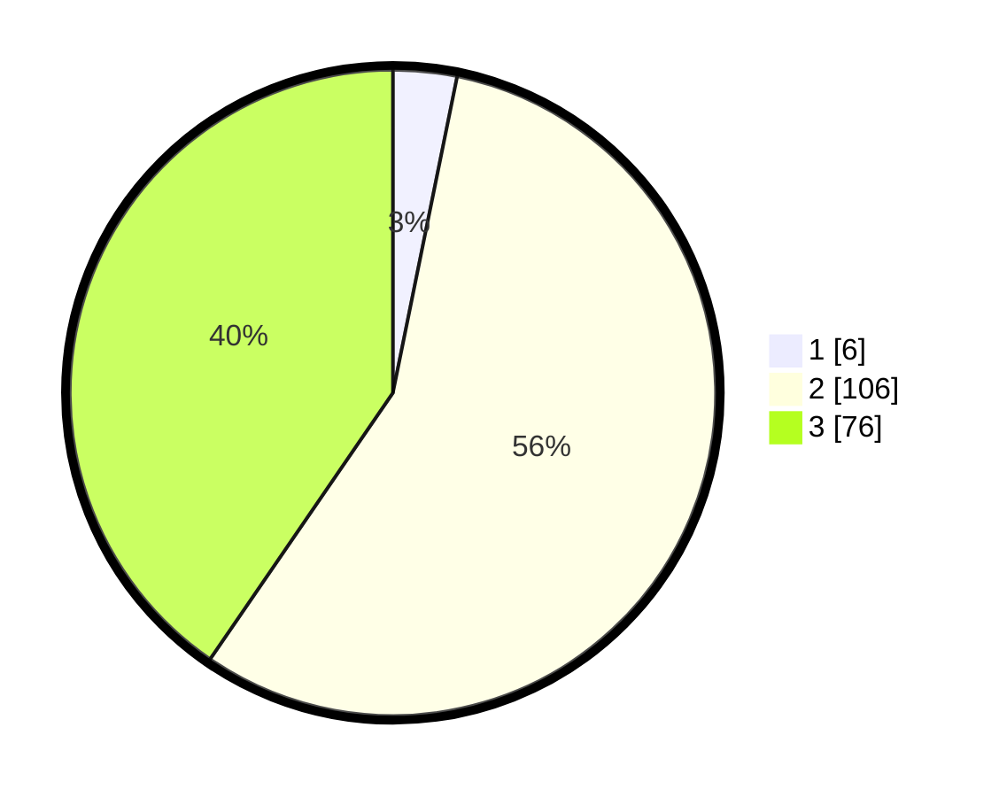

# Hasil

## Grafik

## Tabel

| No. | Nama Paslon    | Suara | Suara (raw) | Persentase |
|:--- |:-------------- | -----:| -----------:| ----------:|
| 1   | ANIES MUHAIMIN | 6     | [6][p-1]    | 3,19       |
| 2   | PRABOWO GIBRAN | 106   | [106][p-2]  | 56,38      |
| 3   | GANJAR MAHFUD  | 76    | [76][p-3]   | 40,43      |

[p-1]: https://github.com/gigit-pemilu/pemilu-2024-51-bali/blob/main/pilpres/hitung-suara/sub/51-bali/sub/07-karangasem/sub/06-bebandem/sub/2008-macang/sub/001-tps/sub/paslon-1.txt
[p-2]: https://github.com/gigit-pemilu/pemilu-2024-51-bali/blob/main/pilpres/hitung-suara/sub/51-bali/sub/07-karangasem/sub/06-bebandem/sub/2008-macang/sub/001-tps/sub/paslon-2.txt
[p-3]: https://github.com/gigit-pemilu/pemilu-2024-51-bali/blob/main/pilpres/hitung-suara/sub/51-bali/sub/07-karangasem/sub/06-bebandem/sub/2008-macang/sub/001-tps/sub/paslon-3.txt

## Foto C Plano

https://sirekap-obj-formc.kpu.go.id/b000/pemilu/ppwp/51/07/06/20/08/5107062008001-20240214-204316--9318b9f6-d163-43c3-bc66-1249c005a95b.jpg

https://sirekap-obj-formc.kpu.go.id/b000/pemilu/ppwp/51/07/06/20/08/5107062008001-20240214-204522--c8c29da7-0e8d-400e-9045-9bfe71ebcf34.jpg

https://sirekap-obj-formc.kpu.go.id/b000/pemilu/ppwp/51/07/06/20/08/5107062008001-20240214-204328--383e963e-946a-43fe-b7c0-6e79201fae9a.jpg

## Metadata

| Key        | Value               |
| ---------- | ------------------- |
| Time Stamp | 2024-02-16 14:00:34 |

