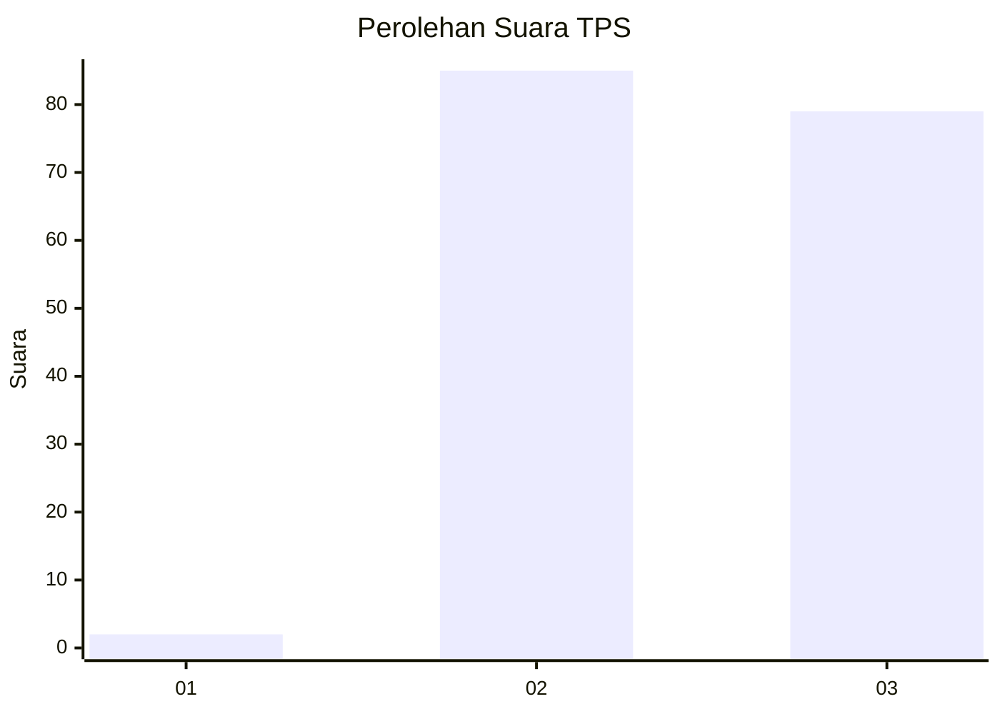
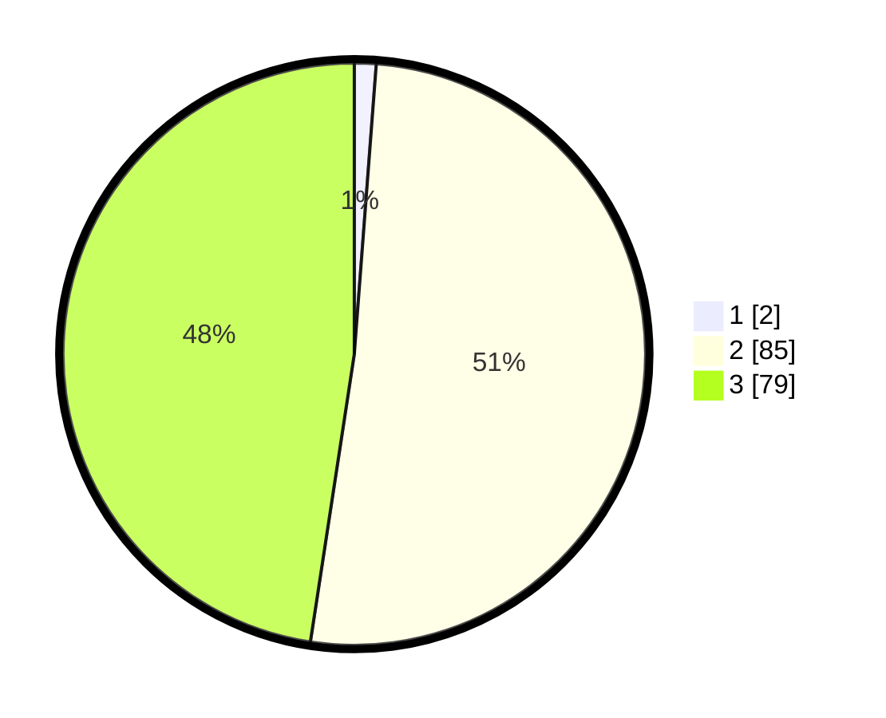

# Hasil

## Grafik

## Tabel

| No. | Nama Paslon    | Suara | Suara (raw) | Persentase |
|:--- |:-------------- | -----:| -----------:| ----------:|
| 1   | ANIES MUHAIMIN | 2     | [2][p-1]    | 1,20       |
| 2   | PRABOWO GIBRAN | 85    | [85][p-2]   | 51,20      |
| 3   | GANJAR MAHFUD  | 79    | [79][p-3]   | 47,59      |

[p-1]: https://github.com/gigit-pemilu/pemilu-2024-51-bali/blob/main/pilpres/hitung-suara/sub/51-bali/sub/07-karangasem/sub/06-bebandem/sub/2008-macang/sub/002-tps/sub/paslon-1.txt
[p-2]: https://github.com/gigit-pemilu/pemilu-2024-51-bali/blob/main/pilpres/hitung-suara/sub/51-bali/sub/07-karangasem/sub/06-bebandem/sub/2008-macang/sub/002-tps/sub/paslon-2.txt
[p-3]: https://github.com/gigit-pemilu/pemilu-2024-51-bali/blob/main/pilpres/hitung-suara/sub/51-bali/sub/07-karangasem/sub/06-bebandem/sub/2008-macang/sub/002-tps/sub/paslon-3.txt

## Foto C Plano

https://sirekap-obj-formc.kpu.go.id/1d18/pemilu/ppwp/51/07/06/20/08/5107062008002-20240215-101626--65858640-fa60-4650-844a-8b426449290f.jpg

https://sirekap-obj-formc.kpu.go.id/1d18/pemilu/ppwp/51/07/06/20/08/5107062008002-20240214-132055--f5968ff5-b2d7-4b09-901d-4a9b1a78a983.jpg

https://sirekap-obj-formc.kpu.go.id/1d18/pemilu/ppwp/51/07/06/20/08/5107062008002-20240214-131849--f7630e60-4de2-43ca-849b-e6486783bcd8.jpg

## Metadata

| Key        | Value               |
| ---------- | ------------------- |
| Time Stamp | 2024-02-24 22:31:28 |

