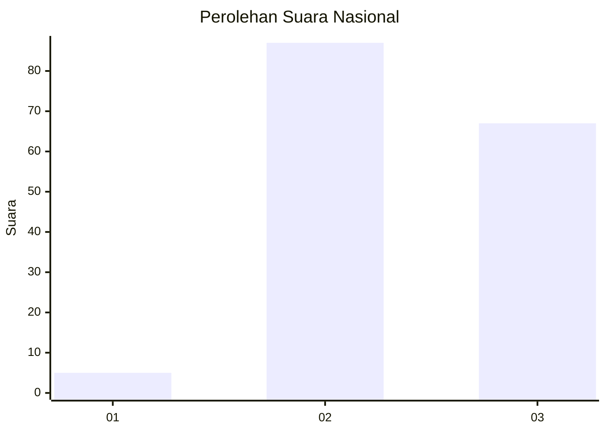
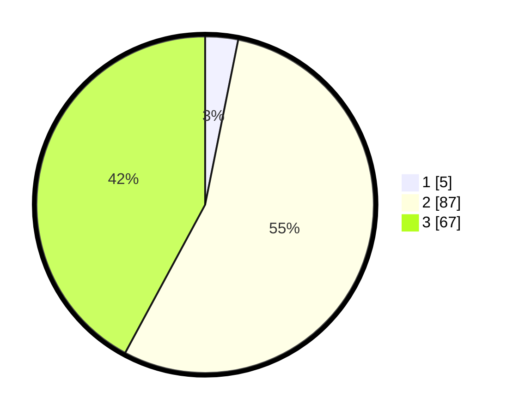

# Hasil

## Grafik

## Tabel

| No. | Nama Paslon    | Suara | Suara (raw) | Persentase |
|:--- |:-------------- | -----:| -----------:| ----------:|
| 1   | ANIES MUHAIMIN | 5     | [5][p-1]    | 3,14       |
| 2   | PRABOWO GIBRAN | 87    | [87][p-2]   | 54,72      |
| 3   | GANJAR MAHFUD  | 67    | [67][p-3]   | 42,14      |

[p-1]: https://github.com/gigit-pemilu/pemilu-2024/blob/main/pilpres/hitung-suara/sub/51-bali/sub/07-karangasem/sub/06-bebandem/sub/2008-macang/sub/003-tps/sub/paslon-1.txt
[p-2]: https://github.com/gigit-pemilu/pemilu-2024/blob/main/pilpres/hitung-suara/sub/51-bali/sub/07-karangasem/sub/06-bebandem/sub/2008-macang/sub/003-tps/sub/paslon-2.txt
[p-3]: https://github.com/gigit-pemilu/pemilu-2024/blob/main/pilpres/hitung-suara/sub/51-bali/sub/07-karangasem/sub/06-bebandem/sub/2008-macang/sub/003-tps/sub/paslon-3.txt

## Foto C Plano

https://sirekap-obj-formc.kpu.go.id/aba9/pemilu/ppwp/51/07/06/20/08/5107062008003-20240214-131642--57f76ab2-3a06-4bcf-b5e1-83508823729a.jpg

https://sirekap-obj-formc.kpu.go.id/aba9/pemilu/ppwp/51/07/06/20/08/5107062008003-20240214-131958--db04b093-1009-4dbb-9845-65b8501cbe7f.jpg

https://sirekap-obj-formc.kpu.go.id/aba9/pemilu/ppwp/51/07/06/20/08/5107062008003-20240214-132139--3913fd2b-ef90-49dd-8b10-0e27b3812130.jpg

## Metadata

| Key        | Value               |
| ---------- | ------------------- |
| Time Stamp | 2024-02-25 11:00:00 |

