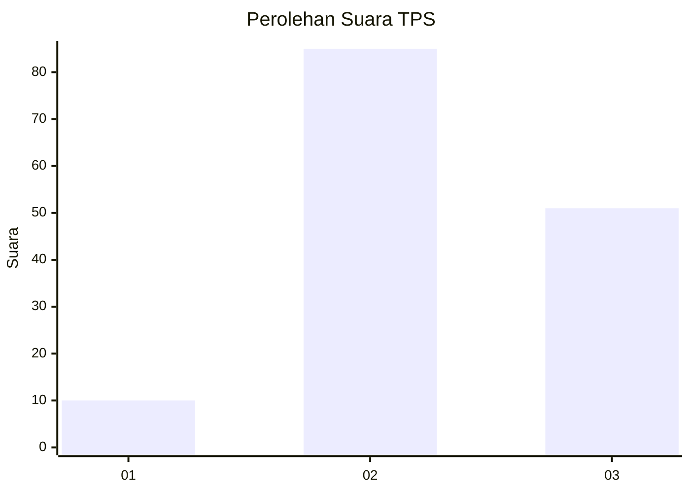
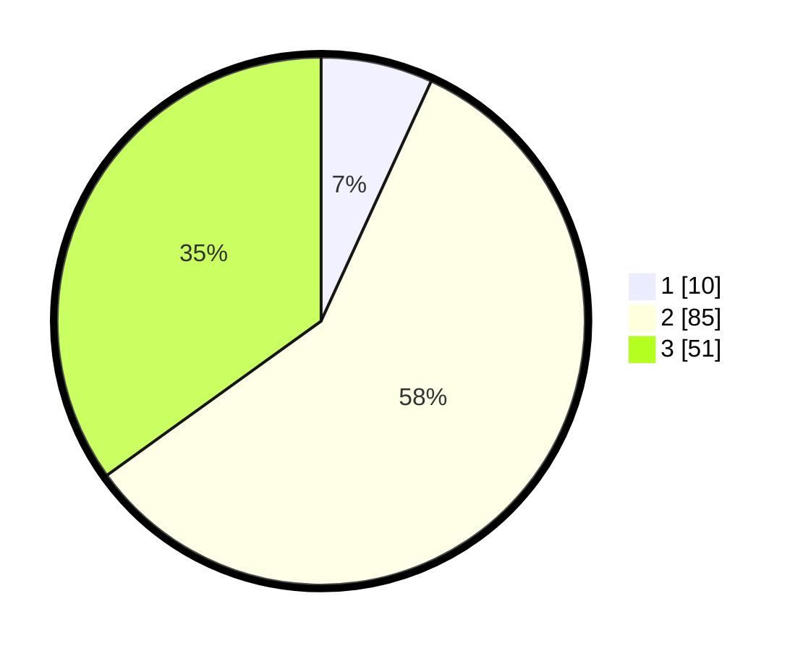

# Hasil

## Grafik

## Tabel

| No. | Nama Paslon    | Suara | Suara (raw) | Persentase |
|:--- |:-------------- | -----:| -----------:| ----------:|
| 1   | ANIES MUHAIMIN | 10    | [10][p-1]   | 6,85       |
| 2   | PRABOWO GIBRAN | 85    | [85][p-2]   | 58,22      |
| 3   | GANJAR MAHFUD  | 51    | [51][p-3]   | 34,93      |

[p-1]: https://github.com/gigit-pemilu/pemilu-2024-51-bali/blob/main/pilpres/hitung-suara/sub/51-bali/sub/07-karangasem/sub/07-selat/sub/2001-muncan/sub/001-tps/sub/paslon-1.txt
[p-2]: https://github.com/gigit-pemilu/pemilu-2024-51-bali/blob/main/pilpres/hitung-suara/sub/51-bali/sub/07-karangasem/sub/07-selat/sub/2001-muncan/sub/001-tps/sub/paslon-2.txt
[p-3]: https://github.com/gigit-pemilu/pemilu-2024-51-bali/blob/main/pilpres/hitung-suara/sub/51-bali/sub/07-karangasem/sub/07-selat/sub/2001-muncan/sub/001-tps/sub/paslon-3.txt

## Foto C Plano

https://sirekap-obj-formc.kpu.go.id/ab30/pemilu/ppwp/51/07/07/20/01/5107072001001-20240214-125902--f15abafe-c88c-433e-ba8b-6344a5a656b3.jpg

https://sirekap-obj-formc.kpu.go.id/ab30/pemilu/ppwp/51/07/07/20/01/5107072001001-20240214-125730--615f419b-7b90-4fe4-a900-41eaae1f0391.jpg

https://sirekap-obj-formc.kpu.go.id/ab30/pemilu/ppwp/51/07/07/20/01/5107072001001-20240214-130001--36b8bb54-0881-4f2c-bcac-fc3dedff9f6f.jpg

## Metadata

| Key        | Value               |
| ---------- | ------------------- |
| Time Stamp | 2024-02-14 21:46:01 |

## DATA PEMILIH TETAP

Jumlah pemilih dalam DPT: **197**.
 * L: **109**.
 * P: **88**.

## DATA PENGGUNA HAK PILIH

Jumlah pengguna hak pilih dalam DPT: **158**.
 * L: **84**.
 * P: **74**.

Jumlah pengguna hak pilih dalam DPTb: **0**.
 * L: **0**.
 * P: **0**.

Jumlah pengguna hak pilih dalam DPK: **0**.
 * L: **0**.
 * P: **0**.

Jumlah pengguna hak pilih: **158**.
 * L: **84**.
 * P: **74**.

## JUMLAH SUARA SAH DAN TIDAK SAH

JUMLAH SELURUH SUARA SAH: **146**.

JUMLAH SUARA TIDAK SAH: **12**.

JUMLAH SELURUH SUARA SAH DAN SUARA TIDAK SAH: **158**.

