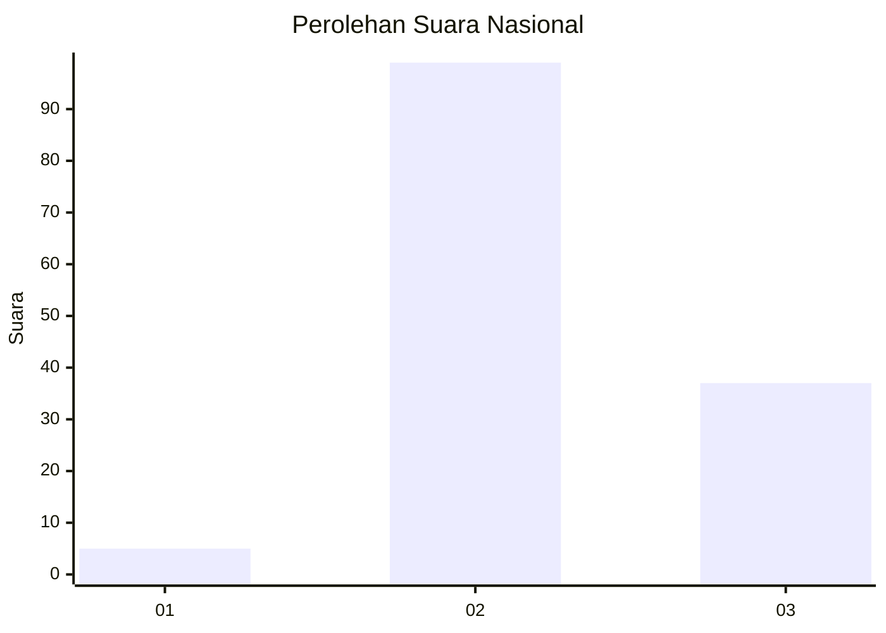
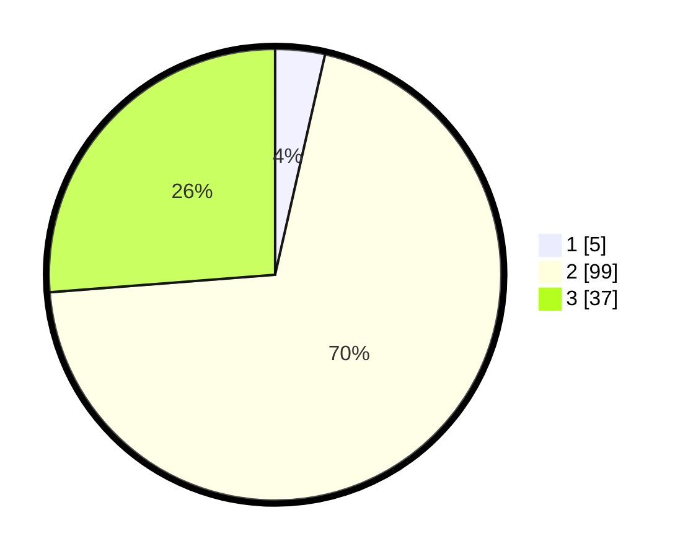

# Hasil

## Grafik

## Tabel

| No. | Nama Paslon    | Suara | Suara (raw) | Persentase |
|:--- |:-------------- | -----:| -----------:| ----------:|
| 1   | ANIES MUHAIMIN | 5     | [5][p-1]    | 3,55       |
| 2   | PRABOWO GIBRAN | 99    | [99][p-2]   | 70,21      |
| 3   | GANJAR MAHFUD  | 37    | [37][p-3]   | 26,24      |

[p-1]: https://github.com/gigit-pemilu/pemilu-2024/blob/main/pilpres/hitung-suara/sub/51-bali/sub/07-karangasem/sub/07-selat/sub/2001-muncan/sub/003-tps/sub/paslon-1.txt
[p-2]: https://github.com/gigit-pemilu/pemilu-2024/blob/main/pilpres/hitung-suara/sub/51-bali/sub/07-karangasem/sub/07-selat/sub/2001-muncan/sub/003-tps/sub/paslon-2.txt
[p-3]: https://github.com/gigit-pemilu/pemilu-2024/blob/main/pilpres/hitung-suara/sub/51-bali/sub/07-karangasem/sub/07-selat/sub/2001-muncan/sub/003-tps/sub/paslon-3.txt

## Foto C Plano

https://sirekap-obj-formc.kpu.go.id/e159/pemilu/ppwp/51/07/07/20/01/5107072001003-20240214-132328--7ef51331-2bcf-49d5-af1a-ed153dad52f2.jpg

https://sirekap-obj-formc.kpu.go.id/e159/pemilu/ppwp/51/07/07/20/01/5107072001003-20240214-191303--dcf8d145-7a50-4299-92c4-f11584f5afe9.jpg

https://sirekap-obj-formc.kpu.go.id/e159/pemilu/ppwp/51/07/07/20/01/5107072001003-20240216-141516--bd82de6b-24d6-4bbb-a5a0-723d2f1aeec6.jpg

## Metadata

| Key        | Value               |
| ---------- | ------------------- |
| Time Stamp | 2024-02-16 14:30:33 |

## DATA PEMILIH TETAP

Jumlah pemilih dalam DPT: **190**.
 * L: **90**.
 * P: **100**.

## DATA PENGGUNA HAK PILIH

Jumlah pengguna hak pilih dalam DPT: **146**.
 * L: **73**.
 * P: **73**.

Jumlah pengguna hak pilih dalam DPTb: **0**.
 * L: **0**.
 * P: **0**.

Jumlah pengguna hak pilih dalam DPK: **0**.
 * L: **0**.
 * P: **0**.

Jumlah pengguna hak pilih: **146**.
 * L: **73**.
 * P: **73**.

## JUMLAH SUARA SAH DAN TIDAK SAH

JUMLAH SELURUH SUARA SAH: **141**.

JUMLAH SUARA TIDAK SAH: **5**.

JUMLAH SELURUH SUARA SAH DAN SUARA TIDAK SAH: **146**.

