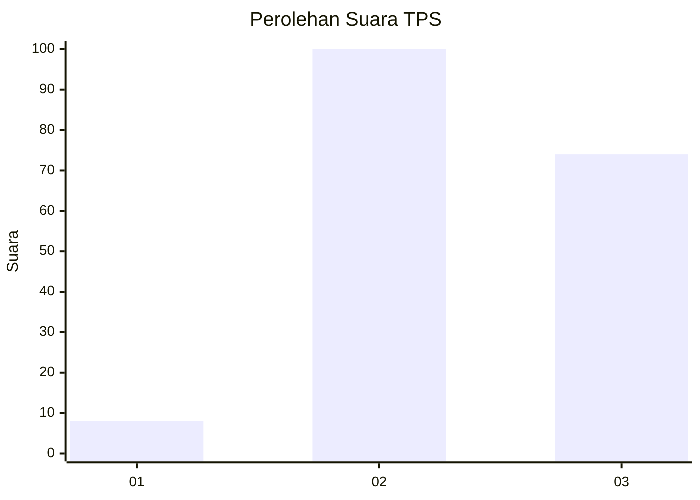
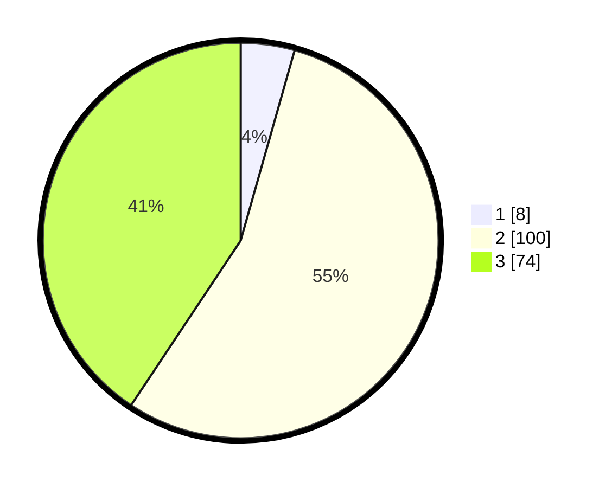

# Hasil

## Grafik

## Tabel

| No. | Nama Paslon    | Suara | Suara (raw) | Persentase |
|:--- |:-------------- | -----:| -----------:| ----------:|
| 1   | ANIES MUHAIMIN | 8     | [8][p-1]    | 4,40       |
| 2   | PRABOWO GIBRAN | 100   | [100][p-2]  | 54,95      |
| 3   | GANJAR MAHFUD  | 74    | [74][p-3]   | 40,66      |

[p-1]: https://github.com/gigit-pemilu/pemilu-2024-51-bali/blob/main/pilpres/hitung-suara/sub/51-bali/sub/07-karangasem/sub/07-selat/sub/2001-muncan/sub/005-tps/sub/paslon-1.txt
[p-2]: https://github.com/gigit-pemilu/pemilu-2024-51-bali/blob/main/pilpres/hitung-suara/sub/51-bali/sub/07-karangasem/sub/07-selat/sub/2001-muncan/sub/005-tps/sub/paslon-2.txt
[p-3]: https://github.com/gigit-pemilu/pemilu-2024-51-bali/blob/main/pilpres/hitung-suara/sub/51-bali/sub/07-karangasem/sub/07-selat/sub/2001-muncan/sub/005-tps/sub/paslon-3.txt

## Foto C Plano

https://sirekap-obj-formc.kpu.go.id/247f/pemilu/ppwp/51/07/07/20/01/5107072001005-20240215-222226--be2d3f66-8775-451b-b646-ad75167102ea.jpg

https://sirekap-obj-formc.kpu.go.id/247f/pemilu/ppwp/51/07/07/20/01/5107072001005-20240215-222228--687d09d8-fbb9-4072-8190-1eec36bb1354.jpg

https://sirekap-obj-formc.kpu.go.id/247f/pemilu/ppwp/51/07/07/20/01/5107072001005-20240215-222227--cf9dd0fe-b9bc-470b-bca2-14c8241fa929.jpg

## Metadata

| Key        | Value               |
| ---------- | ------------------- |
| Time Stamp | 2024-02-16 09:30:28 |

## DATA PEMILIH TETAP

Jumlah pemilih dalam DPT: **276**.
 * L: **129**.
 * P: **147**.

## DATA PENGGUNA HAK PILIH

Jumlah pengguna hak pilih dalam DPT: **197**.
 * L: **97**.
 * P: **100**.

Jumlah pengguna hak pilih dalam DPTb: **0**.
 * L: **0**.
 * P: **0**.

Jumlah pengguna hak pilih dalam DPK: **0**.
 * L: **0**.
 * P: **0**.

Jumlah pengguna hak pilih: **197**.
 * L: **97**.
 * P: **100**.

## JUMLAH SUARA SAH DAN TIDAK SAH

JUMLAH SELURUH SUARA SAH: **182**.

JUMLAH SUARA TIDAK SAH: **15**.

JUMLAH SELURUH SUARA SAH DAN SUARA TIDAK SAH: **197**.

