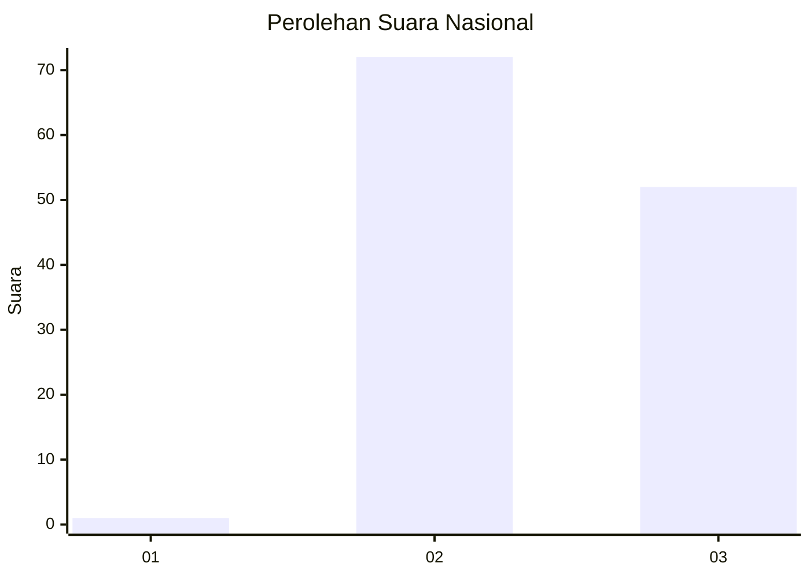
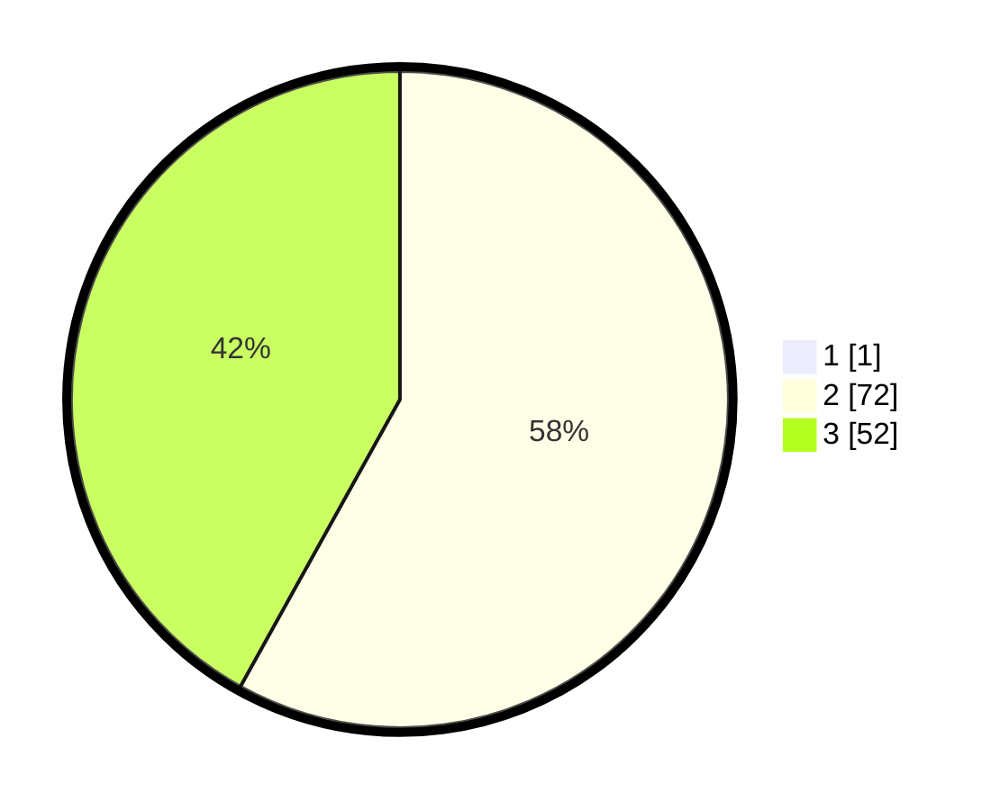

# Hasil

## Grafik

## Tabel

| No. | Nama Paslon    | Suara | Suara (raw) | Persentase |
|:--- |:-------------- | -----:| -----------:| ----------:|
| 1   | ANIES MUHAIMIN | 1     | [1][p-1]    | 0,80       |
| 2   | PRABOWO GIBRAN | 72    | [72][p-2]   | 57,60      |
| 3   | GANJAR MAHFUD  | 52    | [52][p-3]   | 41,60      |

[p-1]: https://github.com/gigit-pemilu/pemilu-2024/blob/main/pilpres/hitung-suara/sub/51-bali/sub/07-karangasem/sub/07-selat/sub/2001-muncan/sub/008-tps/sub/paslon-1.txt
[p-2]: https://github.com/gigit-pemilu/pemilu-2024/blob/main/pilpres/hitung-suara/sub/51-bali/sub/07-karangasem/sub/07-selat/sub/2001-muncan/sub/008-tps/sub/paslon-2.txt
[p-3]: https://github.com/gigit-pemilu/pemilu-2024/blob/main/pilpres/hitung-suara/sub/51-bali/sub/07-karangasem/sub/07-selat/sub/2001-muncan/sub/008-tps/sub/paslon-3.txt

## Foto C Plano

https://sirekap-obj-formc.kpu.go.id/ba40/pemilu/ppwp/51/07/07/20/01/5107072001008-20240215-210307--9af17f50-374f-47be-8ba5-56a814431293.jpg

https://sirekap-obj-formc.kpu.go.id/ba40/pemilu/ppwp/51/07/07/20/01/5107072001008-20240215-210309--aa0ba2d9-4b43-4c19-b134-38f6b4d9e59a.jpg

https://sirekap-obj-formc.kpu.go.id/ba40/pemilu/ppwp/51/07/07/20/01/5107072001008-20240215-210308--4bfb7bc1-b8d5-454b-be74-0a2477bf143b.jpg

## Metadata

| Key        | Value               |
| ---------- | ------------------- |
| Time Stamp | 2024-02-16 09:30:28 |

## DATA PEMILIH TETAP

Jumlah pemilih dalam DPT: **155**.
 * L: **80**.
 * P: **75**.

## DATA PENGGUNA HAK PILIH

Jumlah pengguna hak pilih dalam DPT: **128**.
 * L: **66**.
 * P: **62**.

Jumlah pengguna hak pilih dalam DPTb: **1**.
 * L: **1**.
 * P: **0**.

Jumlah pengguna hak pilih dalam DPK: **0**.
 * L: **0**.
 * P: **0**.

Jumlah pengguna hak pilih: **129**.
 * L: **67**.
 * P: **62**.

## JUMLAH SUARA SAH DAN TIDAK SAH

JUMLAH SELURUH SUARA SAH: **125**.

JUMLAH SUARA TIDAK SAH: **4**.

JUMLAH SELURUH SUARA SAH DAN SUARA TIDAK SAH: **129**.

