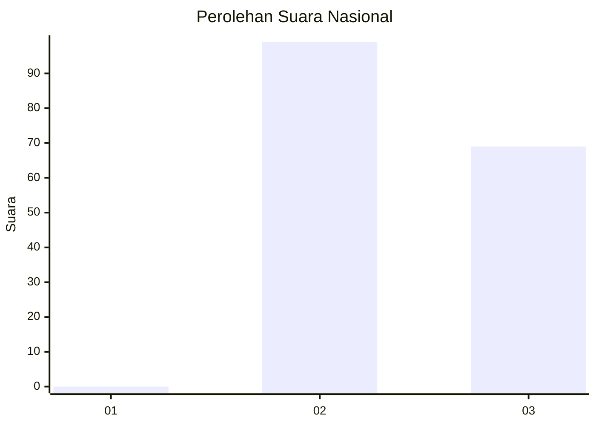
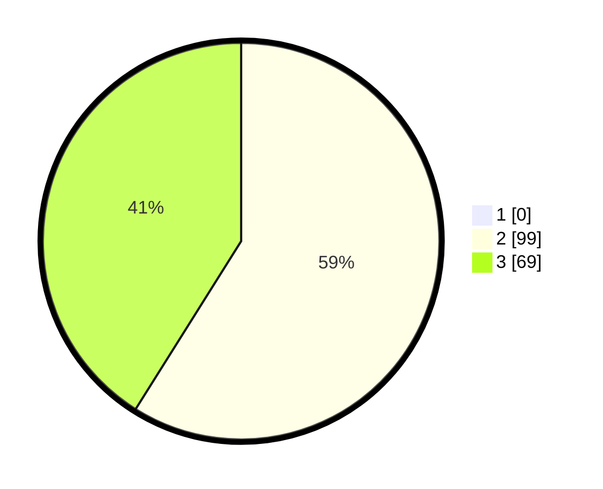

# Hasil

## Grafik

## Tabel

| No. | Nama Paslon    | Suara | Suara (raw) | Persentase |
|:--- |:-------------- | -----:| -----------:| ----------:|
| 1   | ANIES MUHAIMIN | 0     | [0][p-1]    | 0,00       |
| 2   | PRABOWO GIBRAN | 99    | [99][p-2]   | 58,93      |
| 3   | GANJAR MAHFUD  | 69    | [69][p-3]   | 41,07      |

[p-1]: https://github.com/gigit-pemilu/pemilu-2024/blob/main/pilpres/hitung-suara/sub/51-bali/sub/07-karangasem/sub/07-selat/sub/2001-muncan/sub/010-tps/sub/paslon-1.txt
[p-2]: https://github.com/gigit-pemilu/pemilu-2024/blob/main/pilpres/hitung-suara/sub/51-bali/sub/07-karangasem/sub/07-selat/sub/2001-muncan/sub/010-tps/sub/paslon-2.txt
[p-3]: https://github.com/gigit-pemilu/pemilu-2024/blob/main/pilpres/hitung-suara/sub/51-bali/sub/07-karangasem/sub/07-selat/sub/2001-muncan/sub/010-tps/sub/paslon-3.txt

## Foto C Plano

https://sirekap-obj-formc.kpu.go.id/7e94/pemilu/ppwp/51/07/07/20/01/5107072001010-20240215-145839--41d0a6f2-6b7f-4e2a-91fc-1a0ad5da9acf.jpg

https://sirekap-obj-formc.kpu.go.id/7e94/pemilu/ppwp/51/07/07/20/01/5107072001010-20240215-145906--273d88d6-6f7c-4dd8-ad73-60dbd80946f5.jpg

https://sirekap-obj-formc.kpu.go.id/7e94/pemilu/ppwp/51/07/07/20/01/5107072001010-20240215-145951--675925b3-713f-4c1d-be33-5f3832e31277.jpg

## Metadata

| Key        | Value               |
| ---------- | ------------------- |
| Time Stamp | 2024-02-24 22:31:28 |

