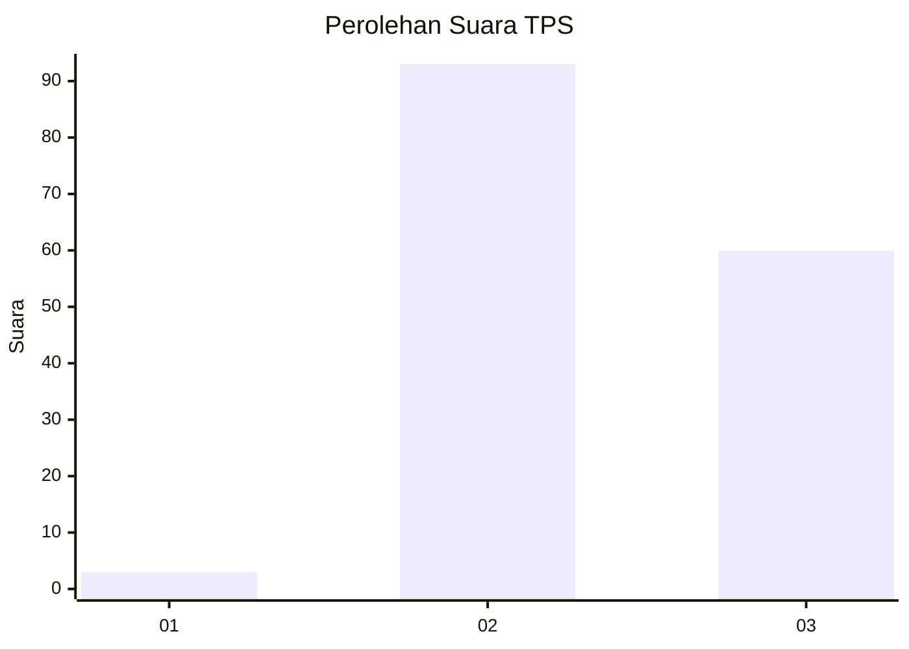
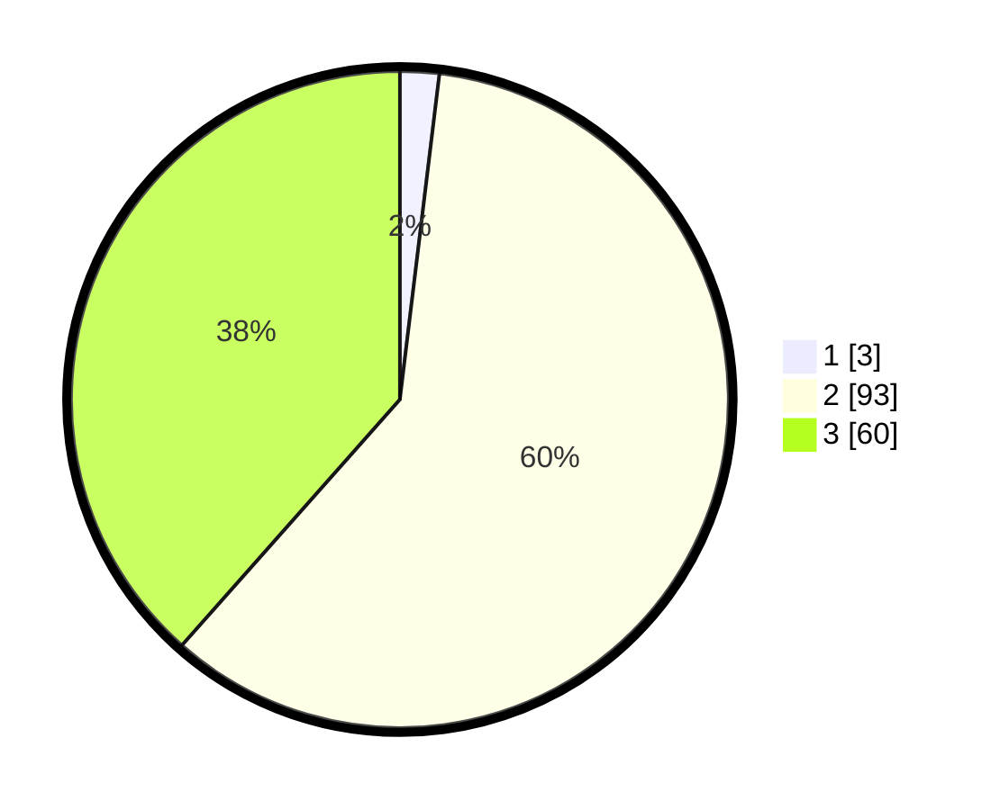

# Hasil

## Grafik

## Tabel

| No. | Nama Paslon    | Suara | Suara (raw) | Persentase |
|:--- |:-------------- | -----:| -----------:| ----------:|
| 1   | ANIES MUHAIMIN | 3     | [3][p-1]    | 1,92       |
| 2   | PRABOWO GIBRAN | 93    | [93][p-2]   | 59,62      |
| 3   | GANJAR MAHFUD  | 60    | [60][p-3]   | 38,46      |

[p-1]: https://github.com/gigit-pemilu/pemilu-2024-51-bali/blob/main/pilpres/hitung-suara/sub/51-bali/sub/07-karangasem/sub/07-selat/sub/2001-muncan/sub/027-tps/sub/paslon-1.txt
[p-2]: https://github.com/gigit-pemilu/pemilu-2024-51-bali/blob/main/pilpres/hitung-suara/sub/51-bali/sub/07-karangasem/sub/07-selat/sub/2001-muncan/sub/027-tps/sub/paslon-2.txt
[p-3]: https://github.com/gigit-pemilu/pemilu-2024-51-bali/blob/main/pilpres/hitung-suara/sub/51-bali/sub/07-karangasem/sub/07-selat/sub/2001-muncan/sub/027-tps/sub/paslon-3.txt

## Foto C Plano

https://sirekap-obj-formc.kpu.go.id/8675/pemilu/ppwp/51/07/07/20/01/5107072001027-20240216-155947--d48ea041-e269-47cd-b3ce-94443076a8e5.jpg

https://sirekap-obj-formc.kpu.go.id/8675/pemilu/ppwp/51/07/07/20/01/5107072001027-20240216-155948--ae45f871-ba5b-448b-b83b-3569f6ca97c6.jpg

https://sirekap-obj-formc.kpu.go.id/8675/pemilu/ppwp/51/07/07/20/01/5107072001027-20240216-155948--0f1b0554-a257-4683-a110-a9fda40607cb.jpg

## Metadata

| Key        | Value               |
| ---------- | ------------------- |
| Time Stamp | 2024-02-17 11:00:02 |

## DATA PEMILIH TETAP

Jumlah pemilih dalam DPT: **194**.
 * L: **96**.
 * P: **98**.

## DATA PENGGUNA HAK PILIH

Jumlah pengguna hak pilih dalam DPT: **159**.
 * L: **81**.
 * P: **78**.

Jumlah pengguna hak pilih dalam DPTb: **0**.
 * L: **0**.
 * P: **0**.

Jumlah pengguna hak pilih dalam DPK: **1**.
 * L: **1**.
 * P: **0**.

Jumlah pengguna hak pilih: **160**.
 * L: **82**.
 * P: **78**.

## JUMLAH SUARA SAH DAN TIDAK SAH

JUMLAH SELURUH SUARA SAH: **156**.

JUMLAH SUARA TIDAK SAH: **4**.

JUMLAH SELURUH SUARA SAH DAN SUARA TIDAK SAH: **160**.

