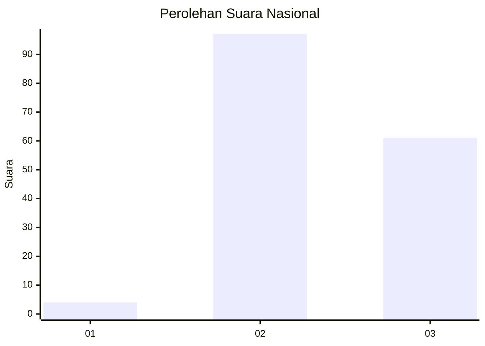
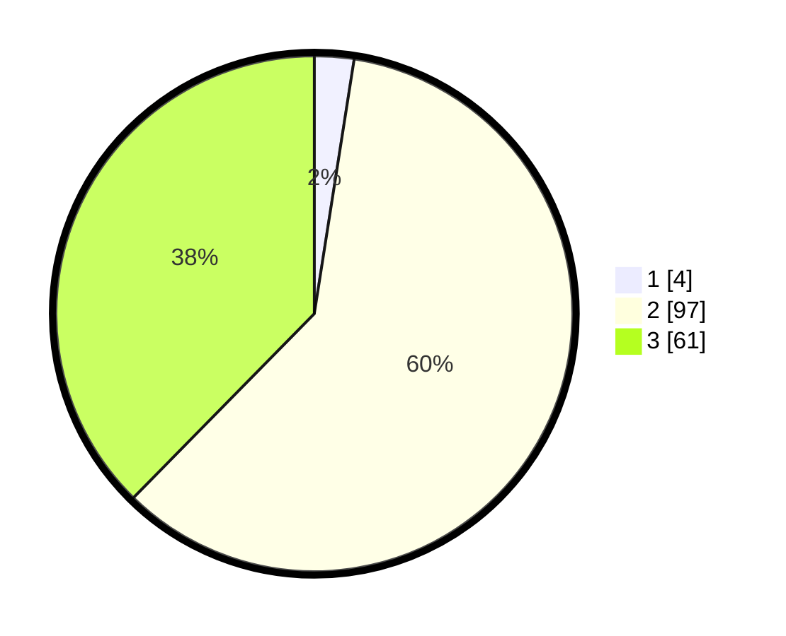

# Hasil

## Grafik

## Tabel

| No. | Nama Paslon    | Suara | Suara (raw) | Persentase |
|:--- |:-------------- | -----:| -----------:| ----------:|
| 1   | ANIES MUHAIMIN | 4     | [4][p-1]    | 2,47       |
| 2   | PRABOWO GIBRAN | 97    | [97][p-2]   | 59,88      |
| 3   | GANJAR MAHFUD  | 61    | [61][p-3]   | 37,65      |

[p-1]: https://github.com/gigit-pemilu/pemilu-2024/blob/main/pilpres/hitung-suara/sub/51-bali/sub/07-karangasem/sub/07-selat/sub/2002-selat/sub/001-tps/sub/paslon-1.txt
[p-2]: https://github.com/gigit-pemilu/pemilu-2024/blob/main/pilpres/hitung-suara/sub/51-bali/sub/07-karangasem/sub/07-selat/sub/2002-selat/sub/001-tps/sub/paslon-2.txt
[p-3]: https://github.com/gigit-pemilu/pemilu-2024/blob/main/pilpres/hitung-suara/sub/51-bali/sub/07-karangasem/sub/07-selat/sub/2002-selat/sub/001-tps/sub/paslon-3.txt

## Foto C Plano

https://sirekap-obj-formc.kpu.go.id/3e84/pemilu/ppwp/51/07/07/20/02/5107072002001-20240214-160057--a3ece5e2-568a-41cc-ba64-c5981ecd86aa.jpg

https://sirekap-obj-formc.kpu.go.id/3e84/pemilu/ppwp/51/07/07/20/02/5107072002001-20240214-160100--e643d856-f1f2-4e3e-94e6-78640a08b5b2.jpg

https://sirekap-obj-formc.kpu.go.id/3e84/pemilu/ppwp/51/07/07/20/02/5107072002001-20240214-160105--22f91659-378e-4748-a930-c267a6f7701f.jpg

## Metadata

| Key        | Value               |
| ---------- | ------------------- |
| Time Stamp | 2024-02-16 16:25:10 |

